### 📖 总览：大模型全栈技术七层图谱

以下是大模型全栈开发中涉及到的技能图谱，我们将其分为七层，每层都代表不同的技术范畴和挑战。理解了这张图，我们就有了**全局视野**，能把碎片化的知识组织成系统框架。

```mermaid
flowchart TD
    A[👤 应用体验层<br>对话产品、Web端] --> B[️💖 应用场景层<br>智能客服、代码生成、数据分析等]
    B --> C[🔧 应用架构与工程层<br>流程编排、云原生、前后端系统]
    C --> D[🧠 核心技术能力层<br>RAG、Agent、微调、系统指令]
    D --> E[🏗️ 模型与框架层<br>基础大模型、开发框架、模型微调库]
    E --> F[📊 数据与算力层<br>海量数据、GPU/TPU集群、向量数据库]
    F --> G[📚 基础理论与算法层<br>数学、ML/DL、Transformer、MoE]
    
    D -.-> H[🤖 智能体<br>工具调用、自主决策]
    D -.-> I[📚 检索增强生成<br>私有知识库]
    D -.-> J[✍️ 提示工程<br>结构化交互]
    D -.-> K[⚙️ 模型微调<br>定制化模型]

    style A fill:#f0f0f0,stroke:#333,stroke-width:2px
    style B fill:#ffe6f0,stroke:#333,stroke-width:2px
    style C fill:#e6f0ff,stroke:#333,stroke-width:2px
    style D fill:#f0e6ff,stroke:#333,stroke-width:2px
    style E fill:#e6ffe6,stroke:#333,stroke-width:2px
    style F fill:#ffffe0,stroke:#333,stroke-width:2px
    style G fill:#ffe6cc,stroke:#333,stroke-width:2px
```

---

现在，从最底层（也是最重要的基石）开始详细拆解每一层里我们必须掌握的核心知识。

#### **第一层：🗝️ 基础理论与算法层 —— 理解Transformer与核心算法**

这是所有技术的灵魂，决定我们能否真正理解模型行为，而非“知其然，不知其所以然”。
*   **计算机科学基础**：数据结构和基础算法（数组、链表、树、图等），具备至少一种编程语言（如Python）的扎实基础。
*   **数学基石**：线性代数（矩阵运算、向量空间）、概率论与统计（贝叶斯定理、分布）、微积分与优化理论（梯度下降、反向传播）。
*   **机器学习与深度学习**：
    *   传统ML算法：线性/逻辑回归、支持向量机、决策树等。
    *   核心DL知识：神经网络基础（感知机、激活函数、损失函数）、CNN与RNN（为理解Transformer做铺垫）。
*   **大模型核心架构**：
    *   **Transformer**：这是我们起步的关键。需理解其核心的**自注意力机制（Self-Attention）**、位置编码（Positional Encoding）、残差连接及前馈神经网络（FFN）。
    *   **主流架构范式**：了解仅编码器（Encoder-Only，如BERT）、仅解码器（Decoder-Only，如GPT系列）等不同模型架构的差异与应用场景。
    *   **前沿架构**（进阶）：理解混合专家模型（MoE）、状态空间模型、Mamba等提升效率的新架构。

> **如何学习这一层？**
> *   **经典教材**：*《深度学习》（"花书"）、*《机器学习》（周志华著）。
> *   **大模型专项书籍**：*《大规模语言模型：从理论到实践》、*《自然语言处理：基于预训练模型的方法》。
> *   **经典论文清单**：
>     - `Attention Is All You Need` (2017) —— 必读！这是Transformer的原始论文，我们应该精读。
>     - `BERT: Pre-training of Deep Bidirectional Transformers for Language Understanding` (2018)
>     - `Language Models are Few-Shot Learners` (GPT-3论文，2020)
> *   **课程**：斯坦福大学的 **CS224n**（NLP with Deep Learning）课程；李飞飞的 **CS231n**（CNNs）课程；Hugging Face的NLP Course。
> *   **深度动手实践**：从头实现一个迷你Transformer，并使用一个简单数据集（如莎士比亚文集）在上面进行预训练。

#### **第二层：️📊 数据与算力层 —— 构建模型的“食材与灶台”**

理解模型背后的“体力活”。
*   **数据生命周期工程**：从数据采集、大规模清洗与去重，到标注、数据增强、隐私合规等精细操作。
*   **算力基础设施**：了解GPU/AI芯片、分布式调度系统（K8s）的基础原理。
*   **数据存储与管理**：了解传统结构化数据（XML）与高性能向量数据库（如Milvus、Pinecone）在不同场景下的作用。

> **如何学习这一层？**
> *   **学习数据处理**：通过实战学习`Pandas`、`NumPy`、`Datasets`库。
> *   **论文与研究**：关注数据处理相关的经典论文，如关于大规模语料库构建（如C4, The Pile）的技术报告。
> *   **参与开源数据处理项目**：在开源社区中参与数据清洗类的具体任务。

#### **第三层：🏗️ 模型与框架层 —— 掌握核心“工具箱”**

我们工作最频繁的地方。了解并熟练使用各种核心模型与开发工具。
*   **开源基础模型**：熟悉各类主流模型的特点与适用场景，如LLaMA、Qwen、DeepSeek等。
*   **微调技术与工具**：学习PEFT方法（LoRA、QLoRA）；掌握标准监督式微调（SFT）、指令微调（Instruction Tuning），以及利用偏好对齐（RLHF、DPO）来优化模型。
*   **模型优化与压缩**：学习在推理端如何“瘦身”，包括知识蒸馏、模型量化（GGUF/GPTQ）、剪枝等。
*   **开发框架**：了解LangChain、LlamaIndex、RAGFlow等编排框架，以及Dify等AI应用平台。

> **如何学习这一层？**
> *   **多动手微调**：利用`Axolotl`、`LLaMA-Factory`等模型微调工具，挑选一个喜欢的开源小模型（如Qwen2-7B），在一个特定的数据集上进行微调。
> *   **尝试一次模型量化**：使用`llama.cpp`或`AutoGPTQ`将一个模型量化到4-bit，对比量化前后的显存占用和推理速度。

#### **第四层：🧠 核心技术能力层 —— 掌握模型能力的关键“魔法”**

我们日常接触最多的概念都汇集于此，这是让基础模型走向实际应用的枢纽。
*   **提示工程**：
    1.0 **指令式** / 2.0 **结构化** / 3.0 **动态交互式**的跃迁。
    *   必学范式：角色指定、Few-shot、CRISPE框架等。
    *   进阶技术：思维链（CoT）/思维树。
*   **检索增强生成 (RAG)**：
    *   核心工作流（索引 → 检索 → 增强 → 生成）。
    *   关键技术点：文档分块策略、嵌入模型与向量检索（kNN）、RAPTOR。
    *   **知识管理**：知识图谱与RAG的结合、图谱增强型RAG等前沿技术。
*   **智能体 (Agent)**：
    *   核心组件：规划、记忆、工具使用。
    *   能设计ReAct模式、多智能体协作等应用。
    *   构建工具：学习LangGraph、AutoGen、CrewAI等。
*   **上下文工程**：系统、熟练地管理上下文窗口与分段技术，实现对长文档的有效处理。

> **如何学习这一层？**
> *   选择一个概念，动手做一个小项目就能打通这一步。例如，我们可以做一个RAG应用（基于私有文档的知识问答系统），或一个能调用工具获取实时信息的Agent。
> *   实用项目参考：
>     *   `RAG`：搭建一个个人知识库问答助手，或一个自动检索并总结最新论文趋势的Agent。
>     *   `Agent`：设计一个能自动规划复杂任务的AI旅行规划师。

#### **第五层：🔧 应用架构与工程层 —— 构建稳定、弹性的企业级AI服务**

当你的AI应用需要服务成百上千用户时，这一层的知识是基石。
*   架构体系：将AI能力无缝集成到工程、业务及云原生架构中，保证高并发和弹性。
*   服务封装：熟悉AI模型的API、gRPC等标准构建方式。
*   可观测性与监控：建立完善的监控、日志、链路追踪体系。

> **如何学习这一层？**
> *   学习方式：将你的`RAG`或`Agent`项目部署上线（集成`FastAPI`等），通过容器化（`Docker`）和编排（`K8s`）来探索扩展性与可靠性。
> *   文档与源码：研究`LangSmith`、`Weights & Biases`等可观测性工具的文档和案例。

#### **第六层： 💖 应用场景层与第七层：️👤 应用体验层 —— 触达用户与市场**

*   **场景分类**：RAG类知识库应用、Agent类工具应用、OLTP/OLAP类企业应用与AI原生应用等。
*   **用户体验**：了解网页端、移动端、H5、小程序及GPTs等产品的设计原则。

> **如何学习这一层？**
> *   持续体验和实践：保持对各厂商Web端产品、GPTs等应用的敏锐度和使用频率。
> *   追踪前沿动态：时刻追踪并体验最新的AI应用趋势（如Perplexity、Cognition等）。

### 🗺️ 整合四大支柱：贯穿所有层的核心脉络

除了层次结构，这张图谱还被四个贯穿始终的技术“支柱”所连接：

1.  **模型训练与微调 (Training & Fine-tuning)**：涵盖从预训练到SFT微调的完整生命周期，这是制造模型的过程。
2.  **推理与部署 (Inference & Deployment)**：学习将模型高效部署于生产环境，如模型压缩、服务化（vLLM、TGI）。
3.  **LLMOps与MLOps**：建立模型全生命周期的运维理念，包含CI/CD、监控、数据管理等最佳实践。
4.  **评估与监控 (Evaluation & Monitoring)**：学习构建自动化测试集（Harness）、评估方法和LLM-as-a-Judge等技术，学会科学评估模型质量。

### 🧭 学习蓝图总览

在开始前，请先审视你的基础：
*   **计算机基础**：★★☆☆☆（需要加强）
*   **数学能力**：★★★★☆（比较扎实）
*   **编程能力**：★★★☆☆（良好，有一定经验）
*   **投入时间**：预计每周10小时

**第一阶段：夯实基础 (1-2个月)**
*   **主题**：基础知识补习（只补弱项）+ Transformer原理学习。
*   **任务**：选择你的薄弱环节（数学/编程）进行系统性学习（如`3Blue1Brown`数学视频）；用PyTorch/TensorFlow实现一个简化版Transformer，并在小数据集上训练它。

**第二阶段：工程入⻔ (2-3个月)**
*   **主题**：熟练调用API，搭建应用。
*   **任务**：学习Prompt Engineering；完成一个RAG项目；尝试对模型进行一次PEFT微调。选择一个完整的学习项目（如`LLM-Course`），吃透它。

**第三阶段：深入与拓展 (3-4个月)**
*   **主题**：模型瘦身，智能体 (Agent)。
*   **任务**：项目部署与优化（学习PyTorch部署）；学习并应用量化/蒸馏；构建一个Agent项目。拓展工具链：LangChain, Hugging Face, RAGFlow, vLLM, Weights & Biases, TensorBoard。

**第四阶段：精通与深化 (3-4个月)**
*   **主题**：LLMOps，追求工程卓越。
*   **任务**：深入理解LLMOps全生命周期（CI/CD, 监控）；阅读前沿论文与技术报告；根据兴趣选择一个专业领域深入，如多模态、模型安全。
*   **🌐 参与生态**：创建一个个人Agent或插件，并发布到社区；尝试向开源项目贡献代码（如LangChain, vLLM）。

> **补充建议**
> 推荐使用GitHub上的“保姆级”课程`LLM-course`（已获数万星标）作为主线学习资源，其分"基础"-"科学家"-"工程师"三大模块的设计很符合进阶逻辑。此外，Datawhale团队的中文教程、微软AI初学者课程也是不错的选择。

### 💎 你的专属学习路径规划

从头到尾看完这七层图谱，可能会有些眼花缭乱。但不用担心，这正是从“小白”走向“高手”的必经之路。重要的是，你已经拥有了这份关于未来AI世界的完整地图，现在，只需要一步一步自信地向前走。

我建议你现在就可以**下载或保存这张图谱**。未来的学习道路上，每遇到一个新技术（比如RAG），你都能在这张图上找到它的位置，并回顾依赖的上下游知识。知道它在哪、从哪来、往哪去，这本身就是一种超越了绝大多数人的深层掌控。

这份大模型技术图谱是一个非常庞大的体系，你想先从哪一个具体分支开始深入呢？比如第二层的 **RAG**（检索增强生成）、第四层的 **Agent**（智能体）或者第六层的 **多模态**？告诉我你的选择，我为你进一步细化学习路径。