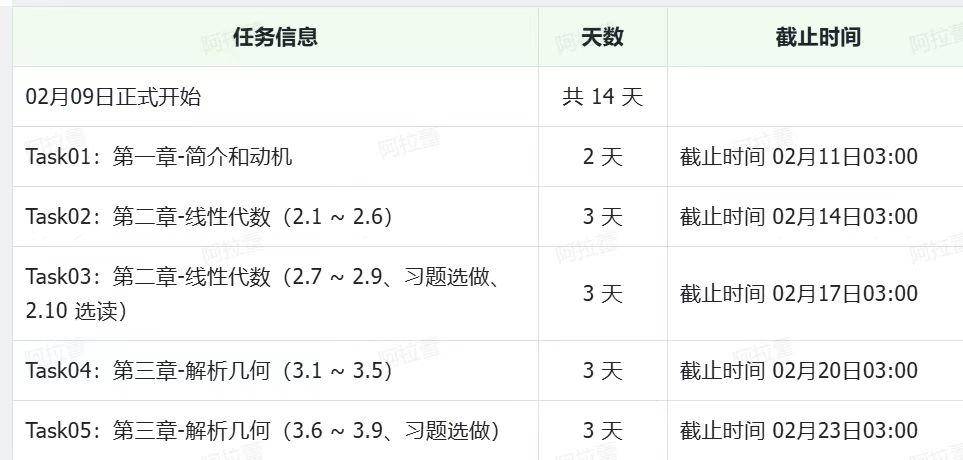

# 面向机器学习的数学

## 学习要求

1. 教程地址：https://datawhalechina.github.io/math-for-ai/#/                             

2. 打卡地址：https://datawhaler.feishu.cn/share/base/form/shrcnB7Q1rFArVEk1Wli5QeIlrE

## 学习计划

## 学习内容

### [第 1 章 简介与动机](./chapter-01/index.md)
