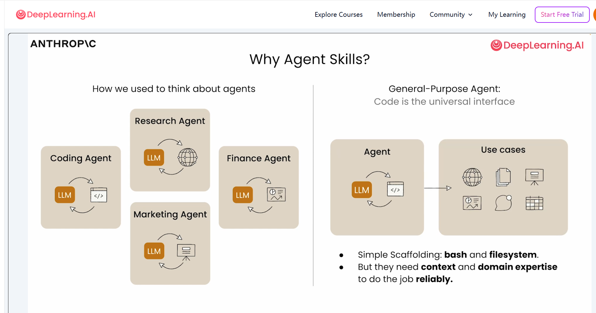
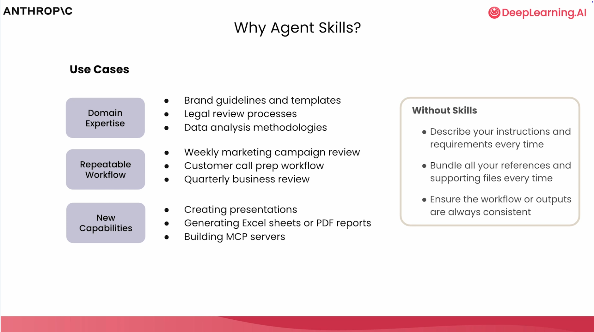
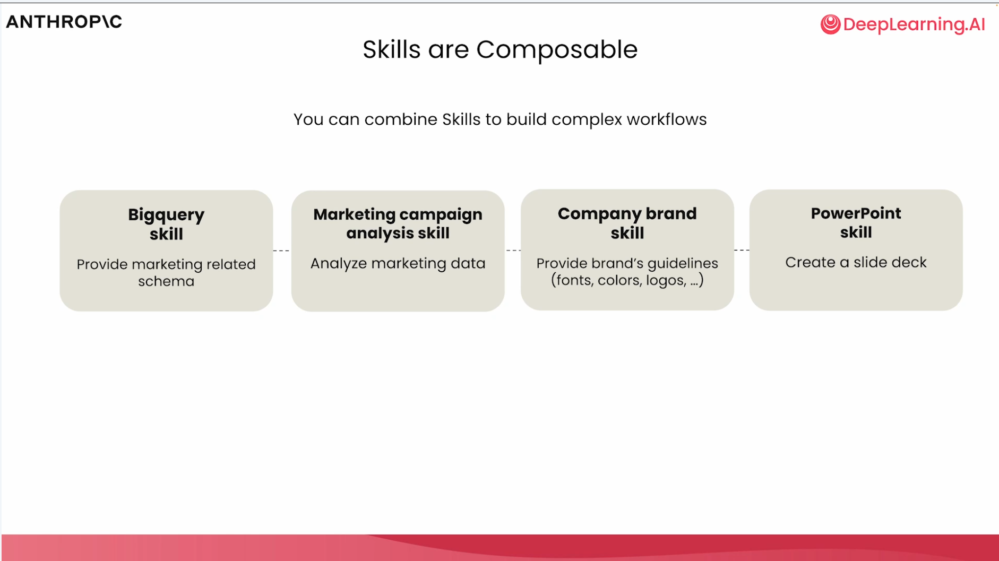
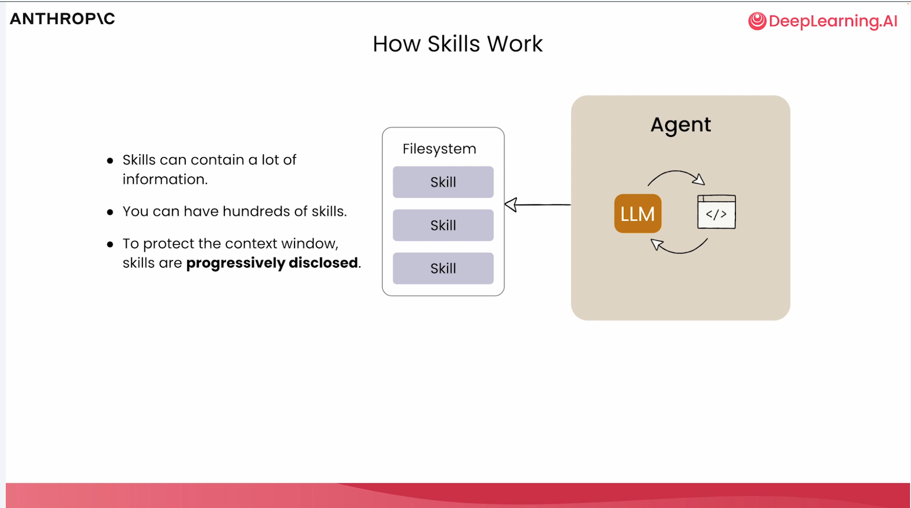
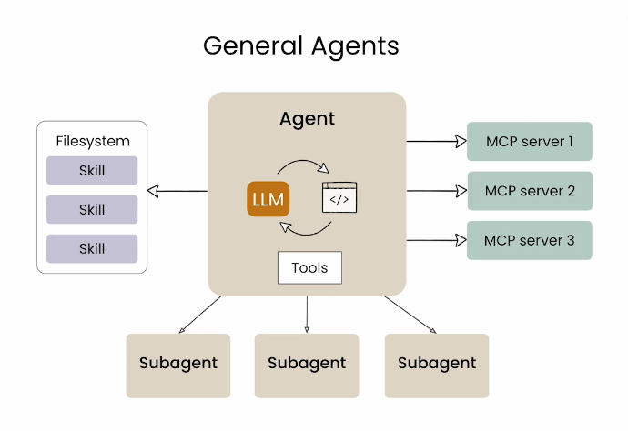
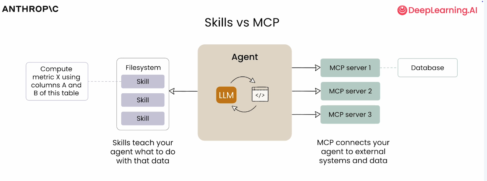
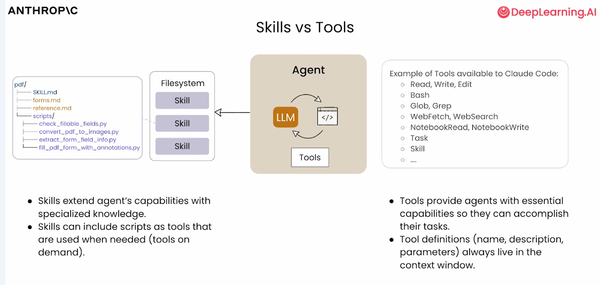
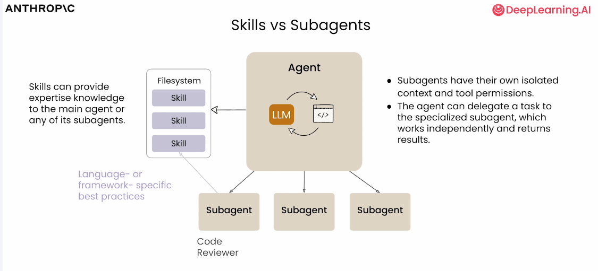
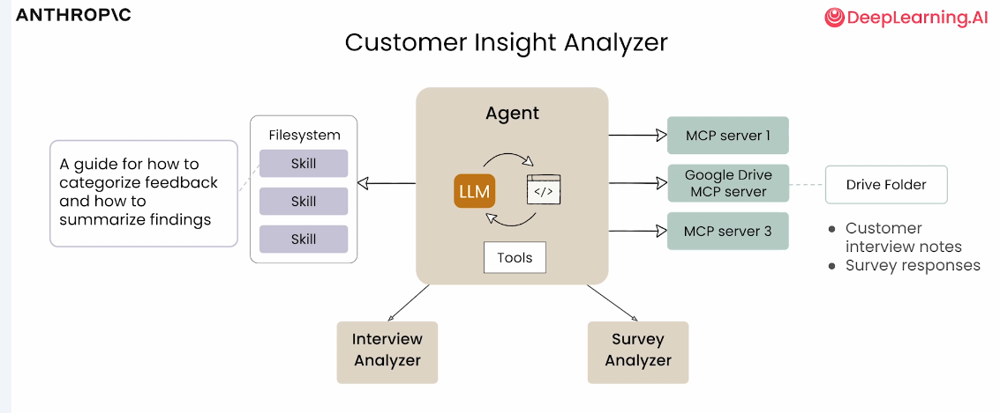

# agent-skills-with-anthropic 学习笔记

学习时间：2026-02-28

## 概览

### 学习目标 

1. 理解Skills的工作原理
2. 掌握Skills的使用
3. 构建适用于不同场景的Skills（包括编程、研究、数据分析等）

### 学习内容
1. Claude AI 入门
    - 结合预建的Excel和PowerPoint技能创建一个营销活动
2. 内容创建和数据分析工作流
    - 创建两个技能，并使用Claude API进行测试
3. Claude Code 代码审查
    - 使用技能进行代码审查
4. 研究智能体构建
    - 使用Claude Agent SDK构建研究智能体
    - 使用技能整合研究结果

## 1. 简介

### 1.1 什么是Agent Skills？

定义：Agent Skills 是一种扩展智能体能力的模块化指令集合。

核心结构： 一个 Skill 本质上是一个包含 SKILL.md 文件的文件夹。该文件包括元数据（至少有 name 和 description）以及告诉 Agent 如何执行特定任务的指令。还可以捆绑脚本、模板和参考资料。

```
my-skill/
├── SKILL.md          # 必需：指令 + 元数据
├── scripts/          # 可选：可执行代码
├── references/       # 可选：文档
└── assets/           # 可选：模板、资源
```

### 1.2 使用Skills所需的工具

智能体需要以下基本工具集来使用Skills:
- 文件系统访问：读取和写入文件
- Bash工具：执行代码

这些工具使智能体能够执行Skills所需的任何命令。

### 1.3 Skills的组合使用

| 组合方式          | 说明                                                                         |
| ----------------- | ---------------------------------------------------------------------------- |
| Skills + MCP      | 使用 MCP 从外部源获取数据，然后依靠技能来处理数据或高效检索数据              |
| Skills + SubAgent | 将任务委托给具有隔离上下文的子智能体，子智能体本身也可以使用技能获取专业知识 |

### 1.4 何时使用Skills?

当我们有一个反复要求智能体实现的工作流时，与其每次都解释相同的工作流，不如将其打包成一个技能，让智能体自动知道该做什么。

## 2. 为什么使用Skills：Skills的意义

### 2.1 Skills是什么

- 是一种轻量、开放的格式，用于扩展AI Agent的能力
- 一个组织好的文件夹，有以下部分组成
  - 指令
  - 脚本
  - 资产与资源

### 2.2 在哪里使用Skills

#### 2.2.1 使用场景

- 领域专业知识 | Domain Expertise
    - 品牌规范与模板 | Brand guidelines and templates
    - 法务审核流程 | Legal review processes
    - 数据分析方法论 | Data analysis methodologies
- 可重复的工作流程 | Repeatable Workflow
    - 每周营销活动复盘 | Weekly marketing campaign review
    - 客户电话准备流程 | Customer call prep workflow
    - 季度业务复盘 | Quarterly business review
- 新能力 | New Capabilities
    - 制作演示文稿 | Creating presentations
    - 生成 Excel 表或 PDF 报告 | Generating Excel sheets or PDF reports
    - 搭建 MCP 服务器 | Building MCP servers

#### 2.2.2 没有Skills会怎样

- 每次都要重新描述指令与需求
- 每次都要重新打包参考资料与支持文件
- 难以保证流程或产出始终一致

### 2.3 理论框架

#### 2.3.1 渐进式披露 - YAML + md + 元数据|指令|资源

- YAML 前置数据
  - 名称 | name
  - 描述 | description
- Markdown正文
  - 输入
  - 漏斗指标（按渠道）
  - 效率指标（按渠道）
  - 输出表格
  - 预算重新分配
- 元数据：总是加载
- 指令：触发时加载
- 资源：按需加载

### 2.4 Excel Skills 实践分析

Skills 是 AI Agent 系统实现复杂自动化与专业化任务的核心单元。

结合实际案例，我们来看如何搭建和实现 Excel 相关的 Skills。

#### 2.4.1 目录结构

以 "分析营销活动" 为例，Skill目录结构如下：

```
analyzing-marketing-campaign/
├── SKILL.md
└── references/
    └── budget_relocation_rules.md
```

- `SKILL.md`: 主说明文档，描述Skill用途、输入输出、核心流程
- `references/`: 存放参考规则、模板、辅助文档等

#### 2.4.2 SKILL.md内容与YAML元数据

SKILL.md 通常包含 YAML Frontmatter（元数据区块），以及详细的任务描述、输入输出格式、核心指标和操作流程。例如：

``` md
---
name: analyzing-marketing-campaign
description: 分析多渠道数字营销数据，计算转化漏斗、效率指标，并给出预算调整建议。
input:
    - file: Excel/CSV，包含Date, Campaign_Name, Channel, Impressions, Clicks, Conversions, Spend, Revenue, Orders等字段
output:
    - Markdown/Excel表格，含各项指标与建议
---

## 任务流程
1. 读取Excel/CSV数据。
2. 计算各渠道CTR（点击率）、CVR（转化率）。
3. 计算ROAS（广告回报率）、CPA（获客成本）、净利润等效率指标。
4. 输出对比表格，生成分析解读与预算建议。

## 公式示例
- CTR% = Clicks / Impressions * 100
- CVR% = Conversions / Clicks * 100
- ROAS = Revenue / Spend
- CPA = Spend / Conversions
- Net Profit = Revenue - (Spend + 其他成本)
```

#### 2.4.3 Excel Skills 的实现与案例

1. 常见Excel自动化任务
    - 数据汇总与设计
    - 条件格式化
    - 多表合并
    - 批量文件生成
    - 数据过滤、排序与导出
2. Excel Skill 实现的技术路线
   1. 工具选择
      - pandas：适合批量数据处理、分析、导出
      - openpyxl：适合复杂格式、公式、Excel特性操作
   2. 工作流程
      1. 选择工具：根据需求选择 pandas 或 openpyxl
      2. 创建/加载文件：新建或读取工作簿
      3. 数据处理：增删改查、公式、格式化
      4. 保存文件：写回 Excel
      5. 公式重算：如涉及公式，需用 recalc.py 脚本进行重算（openpyxl 仅写入公式字符串，不计算结果）
      6. 错误校验与修复：Skill 应返回 JSON 报告所有错误类型和位置，便于二次修正
3. Skill文件夹完整结构
    ``` md
    excel-skill/
    ├── SKILL.md
    ├── scripts/
    │   ├── process_data.py
    │   ├── recalc.py
    ├── references/
    │   ├── example_input.xlsx
    │   ├── output_template.xlsx
    │   └── rules.md
    ```
    - `scripts/`: 存放数据处理、公式重算等 Python 脚本
    - `references`: 输入样例、输出模板、规则文档
    - `SKILL.md`: 说明 Skill 用途、输入输出、流程与注意事项
4. 实践建议与最佳实践
    - 明确 Skill 的输入输出标准，示例文件放在 references 目录
    - 所有脚本应该有异常处理与错误报告能力，便于 Agent 自动修复
    - 复杂逻辑建议分模块实现，主流程在 SKILL.md 中清晰描述
    - Excel 公式相关操作建议分离脚本处理，避免直接在 openpyxl 中计算
    - 尽量输出中间结果与最终数据，便于人工或 Agent 二次校验

### 2.5 总结

Skills 为 AI Agent 提供了专业化、标准化、可复用的能力扩展载体，极大提升了自动化办公与复杂数据处理的效率。

Excel Skill 作为典型案例，通过 SKILL.md 元数据、脚本与参考文件的组合，实现了从数据读取、处理、输出到结果校验的自动化全流程。未来，随着 Skill 生态丰富，AI Agent 将能像积木一样组合各种能力，满足更多元的业务需求。

## 3. 为什么使用Skills：从Agent角度思考Skills

### 3.1 为什么要使用 Agent + Skill 模式



- 结合过去对Agent的理解
  - 编码 Agent | Coding Agent
  - 研究 Agent | Research Agent
  - 营销 Agent | Marketing Agent
  - 金融 Agent | Finance Agent
  - 通用型 Agent：代码是通用接口 | General-Purpose Agent: Code is the universal interface

### 3.2 Skills作为Agent的武器

我们可以把Skills作为Agent的武器，从Agent的功能思考Skill的方向

#### 3.2.1 简单脚手架

- bash: 命令行执行能力
- filesystem: 文件系统操作能力

#### 3.2.2 稳定可靠地完成工作

要稳定可靠地完成工作，还需要：
- 上下文(Context): 理解任务背景和环境
- 领域专业知识(Domain Expertise): 特定领域的专业知识和经验



### 3.3 从Agent的功能思考Skill方向

| Agent类型  | 核心能力             | 对应Skill方向                |
| ---------- | -------------------- | ---------------------------- |
| 编码 Agent | 代码理解、生成、调试 | 代码规范、框架文档、调试流程 |
| 研究 Agent | 信息检索、分析、综合 | 搜索策略、资料筛选、论文分析 |
| 营销 Agent | 内容创作、数据分析   | 品牌规范、营销模板、指标分析 |
| 金融 Agent | 数据处理、风险评估   | 财务规则、合规要求、风险模型 |

### 3.4 总结

Skills 是 Agent 能力的扩展载体。通过将专业知识、工作流程和可重复操作封装为 Skills，Agent 能够：
1. 突破原生限制：获得代码执行之外的专业能力
2. 保证输出一致性：通过标准化流程确保结果稳定
3. 提升效率：避免每次重复扫描相同的需求和上下文



从 Agent 的角度思考 Skills，本质上是思考：Agent需要什么样的“武器”来完成特定任务？



## 4. Skill vs MCP, Tools, SubAgents

本节课将讲解如何使用 Skills（技能） 与 Tools（工具）、MCP 和 Subagents（子代理） 结合使用，创建强大的智能工作流。将逐一介绍每个组件，了解它们如何协同工作，以及学习何时使用什么。

### 4.1 智能体生态系统概览

在智能体生态系统中，各种技术如 MCP、Skills、Tools 和 Subagents 共同协作：
- MCP服务器：提供所需的上下文
- SubAgents：用于多线程和并行处理
- Skills：用于可重复的主线程工作流



### 4.2 Skills vs MCP（模型上下文协议）

| 对比维度     | MCP                        | Skills                    |
| ------------ | -------------------------- | ------------------------- |
| **核心功能** | 连接智能体与外部系统和数据 | 定义可重复的工作流        |
| **数据来源** | 外部数据库等               | 利用 MCP 提供的工具和数据 |
| **使用场景** | 获取模型不知道的外部数据   | 教智能体如何处理这些数据  |

- MCP 就像带来所有底层工具和资源的连接器
- Skills 就像使用这些工具构建特定工作流的可重复流程

当利用外部数据计算指标、研究和计算数据时，所有底层工具和资源都可以通过 MCP 服务器外部提供



### 4.3 Skill vs Tools

想象你有一些**工具**：锤子、锯子和钉子。

#### 4.3.1 区别

| Tools（工具）                    | Skills（技能）                       |
| -------------------------------- | ------------------------------------ |
| 提供访问文件系统的方式           | 扩展智能体的能力，提供专业知识和指令 |
| 提供底层能力来生成、读取技能     | 引入需要执行的额外文件和脚本         |
| 支持文件编辑、执行代码、加载技能 | 创建可预测的工作流                   |

#### 4.3.2 重要特性

- **工具定义**（名称、描述、参数）始终存在于上下文窗口中
- **技能**是渐进式加载的，只在需要时加载
- 如果某个工具不是每次对话都需要，通过仅在需要时加载可以节省大量 token



### 4.4 Skills vs SubAgents

Subagent是一种为执行单一、明确定义的任务而专门构建的特化AI Agent。它并非孤立工作，而是通常在一个Orchestrator（编排器）的协调下，与其他Subagent协同完成复杂的用户请求。

Subagents在多智能体系统中扮演着重要角色，它们通过专业化分工、独立上下文、可定制性和多种交互模式，提升了开发效率和代码质量

#### 4.4.1 SubAgents的工作方式

主智能体可以生成或创建**Subagents**，子代理可以向父智能体报告。这些子代理可以通过以下方式创建：
- Claude Code
- Agent SDK
- 自定义实现

#### 4.4.2 SubAgents的价值

| 特性           | 说明                         |
| -------------- | ---------------------------- |
| **隔离上下文** | 提供独立的上下文环境         |
| **有限权限**   | 限制工具使用权限             |
| **技能访问**   | 每个子代理可以访问特定的技能 |

#### 4.4.3 SubAgents的应用场景

主智能体可以作为**编排器**，利用所需的技能。子代理可以实现相同理念，使用特定技能。

**示例**：一个专门的代码审查子代理，其唯一任务是分析和审查代码库，并利用技能来指定你、你的团队或公司如何进行代码审查。



### 4.5 综合示例：客户洞察分析器



**Agent 是整个架构的大脑与指挥中心**，LLM 作为推理引擎，能够理解复杂指令、进行多步思考和决策规划；同时配备代码执行环境，支持动态调用工具和执行脚本。Agent 的主要职责是接收高层任务目标，将其拆解为可执行的子任务，协调下方的 Interview Analyzer 和 Survey Analyzer 两个子分析器并行工作，最后整合各分析器的输出结果，生成统一、结构化的客户洞察报告。Agent 还负责管理与多个 MCP 服务器的通信，确保数据流的顺畅传输。

**Interview Analyzer & Survey Analyzer 是 Agent 的执行手臂**；Interview Analyzer 专注于处理非结构化的客户访谈记录，运用自然语言理解技术提取关键观点、情感倾向和深层需求；Survey Analyzer 则针对结构化的问卷数据进行统计分析、模式识别和趋势归纳。这两个工具相互独立又可并行运行，各自接收 Agent 分配的任务后，调用 Filesystem 中的 Skills 和 LLM 能力进行深度处理，最终将结构化分析结果返回给 Agent 进行汇总。这种分工设计使得系统能够高效处理不同类型的数据源，同时保持模块化的可扩展性。

**Filesystem 与 Skills 层构成了系统的能力基础设施**；Filesystem 作为技能容器，封装了多个可复用的 Skill 模块，这些 Skill 是经过抽象的业务能力单元。左侧的指导文档（"A guide for how to categorize feedback and how to summarize findings"）作为元指令（Meta-prompt），定义了系统处理数据的标准方法论——包括分类维度、总结框架和质量标准。实现了"知识即配置"的理念：通过修改指导文档即可调整系统行为，无需改动底层代码，Skills 层向下为分析器提供标准化工具支持，向上为 Agent 提供可编排的能力单元，确保分析过程的一致性和可维护性。

MCP 服务器层是系统的外部连接关键，这一层包含三个 MCP 服务器：通用型的 MCP server 1 和 MCP server 3，以及专门对接云存储的 Google Drive MCP server，Agent 能够以统一的方式调用不同服务商的 API，无需关心底层接口差异；

#### 4.5.1 工作原理

```
主智能体（配备工具）
    ↓
通过 MCP 服务器获取工具
    ↓
分派子代理分析客户
    ↓
并行分析客户访谈和调查
    ↓
使用 Skills 进行可预测的分析
```

#### 4.5.2 各组件作用

| 组件       | 作用                                       |
| ---------- | ------------------------------------------ |
| **MCP**    | 外部引入数据                               |
| **子代理** | 并行化执行，在独立线程和上下文中运行       |
| **Skills** | 以可预测、可重复、可移植的方式消费所有信息 |

### 4.6 AI 生态系统组件对比

| 组件                    | 定义                           | 特点                   |
| ----------------------- | ------------------------------ | ---------------------- |
| **Prompts（提示词）**   | 与模型通信的最原子单位         | 基础但不易扩展         |
| **Skills（技能）**      | 通过代码和资源打包提示词和对话 | 可预测、可重复、可移植 |
| **Subagents（子代理）** | 被委派任务的独立智能体         | 可复用技能，隔离上下文 |
| **MCP**                 | 定义子代理使用的工具           | 按需加载必要数据       |

## 5. Exploring Pre-Built Skills 预设Skills探索

### 5.1 官方入口

1. [总仓库](https://github.com/anthropics/skills)
2. [机制说明](https://claude.com/blog/skills-explained)

### 5.2 Office 文档类 Skills （四件套）
- [xlsx](https://github.com/anthropics/skills/tree/main/skills/xlsx)
- [docx](https://github.com/anthropics/skills/tree/main/skills/docx)
- [pdf](https://github.com/anthropics/skills/tree/main/skills/pdf)
- [pptx](https://github.com/anthropics/skills/tree/main/skills/pptx)

### 5.3 重点看的代码路径（skill-creator）

- `skills/skill-creator/scripts/`
  - 这块通常是“把一个 skill 从模板/配置变成可运行产物”的流水线入口。
  - 建议优先读的内容
    - **入口脚本**：从哪里开始执行（通常会有一个主脚本/命令行入口）
    - **配置读取**：skill 的描述、参数、依赖、元信息是怎么被解析的
    - **产物生成**：最终生成了哪些文件，目录结构是什么
    - **打包/发布**：是 zip 还是某种 manifest，如何对接到 Desktop 端
  - 我们可以带着三个问题去看：
    1. “我改了 prompt 或配置，哪些文件会变？”
    2. “更新动作的最小输入是什么（哪些字段必填）？”
    3. “失败时能从哪里定位（日志/报错点/中间产物）？”

## 参考资源

1. [datawhale/agent-skills-with-anthrop](https://github.com/datawhalechina/agent-skills-with-anthropic)
2. [Anthropics Skills](https://github.com/anthropics/skills)
3. [Agent Skills](https://agentskills.io)