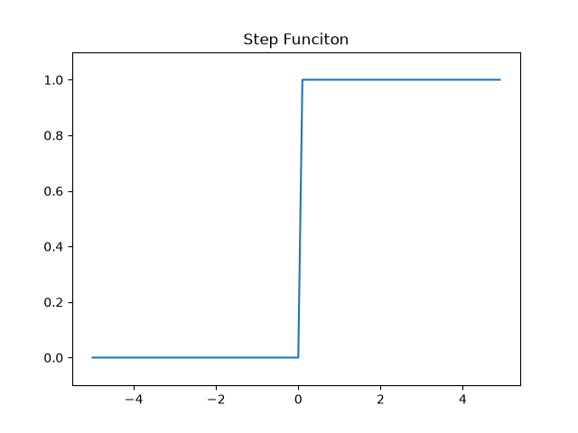
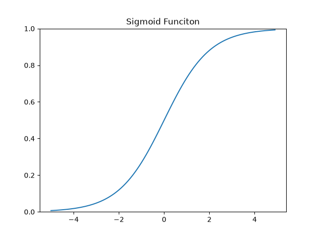
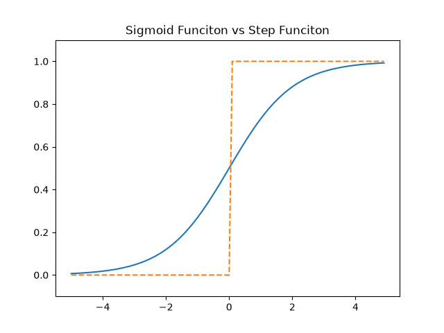
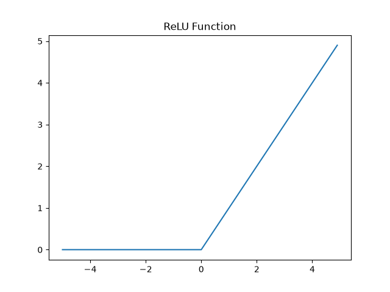

# 第 3 章 神经网络

感知机的权重和偏置都是我们自己计算出来的，如果解决更复杂的问题时，计算权重和偏置参数将是非常复杂的问题。神经网络会自动计算权重和偏置。

神经网络的一个重要性质是它可以自动地从数据中学习到合适的权重参数。

## 3.1 从感知机到神经网络

### 3.1.1 神经网络的例子

神经网络是一种分层、全连接的网状结构的算法。一个简单的神经网络至少具备输入层、隐藏层和输出层。一般我们是根据实际拥有权重和偏置参数的层数作为神经网络的层数（输入层、隐藏层和输出层的数量减1之后的数量）。

### 3.1.2 复习感知机

$$
y=\left\{
\begin{aligned}
0\qquad(b+w_1x_1+w_2x_2 \leq 0)\\
1\qquad(b+w_1x_1+w_2x_2 > 0)
\end{aligned}
\right.
$$

$b$是被称为偏置的参数，用于控制神经元被激活的容易程度；$w_1$和$w_2$表示各个信号的权重的参数，用于控制各个信号的重要性。

我们可以将偏执看做输入数据值为1对应的权重。

$$
y=h(b+w_1x_1+w_2x_2)
$$

输入信号的总和会被函数$h(x)$转换，转换后的值就是输出y。

$$
h(x)=\left\{
\begin{aligned}
0 \qquad (x \leq 0)\\
1 \qquad (x > 0)
\end{aligned}
\right.
$$

### 3.1.3 激活函数登场

上面介绍的函数 $h(x)$ 将输入信号的总和转换为输出信号，这种函数一般称为**激活函数**。激活函数的作用在于如何激活输入信号的总和。

激活函数是链接感知机和神经网络的桥梁。

## 3.2 激活函数

$$
h(x)=\left\{
\begin{aligned}
0 \qquad (x \leq 0)\\
1 \qquad (x > 0)
\end{aligned}
\right.
$$

形如上面这种以0为阈值，大于0的输出1，小于等于0的输出0，这种函数称为“阶跃函数”。因此可以说感知机中是使用阶跃函数作为激活函数。实际上，如果将激活函数换成其他函数，就可以进入神经网络的世界了。

接下来介绍神经网络的激活函数。

### 3.2.1 sigmoid 函数

$$
h(x) = \frac{1}{1+exp(-x)}
$$

上面的函数就是 sigmoid 函数。

神经网络中用 sigmoid 函数作为激活函数，进行信号的转换，转换后的信号被传送到下一个神经元。实际上，感知机和神经网络的主要区别就在于这个激活函数。其他地方基本上和感知机是一样的。

### 3.2.2 阶跃函数的实现

```py
# 阶跃函数
def step_function(x):
    if x > 0:
        return 1
    else:
        return 0
```

这个版本的实现简单、易于理解，但是参数x只能接受实数（浮点数）。为了扩展支持 NumPy 数组，我们做如下实现，其中用到了一些 NumPy 的技巧：

```py
def step_funciton(x: np.array):
    # 将数值型数组转换成 True / False 的数组
    y = x > 0
    # 再将布尔值类型的数值转换成0\1数组
    return y.astype(np.int)
```

下面我们来学习上面用到的 NumPy “魔法”：

```py
import numpy as np

if __name__ == "__main__":
    x = np.array([-1.0, 1.0, 2.0])
    # [-1.  1.  2.]
    print(x)
    # 通过布尔运算，将数值型数组转换成布尔型数组
    y = x > 0
    print(y)
    # [False  True  True]
    y = y.astype(np.int32)
    print(y)
    # [0 1 1]
```

### 3.2.3 阶跃函数的图形

```py
def plot_step_function(x: np.array):
    y = step_funciton(x)
    plt.plot(x, y)
    plt.ylim(-0.1, 1.1)
    plt.show()

if __name__ == "__main__":
    x = np.arange(-5.0, 5.0, 0.1)
    plot_step_function(x)
```



### 3.2.4 sigmoid 函数的实现

```py
def sigmoid(x: np.array):
    """
    sigmoid 激活函数
    """
    return 1 / (1 + np.exp(-x))
```

绘制 sigmoid 的图像：

```py
import numpy as np
from activation_funciton import plot_sigmoid

if __name__ == "__main__":
    x = np.arange(-5.0, 5.0, 0.1)
    plot_sigmoid(x)
```



### 3.2.5 sigmoid函数和阶跃函数的比较

```py
import matplotlib.pyplot as plt
import numpy as np
from activation_funciton import sigmoid, step_funciton

if __name__ == "__main__":
    x = np.arange(-5.0, 5.0, 0.1)
    y1 = sigmoid(x)
    y2 = step_funciton(x)
    plt.ylim(-0.1, 1.1)
    plt.title("Sigmoid Funciton vs Step Funciton")
    plt.plot(x, y1)
    plt.plot(x, y2, linestyle="--")
    plt.show()
```



不同点：

1. sigmoid 是一条平滑的曲线，输出随着输入发生连续性的变化，而阶跃函数以0为边界，输出发生急剧性的变化。
2. 阶跃函数只能返回0和1，sigmoid函数返回0~1之间的实数。如果说感知机中神经元之间流动的是0或1的二元信号，那么神经网络中流动的就是连续的实数值信号。阶跃函数类似“竹筒敲石”，sigmoid类似“水车”。

相同点：

1. 两者输出范围相近，sigmoid为$(0, 1)$，阶跃函数为 $0$ 或 $1$，两者不管输入有多大或多小，总能收敛到0到1之间。
2. 都属于非线性函数，sigmoid是一条曲线，阶跃函数是一条折线。

### 3.2.6 非线性函数

神经网络的激活函数必须使用非线性函数。因为使用线性函数，就失去了层叠的效果了。

例如，激活函数为$f(x)=cx$，其中 $c$ 为常数，那么在叠加三层神经网络之后的输出结果为 $f(x)=c^3x$，其中 $c^3$ 仍然是一个常数。所以使用线性函数作为激活函数无法发挥多层网络带来的优势。

### 3.2.7 ReLU 函数

sigmoid 函数作为早期神经网络的激活函数使用，现代神经网络的激活函数多用 ReLU 函数。ReLU函数的数学表达式如下：

$$
f(x)=\left\{
    \begin{aligned}
        0\qquad (x \leq 0)\\
        x\qquad (x > 0)
    \end{aligned}
\right.
$$

代码实现如下：

```py
def ReLU(x: np.array):
    """
    ReLU 激活函数
    """
    y = x.copy()
    mask = y <= 0
    y[mask] = 0
    return y
```

绘制 ReLU 函数的图像：

```py
import numpy as np
def plot_relu(x: np.array):
    y = ReLU(x)
    plt.title("ReLU Function")
    plt.plot(x, y)
    plt.show()

if __name__ == "__main__":
    x = np.arange(-5.0, 5.0, 0.1)
    plot_relu(x)
```



## 3.3 多维数组的运算

掌握 NumPy 多维数组运算，可以高效地实现神经网络。

### 3.3.1 多维数组

```py
if __name__ == "__main__":
    x = np.arange(1, 5, 1.0)
    print(x)
    # 输出 x 的维度
    print(x.ndim)
    # 1
    # 输出 x 的形状
    print(x.shape)
    # (4,)
```

```py
if __name__ == "__main__":
    A = np.arange(1, 7, 1.0)
    B = A.reshape(2, 3)
    print(B)
    # [[1. 2. 3.]
    # [4. 5. 6.]]
    # 输出 B 的维度
    print(n.ndim(B))
    # 2
    # 输出 B 的形状
    print(B.shape)
    # (2, 3)
```

### 3.3.2 矩阵乘法

将第一个矩阵的行与第二个矩阵的列中对应索引的元素依次相乘求和，作为输出元素的值，输出元素的位置以第一个矩阵的行和第二个矩阵的列作为目标元素的索引。这就要求第一个矩阵的行元素个数必须与第二个矩阵列元素个数相同，否则会出现两个数组相乘时，对应索引元素不存在导致乘法运算失败的问题。

以下演示矩阵乘法：

```py
import numpy as np

if __name__ == "__main__":
    A = np.arange(1, 5, 1.0).reshape(2, 2)
    print(A)
    # [[1. 2.]
    # [3. 4.]]
    B = np.arange(5, 9, 1.0).reshape(2, 2)
    print(B)
    # [[5. 6.]
    # [7. 8.]]
    result = np.dot(A, B)
    print(result)
    # [[19. 22.]
    # [43. 50.]]
```

其中输出结果索引为 $[0, 0]$ 位置的元素计算方式：取第一个矩阵的第 $0$ 行，取第二个矩阵的第 $0$ 列，将对应索引元素依次相乘再求和，$1 * 5 + 2 * 7 = 19$。后面的计算依次类推。

我们再看一个形状不同的两个矩阵乘法运算的例子：

```py
import numpy as np

if __name__ == "__main__":
    A = np.arange(1, 7, 1.0).reshape(2, 3)
    print(A)
    # [[1. 2. 3.]
    # [4. 5. 6.]]
    B = np.arange(1, 7, 1.0).reshape(3, 2)
    print(B)
    # [[1. 2.]
    # [3. 4.]
    # [5. 6.]]
    result = np.dot(A, B)
    print(result)
    # [[22. 28.]
    # [49. 64.]]
```

### 3.3.3 神经网络的内积

下面我们运用矩阵内积运算计算神经网络的输出，此处以单层计算为例：

```py
import numpy as np

if __name__ == "__main__":
    # 输入数据
    x = np.array([1.0, 2.0])
    # 权重参数
    w = np.array([[1, 3, 5], [2, 4, 6]])
    # 神经网络的内积运算
    result = np.dot(x, w)
    print(result)
    # [ 5. 11. 17.]
```

借助 NumPy 的 $dot$ 方法，我们能快速实现多维数组的内积运算。

### 3.4 3 层神经网络的实现

接下来我们进行神经网络的实现。

### 3.4.1 符号确认

### 3.4.2 各层间信号传递的实现

首先我们来模拟第一层的计算过程：

```py
import numpy as np
from activation_funciton import sigmoid

if __name__ == "__main__":
    # 输入数据
    x = np.array([1.0, 0.5])
    # 第一层的权重参数
    w1 = np.array([[0.1, 0.3, 0.5], [0.2, 0.4, 0.6]])
    # 第一层的偏置参数
    b1 = np.array([0.1, 0.2, 0.3])
    # 第一层的计算
    a1 = np.dot(x, w1) + b1
    print(a1)
    # [0.3 0.7 1.1]
    # 在将上一层的计算结果传入下一层之前需要经过激活函数进行转换
    z1 = sigmoid(a1)
    print(z1)
    # [0.57444252 0.66818777 0.75026011]
```

接下来我们来模拟第二层的计算过程：

```py
import numpy as np
from activation_funciton import sigmoid

if __name__ == "__main__":
    # 输入数据，1行2列
    x = np.array([1.0, 0.5])
    # 第一层的权重参数，2行3列
    w1 = np.array([[0.1, 0.3, 0.5], [0.2, 0.4, 0.6]])
    # 第一层的偏置参数，1行3列
    b1 = np.array([0.1, 0.2, 0.3])
    # 第一层的计算结果，1行3列
    a1 = np.dot(x, w1) + b1
    print(a1)
    # [0.3 0.7 1.1]
    # 进行激活函数计算，不改变参数形状，还是1行3列
    z1 = sigmoid(a1)
    print(z1)
    # [0.57444252 0.66818777 0.75026011]

    # 第二层的权重，需要符合第一层的输出的形状，此处为 3行2列
    w2 = np.array([[0.1, 0.4], [0.2, 0.5], [0.3, 0.6]])
    # 第二层的偏置，需要满足第一层输出数据与权重乘积之后的形状，此处为 1行2列
    b2 = np.array([0.1, 0.2])
    # 第二层的计算
    a2 = np.dot(z1, w2) + b2
    print(a2)
    # [0.51615984 1.21402696]
    # 第二层的激活函数计算
    z2 = sigmoid(a2)
    print(z2)
    # [0.62624937 0.7710107 ]
```

最后，我们来模拟输出层的计算，输出层的计算与前两层的唯一区别，在于激活函数，输出层的激活函数需要依据场景采用不同的函数。对于回归问题，我们一般使用 identity 恒等函数，对于分类问题，我们一般采用 softmax 函数。我们先假设此处解决的是回归问题。

```py
def identify_function(x: np.array):
    return x
```

```py
import numpy as np
from activation_funciton import sigmoid, identify_function

if __name__ == "__main__":
    # 输入数据，1行2列
    x = np.array([1.0, 0.5])
    # 第一层的权重参数，2行3列
    w1 = np.array([[0.1, 0.3, 0.5], [0.2, 0.4, 0.6]])
    # 第一层的偏置参数，1行3列
    b1 = np.array([0.1, 0.2, 0.3])
    # 第一层的计算结果，1行3列
    a1 = np.dot(x, w1) + b1
    print(a1)
    # [0.3 0.7 1.1]
    # 进行激活函数计算，不改变参数形状，还是1行3列
    z1 = sigmoid(a1)
    print(z1)
    # [0.57444252 0.66818777 0.75026011]

    # 第二层的权重，需要符合第一层的输出的形状，此处为 3行2列
    w2 = np.array([[0.1, 0.4], [0.2, 0.5], [0.3, 0.6]])
    # 第二层的偏置，需要满足第一层输出数据与权重乘积之后的形状，此处为 1行2列
    b2 = np.array([0.1, 0.2])
    # 第二层的计算
    a2 = np.dot(z1, w2) + b2
    print(a2)
    # [0.51615984 1.21402696]
    # 第二层的激活函数计算
    z2 = sigmoid(a2)
    print(z2)
    # [0.62624937 0.7710107 ]

    # 第三层
    w3 = np.array([[0.1, 0.3], [0.2, 0.4]])
    b3 = np.array([0.1, 0.2])

    a3 = np.dot(z2, w3) + b3
    print(a3)
    # [0.31682708 0.69627909]
    z3 = identify_function(a3)
    print(z3)
    # [0.31682708 0.69627909]
```

### 3.4.3 代码实现小结

至此，我们已经模拟完了 3 层神经网络的计算过程。我们来将上述过程整理成一个更紧凑的逻辑。

```py
import numpy as np
from activation_funciton import identify_function, sigmoid


def init_network():
    """
    初始化神经网络的参数
    """
    network = {}
    # 第一层参数
    network["w1"] = np.array([[0.1, 0.3, 0.5], [0.2, 0.4, 0.6]])
    network["b1"] = np.array([0.1, 0.2, 0.3])
    # 第二层参数
    network["w2"] = np.array([[0.1, 0.4], [0.2, 0.5], [0.3, 0.6]])
    network["b2"] = np.array([0.1, 0.2])
    # 第三层参数
    network["w3"] = np.array([[0.1, 0.3], [0.2, 0.4]])
    network["b3"] = np.array([0.1, 0.2])

    return network


def forward(network, x):
    """
    神经网络的前向计算
    """
    w1, w2, w3 = network["w1"], network["w2"], network["w3"]
    b1, b2, b3 = network["b1"], network["b2"], network["b3"]
    a1 = np.dot(x, w1) + b1
    z1 = sigmoid(a1)
    a2 = np.dot(z1, w2) + b2
    z2 = sigmoid(a2)
    a3 = np.dot(z2, w3) + b3
    y = identify_function(a3)

    return y


if __name__ == "__main__":
    x = np.array([1.0, 0.5])
    network = init_network()
    y = forward(network, x)
    print(y)
    # [0.31682708 0.69627909]
```

## 3.5 输出层的设计

神经网络可以用在分类问题和回归问题上，不过要根据情况改变输出层的激活函数。一般而言，回归问题用恒等式，分类问题用 softmax 函数。

> 机器学习的问题大致可以分为分类问题和回归问题。分类问题是数据属于哪一个类别的问题。比如，区分图像中的人是男性还是女性的问题就是分类问题。而回归问题是根据某个输入预测一个(连续的)数值的问题。比如，根据一个人的图像预测这个人的体重的问题就是回归问题。

### 3.5.1 恒等函数和 softmax 函数

恒等函数会将输入按原样输出，对于输入的信息，不加以任何改动地直接输出。因此，在输出层使用恒等函数时，输入信号会原封不动地被输出。另外，将恒等函数的处理过程用之前的神经网络图来表示的话，和前面介绍的隐藏层的激活函数一样，恒等函数进行的转换处理可以用一根箭头来表示。

分类问题中使用的 softmax 函数可以用下面的式(3.10)表示。

$$
y_k = \frac{\exp({a_k})}{\sum_{i=1}^{n}\exp({a_i})}
$$

$\exp(x)$式表示 $e^x$的指数函数(e 是纳皮尔常数 2.7182...)。式(3.10)表示假设输出层共有$n$个神经元，计算第 $K$ 个神经元的输出$y_k$。如式(3.10)所示，softmax 函数的分子是输入信号$a_k$的指数函数，分母是所有输入信号的指数函数的和。

用图表示 softmax 函数的话，softmax 函数的输出通过箭头与所有的输入信号相连。这是因为，输出层的各个神经元都受到所有输入信号的影响。

现在我们来实现 softmax 函数。

```py
import numpy as np

a = np.array([0.3, 2.9, 4.0])
exp_a = np.exp(a)
print(exp_a)
sum_exp_a = np.sum(exp_a)
print(sum_exp_a)
y = exp_a / sum_exp_a
print(y)
```

考虑到后面还是使用 softmax 函数，这里我们把它定义成如下的 Python 函数：

```py
def softmax(a):
    exp_a = np.exp(a)
    sum_exp_a = np.sum(exp_a)
    return exp_a / sum_exp_a
```

### 3.5.2 实现 softmax 函数时的注意事项

上面的 softmax 函数的实现虽然正确描述了式(3.10)，但在计算机的运算上有一定的缺陷。这个缺陷就是溢出问题。softmax 函数的实现中要进行指数函数的运算，但是此时指数函数的值很容易变得非常大。比如，$e^{10}$的值会超过 20000，$e^{100}$会变成一个后面有 40 多个 0 的超大值， $e^{1000}$的结果会返回一个表示无穷大的 inf。如果在这些超大值之间进行除法运算，结果会出现“不确定”的情况。

> 计算机处理“数”时，数值必须在 4 字节或 8 字节的有限数据宽度内。这意味着数存在有效数位，也就是说，可以表示的数值范围是有限的。因此，会出现超大值无法表示的问题。这个问题成为溢出，在进行计算机的运算时必须注意。

softmax 函数的实现可以像式(3.11)这样进行改进。

$$
y_k = \frac{\exp(a_k)}{\sum_{i=1}^n\exp(a_i)}

=\frac{C\exp(a_k)}{C\sum_{i=1}^{n}exp(a_i)}

=\frac{\exp(a_k +logC)}{\sum_{i=1}^n\exp(a_k + logC)}

=\frac{\exp(a_k+C')}{\sum_{i=1}^n\exp(a_i + C')}
$$

首先，式(3.11)在分子和分母上都乘上 C 这个任意的常数(因为同时对分母和分子乘以相同的常数，所以计算结果不变)。然后，把这个 C 移动到指数函数 $\exp$中，记为 $logC$。最后，把 $logC$替换为另一个符号 $C'$。

式(3.11)说明，在进行 softmax 的指数函数的运算时，加上(或减去)某个常数并不会改变运算的结果。这里的 $C'$ 可以使用任何值，但是为了防止溢出，一般会使用输入信号中的最大值。我们来看一个具体的例子：

```py
a = np.array([1010, 1000, 990])
c = np.exp(a)/np.sum(np.exp(a))
#  RuntimeWarning: invalid value encountered in divide
#   c = np.exp(a)/np.sum(np.exp(a))
print(c)
# [nan nan nan]


a = np.array([1010, 1000, 990])
max_a = np.max(a)
c = np.exp(a-max_a)/np.sum(np.exp(a-max_a))
print(c)
# [9.99954600e-01 4.53978686e-05 2.06106005e-09]
```

如该例所示，通过减去输入信号中最大值，我们发现原本为 nan 的地方，现在被正确计算了。综上，我们可以像下面这样实现 softmax 函数。

```py
def softmax(x):
    c = np.max(x)   # 溢出对策
    exp_x = np.exp(x-c)
    return exp_x / np.sum(exp_x)
```

### 3.5.3 softmax 函数的特征

使用 softmax() 函数，可以按如下访视计算神经网络的输出。

```py
a = np.array([0.3, 2.9, 4.0])
y = softmax(a)
print(y)    # [0.01821127 0.24519181 0.73659691]
print(np.sum(y))    # 1.0
```

如上所示，softmax 函数的输出是 0.0 到 1.0 之间的实数。并且，softmax 函数的输出值的总和为 1.0 。输出总和为 1 是 softmax 函数的一个重要性质。正因为有了这个性质，我们才可以把 softmax 函数的输出解释为 “概率”。

比如，上面的例子可以解释成 y[0] 的概率为 0.018(1.8%)，y[1]的概率为 0.245(24.5%)，y[2]的概率为 0.737(73.7%)。从概率的结果来看，可以说“因为第二个元素的概率最高，所以答案是第二个类别”。而且，还可以回答“有 74%的概率是第 2 个类别，有 25%的概率是第 1 个类别，有 1%的概率是第 0 个类别”。也就是说，通过 softmax 函数，我们可以用概率的方法处理问题。

这里需要注意的事，即便使用了 softmax 函数，各个元素之间的大小关系也不会改变。这是因为指数函数 $y=exp(x)$ 是单调递增函数。实际上，上例中的 a 的各个元素的大小关系和 y 的各元素的大小关系并没有改变。比如，a 的最大值是第 2 个元素，y 的最大值也仍然是第 2 个元素。

一般而言，神经网络只把输出值最大的神经元所对应的类别作为识别结果。并且，即便使用 softmax 函数，输出值最大的神经元的位置也不会改变。因此，神经网络在进行分类时，输出层的 softmax 函数可以省略。在实际应用中，由于指数函数的运算需要颐堤港的计算机运算量，因此输出层的 softmax 函数一般会被省略。

> 求解机器学习问题的步骤可以分为“学习”和“推理”两个阶段。首先，在学习阶段进行模型的学习，然后，在推理阶段，用学到的模型对未知的数据进行推理(分类)。如前所述，推理阶段一般会省略输出层的 softmax 函数。在输出层使用 softmax 函数是因为它和神经网络的学习有关系。

### 3.5.4 输出层的神经元数量

输出层的神经元数量需要根据待解决的问题来决定。对于分类问题，输出层的神经元数量一般设定为类别的数量。比如，对于某个输入图像，预测是图中的数字 0 到 9 中的哪一个的问题，可以将输出层的神经元设定为 10 个。

## 3.6 手写数字识别
