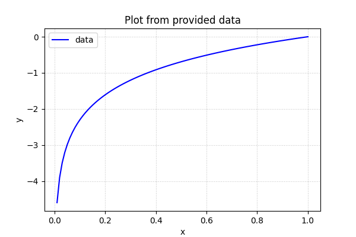

# 第 4 章 神经网络的学习

本章的主题是神经网络的学习。这里所说的“学习”是指从训练数据中自动获取最优权重参数的过程。本章中，为了使神经网络能进行学习，将引入损失函数这一指标。而学习的目的就是以该损失函数为基准，找出能使它的值达到最小的权重参数。为了找出尽可能小的损失函数的值，本章我们将介绍利用了函数斜率的梯度法。

## 4.1 从数据中学习

神经网络的特征就是可以从数据中学习。所谓“从数据中学习”​，是指可以由数据自动决定权重参数的值。这是非常了不起的事情！因为如果所有的参数都需要人工决定的话，工作量就太大了。在实际的神经网络中，参数的数量成千上万，在层数更深的深度学习中，参数的数量甚至可以上亿，想要人工决定这些参数的值是不可能的。本章将介绍神经网络的学习，即利用数据决定参数值的方法，并用 Python 实现对 MNIST 手写数字数据集的学习。

### 4.1.1 数据驱动

数据是机器学习的命根子。从数据中寻找答案、从数据中发现模式、根据数据讲故事……这些机器学习所做的事情，如果没有数据的话，就无从谈起。因此，数据是机器学习的核心。这种数据驱动的方法，也可以说脱离了过往以人为中心的方法。

通常要解决某个问题，特别是需要发现某种模式时，人们一般会综合考虑各种因素后再给出回答。​“这个问题好像有这样的规律性？​”​“不对，可能原因在别的地方。​”——类似这样，人们以自己的经验和直觉为线索，通过反复试验推进工作。而机器学习的方法则极力避免人为介入，尝试从收集到的数据中发现答案（模式）​。神经网络或深度学习则比以往的机器学习方法更能避免人为介入。

深度学习有时也称为端到端机器学习(end-to-end machine learning)。这里所说的端到端是指从一端到另一端的意思，也就是从原始数据（输入）中获得目标结果（输出）的意思。

接下来我们将尝试设计算法实现识别手写数字识别来学习深度学习中**学习**的过程。

### 4.1.2 训练数据和测试数据

机器学习中，一般将数据分为训练数据和测试数据两部分来进行学习和实验等。首先，使用训练数据进行学习，寻找最优的参数；然后，使用测试数据评价训练得到的模型的实际能力。为什么需要将数据分为训练数据和测试数据呢？因为我们追求的是模型的**泛化能力**。为了正确评价模型的泛化能力，就必须划分训练数据和测试数据。另外，训练数据也可以称为**监督数据**。

泛化能力是指处理未被观察过的数据（不包含在训练数据中的数据）的能力。获得泛化能力是机器学习的最终目标。比如，在识别手写数字的问题中，泛化能力可能会被用在自动读取明信片的邮政编码的系统上。此时，手写数字识别就必须具备较高的识别“某个人”写的字的能力。注意这里不是“特定的某个人写的特定的文字”​，而是“任意一个人写的任意文字”​。如果系统只能正确识别已有的训练数据，那有可能是只学习到了训练数据中的个人的习惯写法。

因此，仅仅用一个数据集去学习和评价参数，是无法进行正确评价的。这样会导致可以顺利地处理某个数据集，但无法处理其他数据集的情况。顺便说一下，只对某个数据集过度拟合的状态称为过拟合(over fitting)。避免过拟合也是机器学习的一个重要课题

## 4.2 损失函数

损失函数是表示神经网络性能的“恶劣程度”的指标，即当前的神经网络对监督数据在多大程度上不拟合，在多大程度上不一致。以“性能的恶劣程度”为指标可能会使人感到不太自然，但是如果给损失函数乘上一个负值，就可以解释为“在多大程度上不坏”​，即“性能有多好”​。并且，​“使性能的恶劣程度达到最小”和“使性能的优良程度达到最大”是等价的，不管是用“恶劣程度”还是“优良程度”​，做的事情本质上都是一样的。

### 4.2.1 均方误差

可以用作损失函数的函数有很多，其中最有名的是**均方误差**(mean squared error)。均方误差如下式(4.1)所示。

$$
E=\frac{1}{2}\sum_{k}(y_k-t_k)^2
$$

这里，$y_k$是表示神经网络的输出，$t_k$表示监督数据，$k$表示数据的维数。比如，在 3.6 节手写数字识别的例子中，$y_k$和$t_k$是由如下 10 个元素构成的数据。

```
y = [0.1, 0.05, 0.6, 0.0, 0.05, 0.1, 0.0, 0.1, 0.0, 0.0]
t = [0, 0, 1, 0, 0, 0, 0, 0, 0, 0]
```

数组元素的索引从第一个开始一次对应数字“0”、“1”、“2”...这里，神经网络的输出 y 是 softmax 函数的输出。由于 softmax 函数的输出可以理解为概率，因此上例表示“0”的概率是 0.1，​“1”的概率是 0.05，​“2”的概率是 0.6 等。t 是监督数据，将正确解标签设为 1，其他均设为 0。这里，标签“2”为 1，表示正确解是“2”​。将正确解标签表示为 1，其他标签表示为 0 的表示方法称为**one-hot**表示。

如式(4.1)所示，均方误差会计算神经网络的输出和正确解监督数据的各个元素之差的平方，再求和。现在，我们用 Python 来实现这个均方误差，实现方式如下所示。

```py
def mean_squared_error(y, t):
    """
    均方误差
    """
    return 0.5 * np.sum((y - t) ** 2)
```

这里，参数 $y$ 和 $t$ 是 NumPy 数组。代码实现完全遵照式(4.1)，因此不再具体说明。现在，我们使用这个函数，来实际计算一下：

```py
if __name__ == "__main__":
    # 假设 "2" 为正确解
    y1 = np.array([0.1, 0.05, 0.6, 0.0, 0.05, 0.1, 0.0, 0.1, 0.0, 0.0])
    y2 = np.array([0.1, 0.05, 0.1, 0.0, 0.05, 0.1, 0.0, 0.6, 0.0, 0.0])
    t = np.array([0, 0, 1, 0, 0, 0, 0, 0, 0, 0])
    result = mean_squared_error(y1, t)
    print(result)  # 0.09750000000000003
    result = mean_squared_error(y2, t)
    print(result)  # 0.5975
```

这里举了两个例子。第一个例子中，正确解是“2”，神经网络的输出最大值也是“2”，因为“2”索引对应输出概率是最高的；第二个例子中，正确解是“2”，神经网络的输出最大值是“7”。如实验结果所示，我们发现第一个例子的损失函数值更小，和监督数据之间的误差较小。也就是说，均方误差显示第一个例子的输出结果与监督数据更加吻合。

### 4.2.2 交叉熵误差

除了均方误差之外，**交叉熵误差**(cross entropy error)也经常被用作损失函数。交叉熵误差如下式(4.2)所示。

$$
E=-\sum_{k}{t_k}\log({y_k})
$$

这里 $log$ 表示以 $e$ 为底数的自然对数($log_e$)。$y_k$是神经网络的输出，$t_k$是正确解标签。并且，$t_k$中只有正确解标签的索引为 1，其他均为 0（one-hot 表示）。因此，式(4.2)实际上只计算对应正确解标签的输出的自然对数。比如，假设正确解标签索引是“2”，与之对应的神经网络的输出是 0.6，则交叉熵误差是$-log0.6=0.51$。也就是说，交叉熵误差的值是由正确解标签所对应的输出结果决定的。

自然对数的图像如下图所示：



如图所示，x 等于 1 时，y 为 0；随着 x 向 0 靠近，y 逐渐变小。因此，正确解标签对应的输出越大，交叉熵误差的值越接近 0；当输出为 1 时，交叉熵误差为 0。此外，如果正确解标签对应的输出较小，则交叉熵误差的值较大。

下面，我们来用代码实现交叉熵误差。

```py
def cross_entropy_error(y, t):
    """
    交叉熵误差
    """
    delta = 1e-7
    return -np.sum(t * np.log(y + delta))
```

这里，参数 $y$ 和 $t$ 都是 NumPy 数组。函数内部在计算 $np.log$时，加上了一个微小值 delta 。这是因为，如果神经网络对应的输出 $y_k$ 为0时，即当出现$np.log(0)$时，$np.log(0)$会变成一个负无限大的 $-inf$，这样以来，就会导致后续计算无法进行。作为保护性对策，添加一个微小值可以防止负无限大的发生。下面，我们使用 cross_entropy_error(y, t) 进行一些简单的计算。

```py
if __name__ == "__main__":
    # 假设 "2" 为正确解
    y1 = np.array([0.1, 0.05, 0.6, 0.0, 0.05, 0.1, 0.0, 0.1, 0.0, 0.0])
    y2 = np.array([0.1, 0.05, 0.1, 0.0, 0.05, 0.1, 0.0, 0.6, 0.0, 0.0])
    t = np.array([0, 0, 1, 0, 0, 0, 0, 0, 0, 0])
    result = cross_entropy_error(y1, t)
    print(result)  # 0.510825457099338
    result = cross_entropy_error(y2, t)
    print(result)  # 2.302584092994546
```

由于我们的标签数据是 "One-hot" 形式，所以我们只需要计算正确解标签与该标签索引对应的神经网络输出值进行计算，其余不需要计算，因为其余的计算都是 0 （$-(0*log(y_k))$）。第一个例子中，正确解标签对应的输出为 0.6，此时的交叉熵误差大约为 0.51。第二个例子中，正确解标签对应的输出为 0.1，此时的交叉熵误差大约为 2.3。由此可以看出，这些结果与我们前面讨论的内容是一致的。

### 4.2.3 mini-batch 学习

机器学习使用训练数据进行学习。使用训练数据进行学习，严格来说，就是针对训练数据计算损失函数的值，找出使该值尽可能小的参数。因此，计算损失函数时必须将所有的训练数据作为对象。也就是说，如果训练数据有 100 个的话，我们就要把这 100 个损失函数的总和作为学习的指标。

前面介绍的损失函数的例子中考虑的都是针对单个数据的损失函数。如果要求所有训练数据的损失函数的总和，以交叉熵误差为例，可以写成下面的式(4.3)。

$$
E=-
\frac{1}{N}\sum_n\sum_kt_{nk}log({y_{nk}})
$$

这里，假设数据有 N 个，$t_{nk}$表示第 n 个数据的第 k 个元素的值($y_{nk}$是神经网络的输出，$t_{nk}$是监督数据)。式子虽然看起来有一些复杂，其实只是把求单个数据的损失函数的式(4.2)扩大到了 N 份数据，不过最后还要除以 N 进行正则化。通过除以 N，可以求单个数据的“平均损失函数”。通过这样的平均化，可以获得和训练数据的数量无关的统一指标。比如，即便训练数据有 1000 个或 10000 个，也可以求得单个数据的平均损失函数。

神经网络的学习是从训练数据中选出一批数据（称为 mini-batch，小批量），然后对每个 mini-batch 进行学习。比如，从 60000 个训练数据中随机选择 100 个，在用这 100 个数据进行学习。这种学习方式称为 mini-batch 学习。

下面我们来编写从训练数据中随机选择指定个数的数据的代码，以进行 mini-batch 学习。在这之前，先来看一下用于读入 MNIST 数据集的代码。

```py
import os
import sys
from mnist import load_mnist
sys.path.append(os.pardir)

sys.path.append(os.pardir)
(x_train, t_train), (x_test, t_test) = load_mnist(
    normalize=True, one_hot_label=True
)
print(x_train.shape)    # (60000, 784)
print(t_train.shape)    # (60000, 10)
```

读入上面的 MNIST 数据后，训练数据有 60000 个，输入数据是 784 维(28 x 28)的图像数据，监督数据时 10 维的数组。因此，上面的 x_train、t_train 的形状分别是 (60000, 784) 和 (60000, 10)。

接下来我们可以使用 Numpy 的 np.random.choice() 函数随机抽取数据：

```py
train_size = x_train.shape[0]
batch_size = 10
batch_mask = np.random.choice(train_size, batch_size)
x_batch = x_train[batch_mask]
t_batch = t_train[batch_mask]
print(x_batch.shape)    # (10, 784)
print(t_batch.shape)    # (10, 10)
```

使用 np.random.choice()可以从指定的数字中随机选择想要的数字。比如，np.random.choice(60000, 10)会从 0 到 59999 之间随机选择 10 个数字。

之后，我们只需指定这些随机选出的索引，取出 mini-batch，然后使用这个 mini-batch 计算损失函数即可。

> mini-batch 的损失函数是利用一部分样本数据来近似地计算整体。也就是说，用随机选择的小批量数据(mini-batch)作为全体训练数据的近似值。

### 4.2.4 mini-batch 版交叉熵误差实现

我们现在基于之前的交叉熵误差实现代码进行改良，使其支持 mini-batch 模式：

```py
def cross_entropy_error(y: np.array, t):
    """
    交叉熵误差
    """
    if y.ndim == 1:
        t = t.reshape(1, t.size)
        y = t.reshape(1, y.size)
    batch_size = y.shape[0]
    delta = 1e-7
    return -np.sum(t * np.log((y + delta))) / batch_size
```

这里，y 是神经网络的输出，t 是监督数据。y 的维度为 1 时，即求单个数据的交叉熵误差时，需要改变数据的形状。并且，当输入为 mini-batch 时，要用 batch 的个数进行正规化，计算单个数据的平均交叉熵误差。

此外，当监督数据时标签形式(非 one-hot 表示，而是像 “2”、“7” 这样的标签)时，交叉熵误差可通过如下代码实现：

```py
def cross_entropy_error(y, t):
    """
    交叉熵误差计算：
    y: 预测值
    t: 监督数据，非 ont-hot 格式，例如 [2, 7, 0, 9]，而不是 [[0, 0, 1, 0, 0, 0, 0, 0, 0, 0], ...] 这种 one-hot 编码格式
    """
    if y.ndim == 1:
        y = y.reshape(1, y.size)
        t = t.reshape(1, t.size)
    delta = 1e-7
    batch_size = y.shape[0]
    # 如果 t 不是 one-hot 编码格式，我们可以直接根据 t 的标签值作为索引取对应位置的预测值进行 ln() 计算即可，而不需要将 t 转换为 one-hot 编码格式
    return -np.sum(np.log(y[np.arange(batch_size), t] + delta)) / batch_size
```

实现的要点是，由于 one-hot 表示中 t 为 0 的元素的交叉熵误差也为 0，因此针对这些元素的计算可以忽略。换言之，如果可以获得神经网络在正确解标签处的输出，就可以计算交叉熵误差。因此，t 为 one-hot 表示时通过 `t*np.log(y)` 计算的地方，在 t 为标签形式时，可用 `np.log(y[np.arange(batch_size), t])` 实现相同的处理（为了便于观察，此处省略了微小值 $1e-7$）。

作为参考，简单介绍一下 `np.log(y[np.arange(batch_size), t])`。`np.arange(batch_size)`会生成一个从 0 到 batch_size - 1 的数组。比如当 batch_size 为 5 时，`np.arange(batch_size)`会生成一个 NumPy 数组[0, 1, 2, 3, 4]。因为 t 中标签是以[2, 7, 0, 9, 4]的形式存储的，所以`y[np.arange(batch_size), t]` 会生成 NumPy 数组 `[y[0, 2], y[1, 7], y[2, 0], y[3, 9], y[4, 4]]`。

### 4.2.5 为何要设定损失函数

在神经网络的学习中，寻找最优参数（权重和偏置）时，要寻找使损失函数的值尽可能小的参数。为了找到使损失函数的值尽可能小的地方，需要计算参数的导数（确切地说是梯度），然后以这个导数为指引，逐步更新参数的值。

假设有一个神经网络，现在我们来关注这个神经网络中的某一个权重参数。此时，对该权重参数的损失函数求导，表示的是“如果稍微改变这个权重参数的值，损失函数的值会如何多少”。如果导数的值为负数，通过使该权重参数向正方向改变，可以减小损失函数的值；反过来，如果导数的值为正，则通过使该权重参数向负方向改变，可以减小损失函数的值。不过，当导数的值为 0 时，无论权重参数向哪个方向变化，损失函数的值都不会改变，此时该权重参数的更新会停在此处。

之所以不能以识别精度作为指标，是因为这样一来绝大多数地方的导数都会变为 0，导致参数无法更新。

> 在进行神经网络的学习时，不能将识别精度作为指标。因为如果以识别精度作为指标，则参数的导数在绝大多数地方都会变为 0。

假设某个神经网络正确识别出了 100 笔训练数据中的 32 笔，此时识别精度为 32%。如果以识别精度为指标，即使稍微改变权重参数的值，识别精度也仍将保持在 32%，不会出现变化。也就是说，仅仅微调参数，是无法改善识别精度的。即便识别精度有所改善，它的值也不会像 32.0123...% 这样连续变化，而是变为 33%、34%这样的不连续的、离散的值。而如果把损失函数作为指标，则当前损失函数的值可以表示为 0.92543...这样的值。并且，如果稍微改变一下参数的值，对应的损失函数也像 0.93432...这样发生连续性的变化。

识别精度对微小的参数变化基本上没有什么反应，即便有反应，它的值也是不连续地、突然地变化。作为激活函数的阶跃函数也有同样的情况。出于相同的原因，如果使用阶跃函数作为激活函数，神经网络的学习将无法进行。阶跃函数的导数在绝大多数地方（除了0以外的地方）均为0。也就是说，如果使员工了阶跃函数，那么即便将损失函数作为指标，参数的微小变化也会被阶跃函数抹杀，导致损失函数的值不会产生任何变化。

阶跃函数就像“竹筒敲石”一样，只在某个瞬间产生变化。而sigmoid函数，不仅函数的输出是连续变化的，曲线的斜率（导数）也是连续变化的。也就是说，sigmoid函数的导数在任何地方都不为0。这对神经网络的学习非常重要。得益于这个斜率不会为0的性质，神经网络的学习得以正确进行。

## 4.3 数值微分

梯度法使用梯度的信息决定前进的方向。本节将介绍梯度是什么、有什么性质等内容。

### 4.3.1 导数

导数就是表示某个瞬间的变化量。它可以定义成下面的式子。

$$
\frac{df(x)}{dx} = \lim_{h->0}\frac{f(x+h)-f(x)}{h}
$$

式（4.4）表示的是函数的导数。表示的导数的含义是，x的“微小变化”将导致函数f(x)的值在多大程度上发生变化。其中，表示微小变化的h无限趋近0，表示为$\lim_{h->0}$。

接下来，我们参考式（4.4），来实现求函数的导数的程序。如果直接实现式（4.4）的话，向h中赋入一个微小值，就可以计算出来了。

```py
def numerical_diff(f, x):
    h = 10e-50
    return (f(x+h)-f(x))/h
```

乍一看这个实现没有问题，但是实际上这段代码有两处需要改进的地方。

在上面的实现中，因为想把尽可能小的值赋给h（可以的话，想让h无限趋近0），所以h使用了10e-50这个微小值。但是，这样反而产生了舍入误差。所谓舍入误差，是指因为省略小数的精细部分的数值而造成最终的计算结果上的误差。比如，在Python中，舍入误差如下所示：

```py
print(np.float32(10e-50))   # 0.0
```

如上所示，如果用 float32 类型（32位的浮点数）来表示 10e-50 ，就会变成0.0，无法正确表示出来。也就是说，使用过小的值会造成计算机出现计算上的问题。这是第一个需要改进的地方，即将微小值h改为 $10^{-4}$。使用 $10^{-4}$ 即可计算正确的结果。

第二个需要改进的地方与函数f的差分有关。虽然上述实现中计算了函数f在x+h和x之间的差分，但是必须注意到，这个计算从一开始就有误差。“真的导数”对应函数在x处的斜率（称为切线）​，但上述实现中计算的导数对应的是(x+h)和x之间的斜率。因此，真的导数（真的切线）和上述实现中得到的导数的值在严格意义上并不一致。这个差异的出现是因为h不可能无限接近0。

数值微分含有误差。为了减小这个误差，我们可以计算函数f在(x+h)和(x-h)之间的差分。因为这种计算方法以x为中心，计算它左右两边的差分，所以也称为**中心差分**（而(x+h)和x之间的差分称为**前向差分**）​。下面，我们基于上述两个要改进的点来实现数值微分（数值梯度）​。

```py
def numerical_diff(f, x):
    h = 1e-4
    return (f(x + h) - f(x-h)) / (2 * h)
```

> 利用微小的差分求导数的过程称为数值微分(numerical differentiation)。而基于数学式的推导求导数的过程，则用“解析性”(analytic)一词，称为“解析性求解”或者“解析性求导”​。比如，$y=x^2$的导数，可以通过$\frac{dy}{dx}=2x$解析性地求解出来。因此，当x= 2时，y的导数为4。解析性求导得到的导数是不含误差的“真的导数”​。

### 4.3.2 数值微分的例子

我们试着用上述的数值微分对简单函数进行求导。

```py
def function_1(x):
    return 0.01 * x**2 + 0.1 * x
```

接下来，我们来绘制这个函数的图像：

```py
def plot_function_1():
    x = np.arange(0.0, 20.0, 0.1)
    y = function_1(x)
    plt.xlabel("x")
    plt.ylabel("f(x)")
    plt.plot(x, y)
    plt.show()

plot_function_1()
```

我们来计算一下这个函数在 x=5 和 x=10 处的导数：

```py
gradient_5 = numerical_diff(function_1, 5)
print(gradient_5)  # 0.1999999999990898
gradient_10 = numerical_diff(function_1, 10)
print(gradient_10)  # 0.2999999999986347
```

这里计算的导数是f(x)相对于x的变化量，对应函数的斜率。另外，$f(x)=0.01x^2+0.1x$的解析解是$\frac{dy}{dx}=0.02x+0.1$。因此，在x= 5和x= 10处，​“真的导数”分别为0.2和0.3。和上面的结果相比，我们发现虽然严格意义上它们并不一致，但误差非常小。实际上，误差小到基本上可以认为它们是相等的。

### 4.3.3 偏导数

接下来，我们看一下式(4.6)表示的函数。虽然它只是一个计算参数的平方和的简单函数，但是请注意和上例不同的是，这里有两个变量。

$$
f(x_0, x_1)=x_0^2+x_1^2
$$

这个式子可以用Python表示如下：

```py
def funciton_2(x):
    return x[0] ** 2 + x[1] ** 2
    # return np.sum(x**2)
```

现在我们来求式(4.6)的导数。这里需要注意的是，式(4.6)有两个变量，所以有必要区分对哪个变量求导数，即对$x_0$和$x_1$两个变量中的哪一个求导数。另外，我们把这里讨论的有多个变量的函数的导数称为**偏导数**。用数学式表示的话，可以写成$\frac{\partial f}{\partial x_0}$、$\frac{\partial f}{\partial x_1}$。

怎么求解偏导数呢？我们先试着解一下下面两个关于偏导数的问题。

- 问题1：求$x_0=3,x_1=4$时，关于$x_0$的偏导数$\frac{\partial f}{\partial x_0}$

  ```py
  def funciton_tmp1(x0):
    return x0 **2 + 4.0 ** 2.0
  print(numerical_diff(funciton_tmp1, 3.0))   # 6.00000000000378
  ```

- 问题2：求$x_0=3,x_1=4$时，关于$x_0$的偏导数$\frac{\partial f}{\partial x_1}$

  ```py
  def function_tmp2(x1):
      return 3.0 **2 + x1 ** 2.0
  print(numerical_diff(function_tmp2, 4.0))   # 7.999999999999119
  ```

在这些问题中，我们定义了一个只有一个变量的函数，并对这个函数进行了求导。例如，问题1中，我们定义了一个固定 $x_1=4$ 的新函数，然后对只有变量 $x_0$ 的函数应用了求数值微分的函数。从上面的计算结果可知，问题1的答案是 6.00000000000378，问题2的答案是 7.999999999999119，和解析解的导数基本一致。

像这样，偏导数和单变量的导数一样，都是求某个地方的斜率。不过，偏导数需要将多个变量中的某一个变量定义为目标变量，并将其他变量固定为某个值。在上例的代码中，为了将目标变量以外的变量固定到某些特定的值上，我们定义了新函数。然后，对新定义的函数应用了之前的求数值微分的函数，得到偏导数。

## 4.4 梯度

在刚才的例子中，我们按变量分别计算了 $x_0$ 和 $x_1$ 的偏导数。现在，我们希望一起计算 $x_0$ 和 $x_1$ 的偏导数。比如，我们来考虑求 $x_0=3, x_1=4$ 时 $(x_0, x_1)$ 的偏导数 $(\frac{\partial{f}}{\partial{x_0}}, \frac{\partial{f}}{\partial{x_1}})$。另外，像$(\frac{\partial{f}}{\partial{x_0}}, \frac{\partial{f}}{\partial{x_1}})$ 这样的由全部变量的偏导数汇总而成的向量称为**梯度**（gradient）。梯度可以像下面这样来实现：

```py
def numberical_gradient(f, x):
    """
    数值求梯度
    f: 目标函数
    x: 目标函数的输入值，numpy 数组
    """
    h = 1e-4
    gradient_x = np.zeros_like(x)
    for idx in range(x.size):
        tmp_val = x[idx]
        # f(x+h) 的计算
        x[idx] = tmp_val + h
        fxh1 = f(x)
        # f(x-h) 的计算
        x[idx] = tmp_val - h
        fxh2 = f(x)
        gradient_x[idx] = (fxh1 - fxh2) / (2 * h)
        x[idx] = tmp_val  # 还原值
    return gradient_x
```

函数numerical_gradient(f, x)的实现看上去有些复杂，但它执行的处理和求单变量的数值微分基本没有区别。需要补充说明一下的是，np.zeros_like(x)会生成一个形状和x相同、所有元素都为0的数组。

函数numerical_gradient(f, x)中，参数f为函数，x为NumPy数组，该函数对NumPy数组x的各个元素求数值微分。现在，我们用这个函数实际计算一下梯度。这里我们求点(3, 4)、(0, 2)、(3, 0)处的梯度。

```py
print(numberical_gradient(function_2, np.array([3.0, 4.0])))    # [6. 8.]
print(numberical_gradient(function_2, np.array([0.0, 2.0])))    # [0. 4.]
print(numberical_gradient(function_2, np.array([3.0, 0.0])))    # [6. 0.]
```

### 4.4.1 梯度法

机器学习的主要任务是在学习时寻找最优参数。同样地，神经网络也必须在学习时找到最优参数（权重和偏置）​。这里所说的最优参数是指损失函数取最小值时的参数。但是，一般而言，损失函数很复杂，参数空间庞大，我们不知道它在何处能取得最小值。而通过巧妙地使用梯度来寻找函数最小值（或者尽可能小的值）的方法就是梯度法。

这里需要注意的是，梯度表示的是各点处的函数值减小最多的方向。因此，无法保证梯度所指的方向就是函数的最小值或者真正应该前进的方向。实际上，在复杂的函数中，梯度指示的方向基本上都不是函数值最小处。

> 函数的极小值、最小值以及被称为鞍点(saddle point)的地方，梯度为0。极小值是局部最小值，也就是限定在某个范围内的最小值。鞍点是从某个方向上看是极大值，从另一个方向上看则是极小值的点。虽然梯度法是要寻找梯度为0的地方，但是那个地方不一定就是最小值（也有可能是极小值或者鞍点）​。此外，当函数很复杂且呈扁平状时，学习可能会进入一个（几乎）平坦的地区，陷入被称为“学习高原”的无法前进的停滞期。

虽然梯度的方向并不一定指向最小值，但沿着它的方向能够最大限度地减小函数的值。因此，在寻找函数的最小值（或者尽可能小的值）的位置的任务中，要以梯度的信息为线索，决定前进的方向。

此时梯度法就派上用场了。在梯度法中，函数的取值从当前位置沿着梯度方向前进一定距离，然后在新的地方重新求梯度，再沿着新梯度方向前进，如此反复，不断地沿梯度方向前进。像这样，通过不断地沿梯度方向前进，逐渐减小函数值的过程就是梯度法(gradient method)。梯度法是解决机器学习中最优化问题的常用方法，特别是在神经网络的学习中经常被使用。

现在，我们尝试用数学式来表示梯度法，如式(4.7)所示。

$$
x_0 = x_0 - η\frac{\partial{f}}{\partial{x_0}}
$$

$$
x_1 = x_1 - η\frac{\partial{f}}{\partial{x_1}}
$$

式(4.7)的η表示更新量，在神经网络的学习中，称为学习率(learning rate)。学习率决定在一次学习中，应该学习多少，以及在多大程度上更新参数。

学习率需要事先确定为某个值，比如0.01或0.001。一般而言，这个值过大或过小，都无法抵达一个“好的位置”​。在神经网络的学习中，一般会一边改变学习率的值，一边确认学习是否正确进行了。

下面，我们用Python来实现梯度下降法。如下所示，这个实现很简单。

```py
def gradient_descent(f, init_x, learning_rate=0.01, step_num=100):
    x = init_x
    """
    梯度下降
    f: 目标函数
    init_x: 目标函数的输入值，numpy 数组
    learning_rate: 学习率
    step_num: 迭代次数
    """
    for i in range(step_num):
        grad = numberical_gradient(f, x)
        x -= learning_rate * grad
    return x
```

参数f是要进行最优化的函数，init_x是初始值，lr是学习率learning rate，step_num是梯度法的重复次数。numerical_gradient(f,x)会求函数的梯度，用该梯度乘以学习率得到的值进行更新操作，由step_num指定重复的次数。

使用这个函数可以求函数的极小值，顺利的话，还可以求函数的最小值。下面，我们就来尝试解决下面这个问题。

问题：请用梯度法求解 $f(x)=x_0^2 + x_1^2$

```py
print(gradient_descent(function_2, np.array([-3.0, 4.0]), learning_rate=0.1))    # [-6.11110793e-10  8.14814391e-10]
```

这里，设初始值为(-3.0, 4.0)，开始使用梯度法寻找最小值。最终的结果是(-6.1e-10,8.1e-10)，非常接近(0, 0)。实际上，真的最小值就是(0, 0)，所以说通过梯度法我们基本得到了正确结果。

前面说过，学习率过大或者过小都无法得到好的结果。我们来做个实验验证一下。

```py
print(gradient_descent(function_2, np.array([-3.0, 4.0]), learning_rate=10))
# [-2.58983747e+13 -1.29524862e+12]

print(gradient_descent(function_2, np.array([-3.0, 4.0]), learning_rate=1e-10))
# [-2.99999994  3.99999992]
```

实验结果表明，学习率过大的话，会发散成一个很大的值；反过来，学习率过小的话，基本上没怎么更新就结束了。也就是说，设定合适的学习率是一个很重要的问题。

> 像学习率这样的参数称为超参数。这是一种和神经网络的参数（权重和偏置）性质不同的参数。相对于神经网络的权重参数是通过训练数据和学习算法自动获得的，学习率这样的超参数则是人工设定的。一般来说，超参数需要尝试多个值，以便找到一种可以使学习顺利进行的设定。


### 4.4.2 神经网络的梯度

神经网络的学习也要求梯度。这里所说的梯度是指损失函数关于权重参数的梯度。比如，有一个只有形状为 2x3 的权重 $W$ 的神经网络，损失函数用 $L$ 表示。此时，梯度可以用 $\frac{\partial{L}}{\partial{W}}$ 表示。用数学式表示的话，如下所示。

$$
W = \begin{pmatrix} w_{11} & w_{12} & w_{13} \\ w_{21} & w_{22} & w_{23} \end{pmatrix}
$$

$$
\frac{\partial{L}}{\partial{W}} = \begin{pmatrix} \frac{\partial{L}}{\partial{w_{11}}} & \frac{\partial{L}}{\partial{w_{12}}} & \frac{\partial{L}}{\partial{w_{13}}} \\ \frac{\partial{L}}{\partial{w_{21}}} & \frac{\partial{L}}{\partial{w_{22}}} & \frac{\partial{L}}{\partial{w_{23}}} \end{pmatrix}
$$

$\frac{\partial{L}}{\partial{W}}$的各元素关于$W$的偏导数。比如，第1行第1列的元素$\frac{\partial{L}}{\partial{w_{11}}}$表示当$w_{11}$稍微变化时，损失函数L会发生多大变化。这里的重点是，$\frac{\partial{L}}{\partial{W}}$的形状和$W$相同。
