# 第 6 章 与学习相关的技巧

目标：

1. 理解神经网络的学习过程
2. 理解并掌握SGD、Momentum、AdaGrad、REMProp 和 Adam 等常用学习算法
3. 掌握std=0.01、Xavier初始化、He初始化等参数初始化的方法
4. 理解并掌握正则化常用手法

## 6.1 参数的更新

### 6.1.1 探险家的故事

一个走夜路的探险家如何根据坡度判断一步一步深入谷底。

### 6.1.2 SGD

数学公式：

$$
W = W - η * \frac{\partial{L}}{\partial{W}}
$$

其中：

- η：学习率

代码实现：

```py
class SGD:
    """
    随机梯度下降法计算权重
    """

    def __init__(self, learning_rate=0.1):
        self.learning_rate = learning_rate

    def update(self, params, grads):
        for key in grads.keys():
            params[key] -= self.learning_rate * grads[key]
```

使用方法：

```py
import numpy as np
from dataset.mnist import load_mnist
from optimizer import SGD
from two_layer_net import TwoLayerNetwork

if __name__ == "__main__":
    # # 测试softmax
    # x = np.array([[1, 2, 3], [1, 1, 1]])
    # x = softmax_standard(x)
    # print(x)
    # print(np.sum(x, axis=1, keepdims=True))

    (x_train, t_train), (x_test, t_test) = load_mnist(
        normalize=True, one_hot_label=True
    )

    network = TwoLayerNetwork(28 * 28, 100, 10)
    optimizer = SGD()

    # 批处理大小
    batch_size = 100
    # 训练数据总数，用于生成随机索引
    train_size = t_train.shape[0]
    # 训练迭代次数
    train_loop = 10000
    # 每轮训练过程中，根据梯度更新参数的学习率
    learn_rate = 0.01

    # 重点注意：iter_per_epoch的含义，计算误差的轮次
    iter_per_epoch = max(train_size / batch_size, 1)

    # 重点注意：需要记录什么不清楚
    # 记录每次迭代过程中的误差结果
    train_loss_list = []
    # 保存每轮计算的准确率
    train_acc_list = []
    test_acc_list = []

    for i in range(train_loop):
        train_mask = np.random.choice(train_size, batch_size)
        x_train_batch, t_train_batch = x_train[train_mask], t_train[train_mask]

        # 通过误差反向传播法计算梯度
        grads = network.gradient(x_train_batch, t_train_batch)
        # # 根据梯度和学习率更新权重参数
        # for key in grads.keys():
        #     network.params[key] -= learn_rate * grads[key]
        optimizer.update(network.params, grads)

        # 使用新参数计算损失值
        loss = network.loss(x_train_batch, t_train_batch)
        # 保存每轮训练过程中的损失值
        train_loss_list.append(loss)

        if i % iter_per_epoch == 0:
            print(f"Loss: {loss}.")
            # 重点注意： 此处不是使用 batch 训练数据计算准确率，而是使用全量的训练数据
            train_acc = network.accuracy(x_train, t_train)
            train_acc_list.append(train_acc)
            test_acc = network.accuracy(x_test, t_test)
            test_acc_list.append(test_acc)
            print(f"Train Accuracy: {train_acc}, Test Accuracy: {test_acc}")
```

### 6.1.3 SGD 的缺点

虽然 SGD 简单，并且容易实现，但是在解决某些问题时可能没有效率。我们可以使用SGD计算下面这个函数的最小值：

$$
f(x, y) = \frac{1}{20}x^2 + y^2
$$

我们来使用 matplotlib 绘制这个函数的图像：

```py
# SGD 训练法缺陷

import matplotlib.pyplot as plt
import numpy as np

# 创建网格
x = np.arange(-10, 10.0, 0.1)
y = np.arange(-10, 10.0, 0.1)

X, Y = np.meshgrid(x, y)
print(X.shape)  # (100, 200)
print(Y.shape)  # (100, 200)
Z = X**2 / 20 + Y**2

# 创建三维坐标系
fig = plt.figure(figsize=(8, 6))
ax = fig.add_subplot(111, projection="3d")

# # 绘制曲面
# ax.plot_surface(X, Y, Z)
# 绘制网格（不填充颜色）
ax.plot_wireframe(
    X,
    Y,
    Z,
    color="black",  # 网格颜色
    linewidth=0.6,  # 网格线宽
    rstride=5,  # 行方向每隔5个点绘制一条线
    cstride=5,  # 列方向每隔5个点绘制一条线
)

# 设置坐标轴标签
ax.set_xlabel("x")
ax.set_ylabel("y")
ax.set_zlabel("f(x, y)")
ax.set_title(r"$f(x, y)=\frac{1}{20}x^2+y^2$")
# 设置坐标轴刻度
ax.set_xticks(np.arange(-10, 10, 5))
ax.set_yticks(np.arange(-10, 10, 5))

plt.show()
```

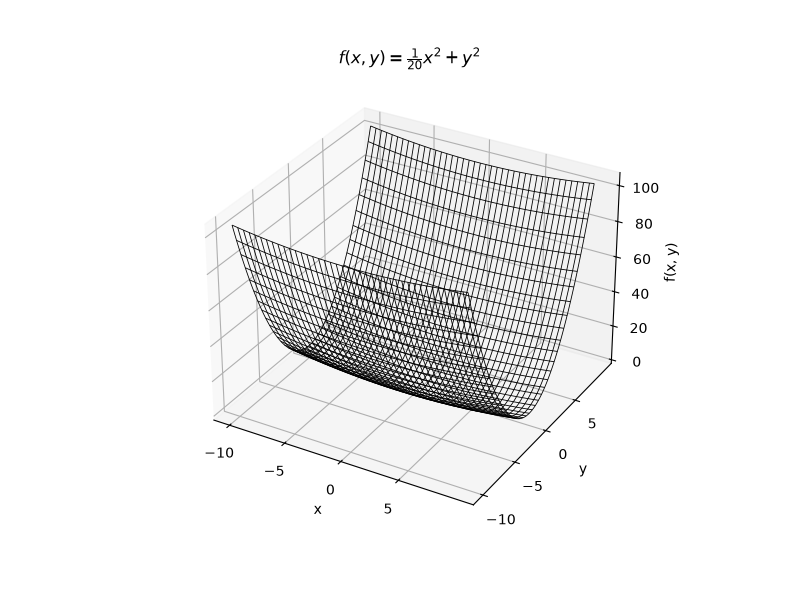

接下来我们在绘制等高线示意图：

```py
# 使用等高线研究SGD的缺陷
import matplotlib.pyplot as plt
import numpy as np

# 创建网格数据
x = np.arange(-10, 10, 0.1)
y = np.arange(-10, 10, 0.1)
X, Y = np.meshgrid(x, y)

Z = X**2 / 20 + Y**2

plt.figure(figsize=(7, 6))
# 绘制等高线
contour = plt.contour(X, Y, Z, levels=20, cmap="viridis")

# 添加数值标签
plt.clabel(contour, inline=True, fontsize=8)

plt.xlabel("x")
plt.ylabel("y")
plt.title(r"$f(x, y)=\frac{1}{20}x^2+y^2$")

plt.axis("equal")

plt.show()
```

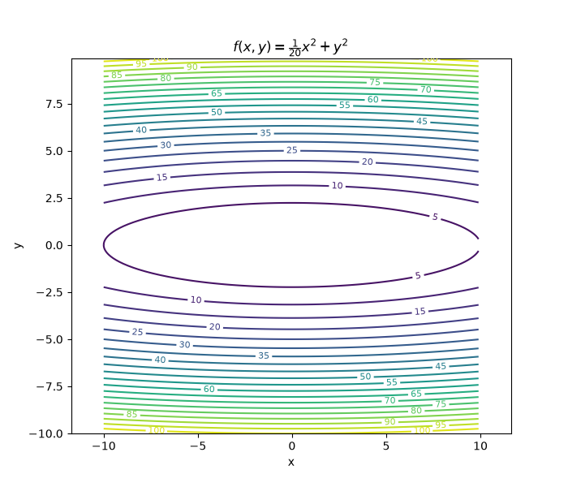

为了能明显看出 SGD 的训练缺陷，我们现在在等高线图中绘制训练过程中的移动路径：

```py
import matplotlib.pyplot as plt
import numpy as np

# 使用等高线绘制函数 $f(x,y)=\frac{1}{20}x^2+y^2$的梯度


class SGD:
    def __init__(self, learning_rate=0.1):
        self.learning_rate = learning_rate

    def update(self, params, grads):
        for key in params:
            params[key] -= self.learning_rate * grads[key]


def f(x, y):
    return x**2 / 20.0 + y**2


def df(x, y):
    return x / 10.0, 2.0 * y


def move_points():
    init_pos = (-7.0, 2.0)
    params = {}
    params["x"], params["y"] = init_pos[0], init_pos[1]
    grads = {}
    grads["x"], grads["y"] = 0, 0

    x_history = []
    y_history = []
    optimizer = SGD(0.95)

    for i in range(20):
        x_history.append(params["x"])
        y_history.append(params["y"])

        grads["x"], grads["y"] = df(params["x"], params["y"])
        optimizer.update(params, grads)

    return x_history, y_history


# 绘制等高线
def plot_contour():
    x = np.arange(-10, 10, 0.01)
    y = np.arange(-5, 5, 0.01)

    X, Y = np.meshgrid(x, y)
    Z = f(X, Y)

    # for simple contour line
    mask = Z > 7
    Z[mask] = 0

    # plot
    # plt.subplot(2, 2, 1)
    plt.figure(figsize=(8, 6))
    x_history, y_history = move_points()
    plt.plot(x_history, y_history, "o-", color="red")
    plt.contour(X, Y, Z)
    plt.ylim(-10, 10)
    plt.xlim(-10, 10)
    plt.plot(0, 0, "+")
    # colorbar()
    # spring()
    plt.title("SGD")
    plt.xlabel("x")
    plt.ylabel("y")

    plt.show()


if __name__ == "__main__":
    plot_contour()
```

我们发现随着梯度更新，更新路径呈现"之"字型移动，这是一个相当低效的路径。

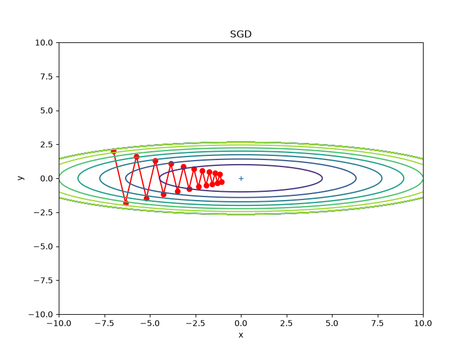

也就是说，SGD的缺点是，如果函数的形状非匀向，比如呈延伸状，搜索的路径就非常低效。最高效的路径是垂直于等高线的路径，因为那样才是最快到达最小值的最短路径。

SGD低效的根本原因是，梯度的方向并没有指向最小值的方向，而是在“震荡”前行。

有两个问题：

1. 容易震荡
2. 前进一步马上忘记上一步走的方向，严格依赖当前梯度

### 6.1.4 Momentum

SGD是因为不区分梯度大小，将参数固定更新 `learning_rate` 倍的梯度，就会导致沿y轴梯更新幅度更大，从而出现“之”字型回荡。

我们能够基于梯度进行改进，依赖梯度的大小来计算更新幅度。这就是我们接下来要学习的改进方案 - Momentum。

momentum 的物理公式为：

$$
p=mv
$$

一个球滚起来以后，即使坡度变小，它仍然会继续向前滚。

机器学习中借鉴了这个思维，**不要值相信当前梯度，而要保留之前运动的惯性**。

于是引入了一个新的变量 `v` —— 它表示参数的更新速度。

Momentum 的标准公式：

$$
v_t​=βv_{t-1}​−ηg_t​
$$

其中：

- $g_t$：表示梯度
- η：学习率
- β：Momentum 系数，默认为0.9

我们转换成如下方式：

$$
v = αv - η\frac{\partial{L}}{\partial{W}}
$$

其中

- α：Momentum 系数
- η：学习率

接下来我们以一个权重参数来逐步分析，加深对 Momentum 原理的理解：

```md
初始化：
v=0
w=10
learning_rate=0.1
momentum=0.9

第一轮计算：
`grad=2`
`v = momentum*v-learning_rate*grads = 0*0.9 - 0.1*2 = -0.2`
`w = w+v = 10-0.2 = 9.8`

第二轮计算：
`grad=2`
`v = momentum*v-learning_rate*grads = 0.9*(-0.2) - 0.1*2 = -0.38`
`w = w+v = 9.8 - 0.38 = 9.42`

第三轮计算：
`grad=2`
`v= momentum*v-learning_rate*grads = 0.9*(-0.38) - 0.1*2 = -0.542`
`w = w+v = 9.42 - 0.542 = 8.878`
```

| 轮次 | grad | v      | w     |
| ---- | ---- | ------ | ----- |
| 1    | 2    | 0      | 9.8   |
| 2    | 2    | -0.38  | 9.42  |
| 3    | 2    | -0.542 | 8.878 |

我们发现，相同梯度情况下，momentum 方案更新权重的速度越来越快。为什么 momentum 能减少震荡呢？因为参数的更新是基于前一轮的梯度进行计算的，如果相邻两轮的梯度变动交到，在SGD算法中就直接产生震荡了，但是在 momentum 算法中，可能不会存在震荡，因为第二次的计算是叠加了第一次的梯度的，两次梯度如果方向相反，会产生叠加，抵消一部分震荡。

代码实现如下：

```py
class Momentum:
    def __init__(self, learning_rate=0.01, momentum=0.9):
        """
        在SGD的基础上增加 momentum 系数，控制加速度
        """
        self.learning_rate = learning_rate
        self.momentum = momentum
        self.v = None

    def update(self, params, grads):
        if self.v is None:
            self.v = {}
            for key, value in params.items():
                self.v[key] = np.zeros_like(value)
        for key in params.keys():
            self.v[key] = self.v[key] * self.momentum - self.learning_rate * grads[key]
            params[key] += self.v[key]
```

> 需要注意的是，我们需要维护每一个参数的速度，在每一轮参数更细过程中，更新指定参数的速度值，并根据对应的梯度更新参数

同 SGD 的示例一样，我们也使用等高线图绘制梯度变更路径：

```py
import matplotlib.pyplot as plt
import numpy as np
from optimizer import Momentum

# 使用等高线绘制函数 $f(x,y)=\frac{1}{20}x^2+y^2$的梯度


def f(x, y):
    return x**2 / 20.0 + y**2


def df(x, y):
    return x / 10.0, 2.0 * y


def move_points():
    init_pos = (-7.0, 2.0)
    params = {}
    params["x"], params["y"] = init_pos[0], init_pos[1]
    grads = {}
    grads["x"], grads["y"] = 0, 0

    x_history = []
    y_history = []
    optimizer = Momentum(learning_rate=0.1)

    for i in range(20):
        x_history.append(params["x"])
        y_history.append(params["y"])

        grads["x"], grads["y"] = df(params["x"], params["y"])
        optimizer.update(params, grads)

    return x_history, y_history


# 绘制等高线
def plot_contour():
    x = np.arange(-10, 10, 0.01)
    y = np.arange(-5, 5, 0.01)

    X, Y = np.meshgrid(x, y)
    Z = f(X, Y)

    # for simple contour line
    mask = Z > 7
    Z[mask] = 0

    # plot
    # plt.subplot(2, 2, 1)
    plt.figure(figsize=(8, 6))
    x_history, y_history = move_points()
    plt.plot(x_history, y_history, "o-", color="red")
    plt.contour(X, Y, Z)
    plt.ylim(-10, 10)
    plt.xlim(-10, 10)
    plt.plot(0, 0, "+")
    # colorbar()
    # spring()
    plt.title("SGD")
    plt.xlabel("x")
    plt.ylabel("y")

    plt.show()


if __name__ == "__main__":
    plot_contour()
```

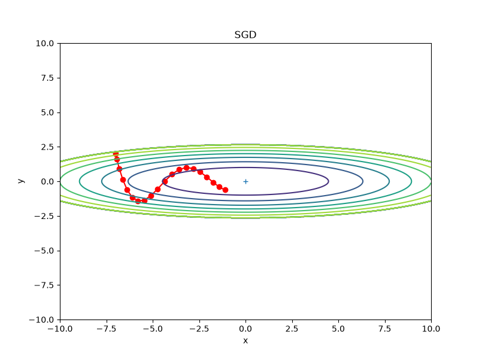

观察上图，我们发现，与SGD相比，“之”字形的程度减轻了。这是因为虽然 x 轴方向受到的力非常小，但是一直在同一方向上受力，所以朝同一方向会有一定的加速。反过来，虽然y轴方向受到的力很大，但是因为交替地受到正方向和反方向的力，它们会互相抵消，所以y轴方向上的速度不稳定。

相比 SGD，momentum虽然减轻了震荡，但是并没有解决震荡问题。

### 6.1.5 AdaGrad

SGD 是固定学习率的方式更新参数，momentum 是基于前一次的梯度动态更新参数，两者都无法避免震荡，那么我们能否通过动态计算学习率的方式来实现呢？学习率太小的话更新次数会增加，学习率太大的话，容易错过最佳值。现在我们基于梯度动态更新学习率，来提高学习效率。

在关于学习率的技巧中，有一种称为**学习率衰减**的方法，即随着学习的进行，使学习率逐渐减小。实际上，一开始“多”学，然后逐渐“少”学的方法，在神经网络的学习中经常被使用。

AdaGrad 会为每个参数的每个元素适当第调整学习率，与此同时进行学习（AdaGrad 的 Ada 来自英文单词 Adaptive，即“适当的”）.

$$
h = h + \frac{\partial{L}}{\partial{W}}  \frac{\partial{L}}{\partial{W}}
$$

AdaGrad 的核心思想：历史梯度越大，以后学习率越小。

因为如果某个参数的梯度一直很大，说明其在剧烈变化，应该慢一点更新。如果有个参数梯度一直都很小，说明学习得比较慢，应该快一点更新。

AdaGrad 会保存一个变量：

$$
h_t=h_{t-1}+g_t^2
$$

然后计算更新参数：

$$
θ=θ-η\frac{g}{\sqrt{h}+ε}
$$

其中：

- g：当前梯度
- h：历史梯度的平方累计
- ε：防止除零

> ε 通常为 $10^{-7}$。

为什么需要平方？

1. 负数变正数，我们只关心梯度的大小
2. 大的梯度影响更明显

为什么在更新参数的时候进行开方？

1. 避免学习率下降太快

下面我们使用 Python 实现上述 AdaGrad 学习算法：

```py
class AdaGrad:
    def __init__(self, learning_rate=0.01):
        self.learning_rate = learning_rate
        self.h = None

    def update(self, params, grads):
        if self.h is None:
            self.h = {}
            for key, value in grads.items():
                self.h[key] = np.zeros_like(value)
        for key in params.keys():
            self.h[key] = self.h[key] + grads[key] * grads[key]
            params[key] -= (
                self.learning_rate * grads[key] / (np.sqrt(self.h[key]) + 1e-7)
            )
```

使用等高线图来分析 AdaGrad 学习路径：

```py
import matplotlib.pyplot as plt
import numpy as np
from optimizer import AdaGrad

# 使用等高线绘制函数 $f(x,y)=\frac{1}{20}x^2+y^2$的梯度


def f(x, y):
    return x**2 / 20.0 + y**2


def df(x, y):
    return x / 10.0, 2.0 * y


def move_points():
    init_pos = (-7.0, 2.0)
    params = {}
    params["x"], params["y"] = init_pos[0], init_pos[1]
    grads = {}
    grads["x"], grads["y"] = 0, 0

    x_history = []
    y_history = []
    optimizer = AdaGrad(learning_rate=1.5)

    for i in range(20):
        x_history.append(params["x"])
        y_history.append(params["y"])

        grads["x"], grads["y"] = df(params["x"], params["y"])
        optimizer.update(params, grads)

    return x_history, y_history


# 绘制等高线
def plot_contour():
    x = np.arange(-10, 10, 0.01)
    y = np.arange(-5, 5, 0.01)

    X, Y = np.meshgrid(x, y)
    Z = f(X, Y)

    # for simple contour line
    mask = Z > 7
    Z[mask] = 0

    # plot
    # plt.subplot(2, 2, 1)
    plt.figure(figsize=(8, 6))
    x_history, y_history = move_points()
    plt.plot(x_history, y_history, "o-", color="red")
    plt.contour(X, Y, Z)
    plt.ylim(-10, 10)
    plt.xlim(-10, 10)
    plt.plot(0, 0, "+")
    # colorbar()
    # spring()
    plt.title("SGD")
    plt.xlabel("x")
    plt.ylabel("y")

    plt.show()


if __name__ == "__main__":
    plot_contour()
```

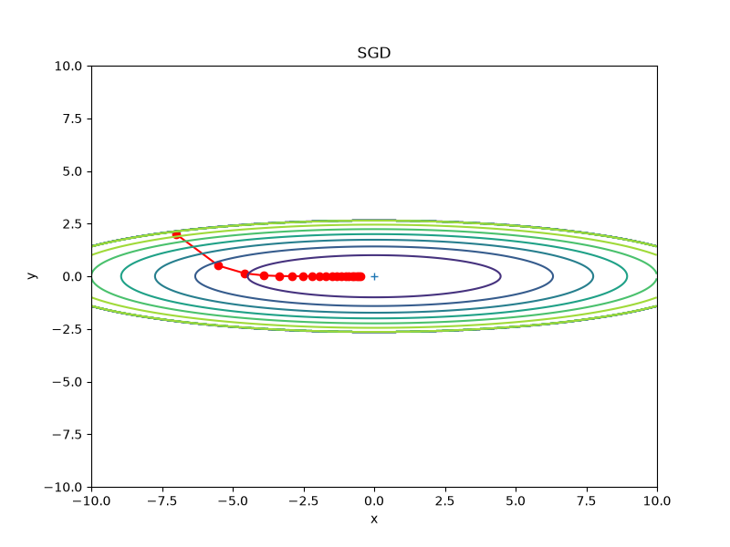

通过观察学习路径，我们发现，随着训练的深入，后面出现了梯度为 0 的问题，导致后续学习路径趋于一条直线，表示后续学习对参数更新微乎其微。

### 6.1.6 RMSProp

我们发现 AdaGrad 有一个明显的短板，随着学习的深入，梯度更新后面趋近于0，导致参数无法更新。**根本原因是AdaGrad记录了所有历史梯度数据**，导致 `h` 的值越来与越大。最终 $\frac{1}{\sqrt{h}}$趋近于 0 。

我们尝试只根据一定比率的最新的历史数据对 AdaGrad 算法进行更新，于是就衍生出了 RMSProp 算法。RMSProp 算法的公式如下：

$$
h_t = ρh_{t-1} + (1-ρ)g^2
$$

其中：

- ρ：表示保留的历史梯度数据的比例

代码实现如下：

```py
class RMSProp:
    def __init__(self, ratio=0.9, learning_rate=0.01):
        self.ratio = ratio
        self.learning_rate = learning_rate
        self.h = None

    def update(self, params, grads):
        if self.h is None:
            self.h = {}
            for key, value in grads.items():
                self.h[key] = np.zeros_like(value)

        for key in params.keys():
            self.h[key] = (
                self.ratio * self.h[key] + (1 - self.ratio) * grads[key] * grads[key]
            )
            params[key] -= (
                self.learning_rate * grads[key] / (np.sqrt(self.h[key]) + 1e-7)
            )
```

我们通过等高线图绘制学习路径来观察 RMSProp 算法：

```py
import matplotlib.pyplot as plt
import numpy as np
from optimizer import RMSProp

# 使用等高线绘制函数 $f(x,y)=\frac{1}{20}x^2+y^2$的梯度


def f(x, y):
    return x**2 / 20.0 + y**2


def df(x, y):
    return x / 10.0, 2.0 * y


def move_points():
    init_pos = (-7.0, 2.0)
    params = {}
    params["x"], params["y"] = init_pos[0], init_pos[1]
    grads = {}
    grads["x"], grads["y"] = 0, 0

    x_history = []
    y_history = []
    optimizer = RMSProp(learning_rate=0.5)

    for i in range(20):
        x_history.append(params["x"])
        y_history.append(params["y"])

        grads["x"], grads["y"] = df(params["x"], params["y"])
        optimizer.update(params, grads)

    return x_history, y_history


# 绘制等高线
def plot_contour():
    x = np.arange(-10, 10, 0.01)
    y = np.arange(-5, 5, 0.01)

    X, Y = np.meshgrid(x, y)
    Z = f(X, Y)

    # for simple contour line
    mask = Z > 7
    Z[mask] = 0

    # plot
    # plt.subplot(2, 2, 1)
    plt.figure(figsize=(8, 6))
    x_history, y_history = move_points()
    plt.plot(x_history, y_history, "o-", color="red")
    plt.contour(X, Y, Z)
    plt.ylim(-10, 10)
    plt.xlim(-10, 10)
    plt.plot(0, 0, "+")
    # colorbar()
    # spring()
    plt.title("SGD")
    plt.xlabel("x")
    plt.ylabel("y")

    plt.show()


if __name__ == "__main__":
    plot_contour()
```

具体展示如下图所示：
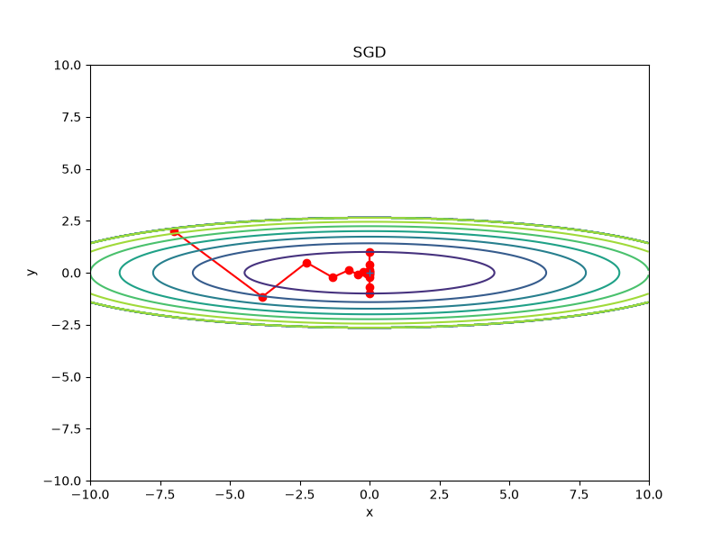

### 6.1.7 Adam

Adam 想同时解决两个问题：

- Momentum
  - 利用历史梯度，加快收敛
  - 减少震荡
- RMSProp
  - 每个参数使用不同学习率
  - 防止学习过大或过小

因此 Adam 同时维护两个变量：

- 一阶矩阵：保存梯度的指数滑动平均 - $m$
- 二阶矩阵：保存提低平方的指数滑动平均 - $v$

#### Adam 的数学表达式

$$
g_t​=∇_θ​J(θ_t​)
$$

表示第 t 次迭代的梯度。

##### 第一步：更新一阶矩阵(Momentum)

$$
m_t=β_1m_{t-1}+(1-β_1)g_t
$$

其中：

- $β_1$ = 0.9 是默认值
- $m_t$: 表示保存的梯度方向。

它其实就是 Momentum。

##### 第二步：更新二阶矩阵(RMSProp)

$$
v_t=β_2v_{t-1}+(1-β_2)g_t^2
$$

其中：

- $β_2$ = 0.999
- $v_t$ 保存的是梯度平方，它就是 RMSProp 计算。

##### 第三步：偏差修正（Bias Correction）

初始化：

$$
m_0=0\\
v_0=0
$$

导致训练开始时，估计值偏小。因此，Adam 引入 一阶修正和二阶修正。

1. 修正一阶矩阵
   $$
   \hat{m_t} = \frac{m_t}{1-β_1^t}
   $$
2. 修正二阶矩阵
   $$
   \hat{v_t} = \frac{v_t}{1-β_2^t}
   $$

##### 第四步：更新参数

$$
θ_t=θ_{t-} - η\frac{\hat{m_t}}{\sqrt{\hat{v_t}} + ε}
$$

其中：

- η：学习率
- ε：防止除数为零，通常为 $10^{-7}$ 或 $10^{-8}$

#### 为什么需要 Bias Correction？

这是 Adam 最大的特点。我们现在来通过数据举例分析：

第一次：

$$
m_1=0\\
g=10
$$

计算 $m_2$，根据现在的计算公式，计算得$0.9×0+0.1×10=1$。实际上，梯度明明是 10，但是 momentum计算只有1，明显偏小，因此，进行第一次修正：

$$
\hat{m_1} = \frac{m_1}{1-β_1} = \frac{1}{1-0.9}=10
$$

刚好恢复为梯度值。所以，Bias Correction 就是修正 EMA 初始偏小的问题的。

可以将 Adam 理解为 Momentum + RMSProp + Bias Correction

#### 代码实现

```py
class Adam:
    def __init__(self, learning_rate=0.001, beta1=0.9, beta2=0.999):
        self.lr = learning_rate
        self.beta1 = beta1  # 一阶矩衰减率（动量）
        self.beta2 = beta2  # 二阶矩衰减率（自适应）
        self.iter = 0
        self.m = None  # 一阶矩（动量）
        self.v = None  # 二阶矩（自适应）

    def update(self, params, grads):
        if self.m is None:
            self.m, self.v = {}, {}
            for key in params.keys():
                self.m[key] = np.zeros_like(params[key])
                self.v[key] = np.zeros_like(params[key])
                self.iter += 1
        for key in params.keys():
            # 1. 更新一阶矩（类似Momentum）
            self.m[key] = self.beta1 * self.m[key] + (1 - self.beta1) * grads[key]
            # 2. 更新二阶矩（类似AdaGrad）
            self.v[key] = self.beta2 * self.v[key] + (1 - self.beta2) * grads[key] ** 2
            # 3. 偏差修正（初始时避免偏向0）
            m_hat = self.m[key] / (1 - self.beta1**self.iter)
            v_hat = self.v[key] / (1 - self.beta2**self.iter)
            # 4. 更新参数
            params[key] -= self.lr * m_hat / (np.sqrt(v_hat) + 1e-7)
```

我们在等高线图中绘制学习路径：

```py

```

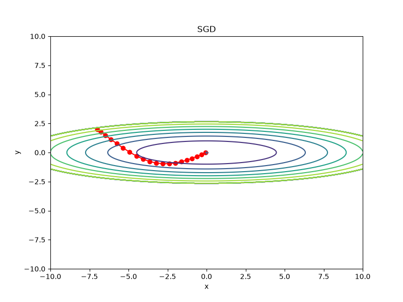

### 6.1.8 各种优化器之间的关系

| 优化器   | 保存的信息              | 是否自适应学习率 | 是否利用历史方向 | 是否偏差修正 |
| -------- | ----------------------- | ---------------- | ---------------- | ------------ |
| SGD      | 无                      | ❌               | ❌               | ❌           |
| Momentum | 一阶矩 (m)              | ❌               | ✅               | ❌           |
| AdaGrad  | 梯度平方累计            | ✅               | ❌               | ❌           |
| RMSProp  | 二阶矩 (v)（EMA）       | ✅               | ❌               | ❌           |
| **Adam** | 一阶矩 (m) + 二阶矩 (v) | ✅               | ✅               | ✅           |

### 6.1.8 基于 MNIST 数据集的更新方法的比较

我们通过实现多层神经网络，然后利用 MNIST 数据集进行误差计算，比较几个优化器在误差计算过程中的变化：

首先来实现多层神经网络

```py
from collections import OrderedDict

import numpy as np


class Sigmoid:
    def __init__(self):
        self.out = None

    def forward(self, x):
        self.out = 1 / (1 + np.exp(-x))

        return self.out

    def backward(self, dout):
        dx = dout * (1.0 - self.out) * self.out

        return dx


class ReLu:
    def __init__(self):
        self.mask = None

    def forward(self, x):
        self.mask = x <= 0
        out = x.copy()
        out[self.mask] = 0

        return out

    def backward(self, dout):
        dx = dout.copy()
        dx[self.mask] = 0

        return dx


class Affine:
    def __init__(self, w, b):
        self.w = w
        self.b = b
        self.x = None

        # 用于后续进行参数更新时使用，w = w - dw，b = b - db
        self.dw = None
        self.db = None

    def forward(self, x):
        self.x = x
        out = np.dot(self.x, self.w) + self.b

        return out

    def backward(self, dout):
        dx = np.dot(dout, self.w.T)
        self.dw = np.dot(self.x.T, dout)
        self.db = np.sum(dout, axis=0)

        return dx


def softmax(x):
    if x.ndim == 1:
        x = x.reshape(1, len(x))
    max_x = np.max(x, axis=1, keepdims=True)
    normal_x = x - max_x
    exp_x = np.exp(normal_x)

    return exp_x / np.sum(exp_x, axis=1, keepdims=True)


def cross_entropy_error(x, t):
    if x.ndim == 1:
        x = x.reshape(1, len(x))
        t = t.reshape(1, len(t))
    batch_size = t.shape[0]

    return -np.sum(t * np.log(x + 1e-7)) / batch_size


class SoftmaxWithLoss:
    def __init__(self):
        self.y = None
        self.t = None
        self.loss = None

    def forward(self, x, t):
        self.y = softmax(x)
        self.t = t
        self.loss = cross_entropy_error(self.y, t)

        return self.loss

    def backward(self, dout):
        batch_size = self.t.shape[0]
        return (self.y - self.t) / batch_size


class MultiLayerNet:
    def __init__(
        self,
        input_size,
        hidden_size_list,
        output_size,
        activation="relu",
        weight_init_std="relu",
        weight_decay_lambda=0,
    ):
        self.input_size = input_size
        self.output_size = output_size
        self.hidden_size_list = hidden_size_list
        self.hidden_layer_num = len(hidden_size_list)
        self.weight_decay_lambda = weight_decay_lambda
        self.params = {}

        # 初始化参数
        self.__init_weight(weight_init_std)

        # 激活函数
        activation_layer = {"sigmoid": Sigmoid, "relu": ReLu}
        self.layers = OrderedDict()
        for idx in range(1, self.hidden_layer_num + 1):
            self.layers["Affine" + str(idx)] = Affine(
                self.params["W" + str(idx)], self.params["b" + str(idx)]
            )
            self.layers["Activation_function" + str(idx)] = activation_layer[
                activation
            ]()
        idx = self.hidden_layer_num + 1
        self.layers["Affine" + str(idx)] = Affine(
            self.params["W" + str(idx)], self.params["b" + str(idx)]
        )

        self.last_layer = SoftmaxWithLoss()

    def __init_weight(self, weight_init_std):
        """
        初始化权重参数
        """
        all_size_list = [self.input_size] + self.hidden_size_list + [self.output_size]
        for idx in range(1, len(all_size_list)):
            scale = weight_init_std
            if str(weight_init_std).lower() in ("relu", "he"):
                scale = np.sqrt(2.0 / all_size_list[idx - 1])
            elif str(weight_init_std).lower() in ("sigmoid", "xavier"):
                scale = np.sqrt(1.0 / all_size_list[idx - 1])

            self.params["W" + str(idx)] = scale * np.random.randn(
                all_size_list[idx - 1], all_size_list[idx]
            )
            self.params["b" + str(idx)] = np.zeros(all_size_list[idx])

    def predict(self, x):
        for layer in self.layers.values():
            x = layer.forward(x)

        return x

    def loss(self, x, t):
        y = self.predict(x)
        return self.last_layer.forward(y, t)

    def accuracy(self, x, t):
        y = self.predict(x)
        y = np.argmax(y, axis=1)
        if t.ndim != 1:
            t = np.argmax(t, axis=1)

        accuracy = np.sum(y == t) / float(x.shape[0])

        return accuracy

    def gradient(self, x, t):
        # forward
        loss = self.loss(x, t)

        # backward
        dout = 1
        dout = self.last_layer.backward(dout)
        for layer in reversed(self.layers.values()):
            dout = layer.backward(dout)

        grads = {}
        for idx in range(1, self.hidden_layer_num + 2):
            grads["W" + str(idx)] = self.layers["Affine" + str(idx)].dw
            grads["b" + str(idx)] = self.layers["Affine" + str(idx)].db

        return grads, loss
```

接下来使用 MNIST 数据集来训练各个优化器下的五层神经网络，并用折线图绘制各个优化器在每100轮训练之后的误差分布：

```py
import matplotlib.pyplot as plt
import numpy as np
from dataset.mnist import load_mnist
from multi_layer_net import MultiLayerNet
from optimizer import SGD, AdaGrad, Adam, Momentum, RMSProp


def smooth_curve(x):
    """用于平滑损失函数的图像。

    参考：http://glowingpython.blogspot.jp/2012/02/convolution-with-numpy.html
    """
    window_len = 11
    s = np.r_[x[window_len - 1 : 0 : -1], x, x[-1:-window_len:-1]]
    w = np.kaiser(window_len, 2)
    y = np.convolve(w / w.sum(), s, mode="valid")
    return y[5 : len(y) - 5]


if __name__ == "__main__":
    (t_train, t_test), (x_train, x_test) = load_mnist(
        normalize=True, one_hot_label=True
    )
    train_size = t_train.shape[0]
    batch_size = 128
    max_iterations = 2000

    optimizers = {}
    optimizers["SGD"] = SGD()
    optimizers["Momentum"] = Momentum()
    optimizers["AdaGrad"] = AdaGrad()
    optimizers["RMSProp"] = RMSProp()
    optimizers["Adam"] = Adam()

    networks = {}
    train_loss = {}
    for key in optimizers.keys():
        networks[key] = MultiLayerNet(
            input_size=784, hidden_size_list=[100, 100, 100, 100], output_size=10
        )
        train_loss[key] = []

    for i in range(max_iterations):
        batch_mask = np.random.choice(train_size, batch_size)
        x_batch, t_batch = t_train[batch_mask], t_test[batch_mask]

        for key in optimizers.keys():
            grads, loss = networks[key].gradient(x_batch, t_batch)
            optimizers[key].update(networks[key].params, grads)
            # loss = networks[key].loss(x_batch, t_batch)
            train_loss[key].append(loss)

        if i % 100 == 0:
            print("===========" + "iteration:" + str(i) + "===========")
            for key in optimizers.keys():
                loss = networks[key].loss(x_batch, t_batch)
                print(key + ":" + str(loss))

    markers = {"SGD": "o", "Momentum": "x", "AdaGrad": "s", "RMSProp": "*", "Adam": "D"}
    x = np.arange(max_iterations)
    for key in optimizers.keys():
        plt.plot(
            x,
            smooth_curve(train_loss[key]),
            marker=markers[key],
            markevery=100,
            label=key,
        )
    plt.xlabel("iterations")
    plt.ylabel("loss")
    plt.ylim(0, 1)
    plt.legend()
    plt.show()
```

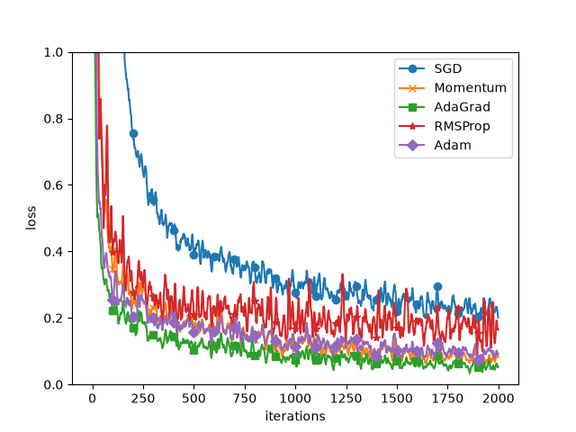

从图中可知，与 SGD 相比，其他 4 种方法学习的更快，并且速度基本相同，仔细看的话，AdaGrad的学习进行的稍微快一点。

## 6.2 权重的初始值

在神经网络中，权重的初始值非常重要，甚至决定学习是否能够成功。

### 6.2.1 可以将权重初始值都设为0吗

答案是否定的。因为在误差反向传播中，所有权重值都会进行相同的更新。比如，在 2 层神经网络中，假设第 1 层和第 2 层的权重为 0。这样一来，正向传播时，因为输入层的权重为 0，所以第 2 层的神经元全部会被传递相同的值。第 2 层的神经元中全部输入相同的值，这意味着反向传播时第 2 层的权重全部都会进行相同的更新（回忆一下“乘法节点的反向传播”的内容）​。因此，权重被更新为相同的值，并拥有了对称的值（重复的值）​。这使得神经网络拥有许多不同的权重的意义丧失了。为了防止“权重均一化”​（严格地讲，是为了瓦解权重的对称结构）​，必须随机生成初始值。

### 6.2.2 隐藏层的激活值的分布

观察隐藏层的激活值（激活函数的输出数据）的分布，可以获得很多启发。

```py
import matplotlib.pyplot as plt
import numpy as np

# 探索 权重初始值 与激活函数的输出值的分布关系


def sigmoid(x):
    return 1 / (1 + np.exp(-x))


x = np.random.randn(1000, 100)  # 模拟 1000 个输入数据
node_num = 100  # 设置隐藏层神经元个数 100
hidden_layer_size = 5  # 设置 5 层神经元
activations = {}  # 记录每一层的激活函数

for i in range(hidden_layer_size):
    if i != 0:
        x = activations[i - 1]

    # 设置每层的权重分布都是 100 * 100，且初始值都为 1
    w = np.random.randn(node_num, node_num) * 1

    z = np.dot(x, w)
    a = sigmoid(z)
    activations[i] = a

# 绘制直方图
for i, a in activations.items():
    plt.subplot(1, len(activations), i + 1)
    plt.title(str(i + 1) + "-layer")
    plt.hist(a.flatten(), 30, range=(0, 1))
plt.show()
```

分布如下图所示：

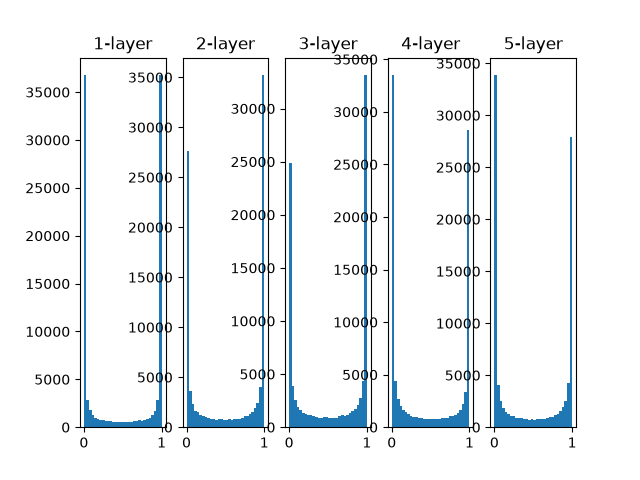

从上图可知，各层的激活值呈偏向 0 和 1 的分布。这里使用的 sigmoid 函数是 S 型函数，随着输出不断地靠近 0（或者靠近 1）​，它的导数的值逐渐接近 0。因此，偏向 0 和 1 的数据分布会造成反向传播中梯度的值不断变小，最后消失。这个问题称为**梯度消失（Gradient Vanishing）**。层次加深的深度学习中，梯度消失的问题可能会更加严重。

下面，我们将权重的标准差设为 0.01，进行相同的实验。分布如下图所示：

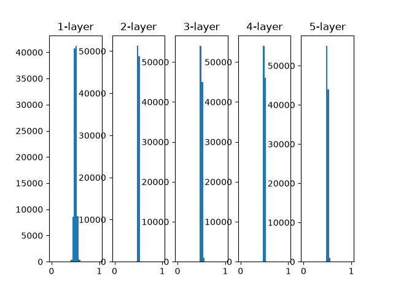

这次呈集中在 0.5 附近的分布。因为不像刚才的例子那样偏向 0 和 1 ，所以不会发生梯度消失的问题。但是，激活值的分布有所偏向，说明在表现力上会有很大问题。为什么这么说呢？因为如果有多个神经元都输出几乎相同的值，那它们就没有存在的意义了。比如，如果 100 个神经元都输出几乎相同的值，那么也可以由 1 个神经元来表达基本相同的事情。因此，激活值在分布上有所偏向会出现“表现力受限”的问题。

接下来我们尝试使用 “Xavier 初始值” 初始化权重参数，再来观察激活函数输出值的分布。为了使各层的激活值呈现出具有相同广度的分布，“Xavier 初始值”推导出了一套合适的权重尺度。推导出的结论是，如果前一层的节点数为 n，则初始值使用标准差为 $\frac{1}{\sqrt{n}}$的分布。

分布结果如下如所示：

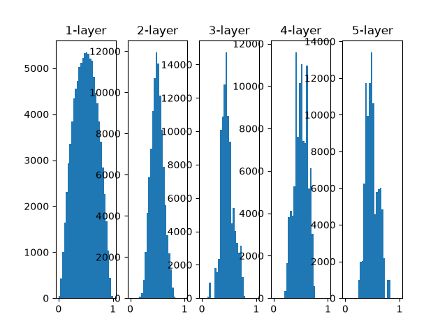

从这个结果可知，越是后面的层，图像变得越歪斜，但是呈现了比之前更有广度的分布。因为各层间传递的数据有适当的广度，所以 sigmoid 函数的表现力不受限制，有望进行高效的学习。

### 6.2.3 ReLU的权重初始值

Xavier初始值是以激活函数是线性函数为前提而推导出来的。因为 sigmoid 函数和 tanh 函数左右对称，且中央附近可以视作线性函数，所以适合使用 Xavier初始值。但当激活函数使用ReLU时，一般推荐使用 ReLU 专用的初始值，也就是Kaiming He等人推荐的初始值，也称为“He初始值”。当前一层节点数为 n 时，He初始值使用标准差为 $\sqrt{\frac{2}{n}}$ 的高斯分布。

我们来编写程序使用直方图展示权重参数初始值为不同标准差时，激活函数输出值的分布图：

```py
import matplotlib.pyplot as plt
import numpy as np

# 探索 权重初始值 与激活函数的输出值的分布关系


def relu(x):
    return np.maximum(0, x)


x = np.random.randn(1000, 100)
node_num = 100
hidden_layer_size = 5

scales = {
    "std=0.01": lambda: 0.01,
    "Xavier": lambda: np.sqrt(1.0 / node_num),
    "He": lambda: np.sqrt(2.0 / node_num),
}

plt.figure(figsize=(9, 6))
for row, (name, scale_func) in enumerate(scales.items()):
    layer_input = x
    for col in range(hidden_layer_size):
        w = np.random.randn(node_num, node_num) * scale_func()
        z = np.dot(layer_input, w)
        a = relu(z)
        ax = plt.subplot(
            len(scales), hidden_layer_size, row * hidden_layer_size + col + 1
        )
        ax.hist(a.flatten(), bins=30, range=(0, 1.5))
        ax.set_title(f"{col + 1}-layer" if row == 0 else "")
        # 动态设置 y 轴刻度
        y_lim = ax.get_ylim()
        step = 10000
        y_ticks = np.arange(0, y_lim[1] + step, step)
        ax.set_yticks(y_ticks)
        layer_input = a
        ax.set_ylabel(name)  # 在每行最左侧加标签（可通过 subplot 定位，这里简单演示）

plt.tight_layout()
plt.show()
```

现在统一使用 ReLU 作为激活函数，使用 std=0.01、Xavier初始值、He初始值作为权重初始值的平方差，下面是具体的计算的直方图：

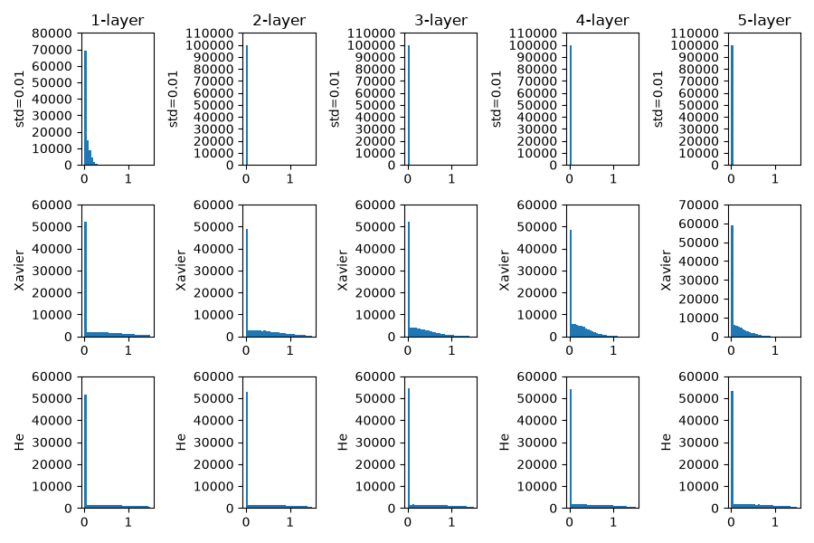

观察实验结果可知，当“std = 0.01”时，各层的激活值非常小。神经网络上传递的是非常小的值，说明逆向传播时权重的梯度也同样很小。这是很严重的问题，实际上学习基本上没有进展。

接下来是初始值为Xavier初始值时的结果。在这种情况下，随着层的加深，偏向一点点变大。实际上，层加深后，激活值的偏向变大，学习时会出现梯度消失的问题。而当初始值为He初始值时，各层中分布的广度相同。由于即便层加深，数据的广度也能保持不变，因此逆向传播时，也会传递合适的值。

总结一下，当激活函数使用ReLU时，权重初始值使用He初始值，当激活函数为sigmoid或tanh等S型曲线函数时，初始值使用Xavier初始值。这是目前的最佳实践。

### 6.2.4 基于 MNIST 数据集的权重处置值的比较

下面通过实际的数据，观察不同的权重初始值的赋值方法会在多大程度上影响神经网络的学习。

```py
import matplotlib.pyplot as plt
import numpy as np
from dataset.mnist import load_mnist
from multi_layer_net import MultiLayerNet
from optimizer import SGD


def smooth_curve(x):
    """用于平滑损失函数的图像。

    参考：http://glowingpython.blogspot.jp/2012/02/convolution-with-numpy.html
    """
    window_len = 11
    s = np.r_[x[window_len - 1 : 0 : -1], x, x[-1:-window_len:-1]]
    w = np.kaiser(window_len, 2)
    y = np.convolve(w / w.sum(), s, mode="valid")
    return y[5 : len(y) - 5]


if __name__ == "__main__":
    (t_train, t_test), (x_train, x_test) = load_mnist(
        normalize=True, one_hot_label=True
    )
    train_size = t_train.shape[0]
    batch_size = 128
    max_iterations = 2000

    weight_init_types = {"std=0.01": 0.01, "Xavier": "sigmoid", "He": "relu"}
    optimizer = SGD(learning_rate=0.01)

    networks = {}
    train_loss = {}
    for key, weight_type in weight_init_types.items():
        networks[key] = MultiLayerNet(
            input_size=784,
            hidden_size_list=[100, 100, 100, 100],
            output_size=10,
            weight_init_std=weight_type,
        )
        train_loss[key] = []

    for i in range(max_iterations):
        batch_mask = np.random.choice(train_size, batch_size)
        x_batch, t_batch = t_train[batch_mask], t_test[batch_mask]

        for key in weight_init_types.keys():
            grads, loss = networks[key].gradient(x_batch, t_batch)
            optimizer.update(networks[key].params, grads)
            # loss = networks[key].loss(x_batch, t_batch)
            train_loss[key].append(loss)

        if i % 100 == 0:
            print("===========" + "iteration:" + str(i) + "===========")
            for key in weight_init_types.keys():
                loss = networks[key].loss(x_batch, t_batch)
                print(key + ":" + str(loss))

    markers = {"std=0.01": "o", "Xavier": "s", "He": "D"}
    x = np.arange(max_iterations)
    for key in weight_init_types.keys():
        plt.plot(
            x,
            smooth_curve(train_loss[key]),
            marker=markers[key],
            markevery=100,
            label=key,
        )
    plt.xlabel("iterations")
    plt.ylabel("loss")
    plt.ylim(0, 2.5)
    plt.legend()
    plt.show()
```

不同初始值的损失值分布图如下图所示：

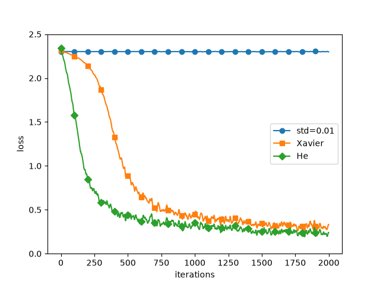

在这个实验中，神经网络有 5 层，每层有 100 个神经元，激活函数使用的是 ReLU。从上图可以看出，std = 0.01时完全无法进行学习。这和刚才观察到的激活值的分布一样，是因为正向传播中传递的值很小（集中在0附近的数据）​。因此，逆向传播时求到的梯度也很小，权重几乎不进行更新。相反，当权重初始值为Xavier初始值和He初始值时，学习进行得很顺利。并且，我们发现He初始值时的学习进度更快一些。

综上，在神经网络的学习中，权重初始值非常重要。很多时候权重初始值的设定关系到神经网络的学习能否成功。权重初始值的重要性容易被忽视，而任何事情的开始（初始值）总是关键的，因此在结束本节之际，再次强调一下权重初始值的重要性。
