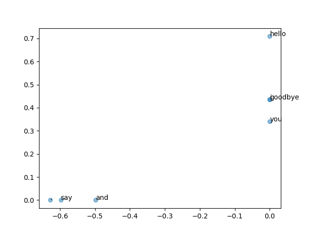

# 第 2 章 自然语言处理和单词的分布式表示

## 2.1 什么是自然语言处理

简单地说，自然语言处理是一种能够让计算机理解人类语言的技术。换言之，自然语言处理的目标就是让计算机理解人说的话，进而完成对我们有帮助的事情。

首要目标是让计算机理解单词的含义。目前主要有三种方法：

- 基于同义词词典的方法
- 基于计数的方法
- 基于推理的方法

## 2.2 同义词词典

目前被广泛使用的同义词词典，不是像《新华字典》那样解释说明一个词的含义，而是将具有相同含义或含义类似的词归为一组。

另外，在自然语言处理中用到的同义词词典有时会定义单词之间的粒度更细的关系，比如“上位-下位”关系、​“整体-部分”关系。

通过对所有单词创建近义词集合，并用图表示各个单词的关系，可以定义单词之间的联系。利用这个“单词网络”​，可以教会计算机单词之间的相关性。

### 2.2.1 WordNet

在自然语言处理领域，最出名的同义词词典是 WordNet。

### 2.2.2 同义词词典的问题

- 难以顺应时代的变化
- 人力成本高
- 无法表示单词的微妙差异

## 2.3 基于计数的方法

### 2.3.1 基于Python的语料库的预处理

首先我们建立单词与id的关联列表

```py
import re

message = "You say goodbye and i say hello."
words = re.split("\W ?", message.lower())
print(words)
# ['You', 'say', 'goodbye', 'and', 'i', 'say', 'hello', '']
word_to_id = {}
id_to_word = {}

for word in words:
    if word not in word_to_id:
        new_id = len(word_to_id)
        word_to_id[word] = new_id
        id_to_word[new_id] = word

print(word_to_id)
print(id_to_word)
```

接下来，我们生成id列表：

```py
id_list = [word_to_id[word] for word in words]
id_list = np.array(id_list)
```

上述都是预料处理逻辑，我们现在将其封装成函数：

```py
import re

import numpy as np


def preprocess(message):
    """
    将 message 语句转换成语料库
    """

    words = re.split("\\W+", message.lower())
    word_to_id = {}
    id_to_word = {}
    for word in words:
        if word not in word_to_id:
            new_id = len(word_to_id)
            word_to_id[word] = new_id
            id_to_word[new_id] = word

    corpus = [word_to_id[word] for word in words]
    corpus = np.array(corpus)

    return corpus, word_to_id, id_to_word
```

至此，语料库的预处理就完成了。接下来就是利用语料库提取单词含义。

### 2.3.2 单词的分布式表示

类比RGB格式的颜色，我们将单词转换成向量。将单词领域构建紧凑合理的向量表示，这在自然语言处理领域称为“分布式表示”。

单词的分布式表示将单词表示为固定长度的向量。这种向量的特征在于它是用密集向量表示的。密集向量的意思是，向量的各个元素（大多数）是由非0实数表示的。例如，三维分布式表示是[0.21,-0.45,0.83]​。

### 2.3.3 分布式假设

许多研究表明“某个单词的含义由它周围的单词形成”​，这称为分布式假设（distributional hypothesis）​。

分布式假设所表达的理念非常简单。单词本身没有含义，单词含义由它所在的上下文（语境）形成。的确，含义相同的单词经常出现在相同的语境中。比如“I drink beer.”​“We drink wine.”,drink的附近常有饮料出现。

从现在开始，我们会经常使用“上下文”一词。本章说的上下文是指某个单词（关注词）周围的单词。这里，我们将上下文的大小（即周围的单词有多少个）称为窗口大小（window size）​。窗口大小为1，上下文包含左右各1个单词；窗口大小为2，上下文包含左右各2个单词，以此类推。

这里，我们将左右两边相同数量的单词作为上下文。但是，根据具体情况，也可以仅将左边的单词或者右边的单词作为上下文。此外，也可以使用考虑了句子分隔符的上下文。

### 2.3.4 共现矩阵

下面，我们来考虑如何基于分布式假设使用向量表示单词，最直截了当的实现方法是对周围单词的数量进行计数。具体来说，在关注某个单词的情况下，对它的周围出现了多少次什么单词进行计数，然后再汇总。这里，我们将这种做法称为“基于计数的方法”​，在有的文献中也称为“基于统计的方法”​。

我们还是以 "You say goodbye and i say hello." 为例，基于统计的方法计算每个单词其周围单词出现的次数作为其向量表示。

```py
def create_co_matrix(corpus, vocab_size, windows_size=1):
    """
    计算词向量
    corpus：语料库id列表
    vocab_size：词汇数量
    window_size：计算窗口大小
    """
    corpus_size = len(corpus)
    co_matrix = np.zeros((vocab_size, vocab_size), dtype=np.int32)

    for idx, word_id in enumerate(corpus):
        # 以当前遍历的词汇为中心轴，再结合窗口大小，计算当前词汇左右两侧窗口范围内的词汇表
        for i in range(1, windows_size + 1):
            left_idx = idx - i
            right_idx = idx + i
            # 根据语料id列表获取词汇id，根据词汇id更新值
            if right_idx < corpus_size:
                right_word_id = corpus[right_idx]
                co_matrix[word_id, right_word_id] += 1

            if left_idx >= 0:
                left_word_id = corpus[left_idx]
                co_matrix[word_id, left_word_id] += 1

    return co_matrix
```

上述实现进行了一个取巧，将词汇的ID作为矩阵的行号，借助ID计算词汇在矩阵中的位置。

无论语料库多大，都可以自动生成共现矩阵。

### 2.3.5 向量间的相似度

前面我们根据共现矩阵将词汇转换成向量。下面我们来看一下如何测量向量间的相似度。

测量向量间的相似度有很多种方法，其中最具代表性的方法有向量内积或欧式距离等。还存在其他很多种方法，但是余弦相似度是很常用的。余弦相似度计算公式如下：

$$
similarity(x, y)=\frac{x \cdot y}{||x||\cdot||y||}=\frac{x_1y_1+...+x_ny_n}{\sqrt{x_1^2+...x_n^2}\sqrt{y_1^2+...y_n^2}}
$$

代码实现：

```py
def cos_similarity(x, y, eps=1e-8):
    """
    根据余弦相似度计算向量相似度
    x：第一个向量
    y：第二个向量
    eps：防止除数为零
    """
    nx = x / np.sqrt(np.sum(x**2) + eps)  # x 的正则化
    ny = y / np.sqrt(np.sum(y**2) + eps)  # y 的正则化

    return np.dot(nx, ny)
```

我们尝试计算 "i" 和 "you" 这两个单词对应向量的余弦相似度：

```py
import sys

sys.path.append("../../")
from common.util import cos_similarity, create_co_matrix, preprocess

message = "You say goodbye and i say hello."
corpus, word_to_id, id_to_word = preprocess(message)

print(corpus)
print(word_to_id)
print(id_to_word)

co_matrix = create_co_matrix(corpus, vocab_size=len(word_to_id))
print(co_matrix)

word_1 = "i"
word_2 = "you"
x = co_matrix[word_to_id[word_1]]
y = co_matrix[word_to_id[word_2]]
similarity = cos_similarity(x, y)
print(f'The word "{word_1}" and "{word_2}"\'s similarity is {similarity}')
# The word "i" and "you"'s similarity is 0.7071067758832467
```

余弦相似度的值域在 $[-1, 1]$。越趋向于1，向量就越相似。

### 2.3.6 相似单词的排序

接下来我们将计算与给定单词相似度最高的几个单词。

```py
def most_similarity(query, word_to_id, id_to_word, word_matrix, top=5):
    """
    计算给定词汇相似排名前top的词汇
    query: 查询的词
    word_to_id: 单词到单词ID的字典
    id_to_word: 单词ID到单词的字典
    top: 显示到前几位
    """
    # 首先需要保证查询的词汇在我们的语料库中
    if query not in word_to_id:
        print(f"{query} is not found")
        return
    # 根据语料库将要查询的词汇转换成词汇ID和词汇向量
    query_id = word_to_id[query]
    query_vec = word_matrix[query_id]

    # 获取当前词汇表中词汇量总数，便于接下来遍历
    vocab_size = len(id_to_word)
    # 根据词汇总量初始化词汇相似度列表
    similarity = np.zeros(vocab_size)
    # 遍历语料库
    for i in range(vocab_size):
        # 计算每个语料与查询词汇之间的余弦相似度
        similarity[i] = cos_similarity(word_matrix[i], query_vec)

    count = 0
    # argsort 根据值从小到大排序返回排序之后的索引列表，此处乘以-1，就转换成了从大到小排序
    for i in (-1 * similarity).argsort():
        # 排除语料库中查询词对应语料的相似度值
        if id_to_word[i] == query:
            continue
        print(f"{id_to_word[i]}, {similarity[i]}")
        count += 1
        if count >= top:
            return
```

上述实现利用 `np.argsort` 函数进行取巧操作，通过乘以 `-1` 来实现相似度值倒序排序。

下面我们来测试上面的方法：

```py
import sys

sys.path.append("../../")
from common.util import create_co_matrix, most_similarity, preprocess

message = "You say goodbye and i say hello."
corpus, word_to_id, id_to_word = preprocess(message)
co_matrix = create_co_matrix(corpus, vocab_size=len(word_to_id))
most_similarity("you", word_to_id, id_to_word, co_matrix, top=5)
# [query] you
# goodbye, 0.7071067758832467
# hello, 0.7071067758832467
# i, 0.7071067758832467
# and, 0.0
# say, 0.0
```

## 2.4 基于计数的方法的改进

上一节我们创建了单词的共现矩阵，并使用它成功地将单词表示为了向量。但是，这个共现矩阵还有许多可以改进的地方。

### 2.4.1 点互信息

上一节的共现矩阵的元素表示两个单词同时出现的次数。但是，这种“原始”的次数并不具备好的性质。如果我们看一下高频词汇（出现次数很多的单词）​，就能明白其原因了。比如，我们来考虑某个语料库中the和car共现的情况。在这种情况下，我们会看到很多“...the car...”这样的短语。因此，它们的共现次数将会很大。另外，car和drive也明显有很强的相关性。但是，如果只看单词的出现次数，那么与drive相比，the和car的相关性更强。这意味着，仅仅因为the是个常用词，它就被认为与car有很强的相关性。

为了解决这一问题，可以使用点互信息（Pointwise Mutual Information, PMI）这一指标。对于随机变量x和y，它们的PMI定义如下：

$$
PMI(x, y)=\log_{2}\frac{P(x, y)}{P(x)P(y)}
$$

其中，$P(x)$ 表示 x 发生的概率，$P(y)$表示 y 发生的概率，$P(x, y)$表示 x 和 y 同时发生的概率。PMI 值越高，表明相关性越强。

在自然语言的例子中，$P(x)$ 就是单词 x 在语料库中出现的概率。假设某个语料库中有 10000 个单词，其中单词 `the` 出现了 100 次，则 $P("the")=\frac{100}{10000}=0.01$。另外，$P(x, y)$ 表示单词 x 和 y 同时出现的概率。例如，单词 `the` 和 `car` 同时出现的概率为10，则 $P("the", "car")=\frac{10}{10000}=0.001$。

现在我们来使用共现矩阵重写上述公式。这里将共现矩阵表示为 C，将单词 x 和 y 的共现次数表示为 $C(x, y)$，将单词 x 和 y 的出现次数分别表示为 $C(x)$ 和 $C(y)$，将语料库的单词数量记为 N，则上述表达式可以重写为：

$$
PMI(x, y)=\log_{w}{\frac{P(x, y)}{P(x)P(y)}}=\log_2{\frac{\frac{C(x, y)}{N}}{\frac{C(x)C(y)}{N}}}=\frac{C(x, y)\cdot{N}}{C(x)C(y)}
$$

假设我们语料库的单词数量（N）为 10000，the 出现 1000 次，car 出现 20 次，drive 出现 10 次， the 和 car 共出现 10 次，car 和 drive 共现 5 次。这时，如果从共现次数的角度来看，则与 drive 比，the 和 car 的相关性更强。而如果从 PMI 的角度来看：

$$
PMI("the", "car")=\log_2{\frac{10 * 10000}{1000 * 20}}\approx 2.32\\
PMI("drive", "car")=\log_2{\frac{5 * 10000}{10 * 20}}\approx 7.97
$$

结果表明，在使用 PMI 的情况下，与 the 相比，drive 与 car 的相关性更强。这是我们想要的结果，之所以出现这个结果，是因为我们考虑了单词单独出现的次数。在这个例子中，因为 the 本身出现得多，所以 PMI 的得分被拉低了。

虽然我们已经获得了 PMI 这样一个好的指标，但是 PMI 也有一个问题。那就是当两个单词的共现次数为 0 时，$\log_2{0}=-\infin$。为了解决这个问题，实践上我们会使用下述**正的点互信息(Positive PMI, PPMI)**。

$$
PPMI(x, y)=max(0, PMI(x, y))
$$

当 PMI 为负数时，PPMI 为 0，这样就可以将单词间的相关性表示为大于等于 0 的实数。下面，我们来实现将共现矩阵转化为 PPMI矩阵的函数。

```py
def ppmi(C, verbose=False, eps=1e-8):
    """
    将共现矩阵转换为 PPMI矩阵
    """
    # 初始化 PPMI矩阵
    M = np.zeros_like(C, dtype=np.float32)
    # 计算所有单词的总数
    N = np.sum(C)
    # 计算每个单词出现的次数
    S = np.sum(C, axis=0)
    total = C.shape[0] * C.shape[1]
    cnt = 0

    for i in C.shape[0]:
        for j in C.shape[1]:
            pmi = np.log((M[i, j] * N) / (S[i] * S[j]) + eps)
            M[i, j] = max(0, pmi)

            if verbose:
                cnt += 1
                if cnt % (total // 100 + 1) == 0:
                    print("%.1f%% done") % (100 * cnt / total)

    return M
```

这里，参数C表示共现矩阵，verbose是决定是否输出运行情况的标志。当处理大语料库时，设置`verbose=True`，可以用于确认运行情况。在这段代码中，为了仅从共现矩阵求PPMI矩阵而进行了简单的实现。具体来说，当单词x和y的共享次数为`C(x, y)`时，$C(x)=\sum_iC(i, x)$、$C(y)=\sum_{i}C(i, y)$、$N=\sum_{i}\sum_{j}C(i, j)$进行这样近似并实现。另外，在上述代码中，为了方式 $log_2^(0)=-\infin$而使用了微小值 `eps`。

> 在求解PMI时不需要考虑除数为0的情况，因为 `S[i]` 和 `S[j]` 分别表示 ID 为 i 和 j 的总词频，如果他们有任何一个为0，则意味着该词语没有在语料中出现过，这显然是不可能的。
>
> 在初始化PPMI矩阵的时候一定要指定 `dtype` 为 `np.float32`，因为传入的共现矩阵的类型在 `create_co_matrix` 中明确指定为 `dtype=np.int32`，`np.zeros_like`默认会以传入数据的类型作为默认类型，所以如果在初始化PPMI矩阵时不指定数据类型的话，就默认 `np.int32`，就会导致计算精度丢失，会出现只有0和1的数据。

现在将共现矩阵转化为 PPMI 矩阵，可以想下面这样进行实现：

```py
import numpy as np
from util.create_co_matrix import create_co_matrix
from util.ppmi import ppmi
from util.preprocess import preprocess

if __name__ == "__main__":
    message = "You say goodbye and i say hello."
    corpus, word_to_id, id_to_word = preprocess(message)
    C = create_co_matrix(corpus, len(word_to_id))
    W = ppmi(C)

    np.set_printoptions(precision=3)  # 有效位数为3位
    print("covariance matrix")
    print(C)
    print("-" * 50)
    print("PPMI")
    print(W)
```

运行该文件，可得到下述结果。

```
covariance matrix
[[0 1 0 0 0 0 0]
 [1 0 1 0 1 1 0]
 [0 1 0 1 0 0 0]
 [0 0 1 0 1 0 0]
 [0 1 0 1 0 0 0]
 [0 1 0 0 0 0 1]
 [0 0 0 0 0 1 0]]
--------------------------------------------------
PPMI
[[0.    1.253 0.    0.    0.    0.    0.   ]
 [1.253 0.    0.56  0.    0.56  0.56  0.   ]
 [0.    0.56  0.    1.253 0.    0.    0.   ]
 [0.    0.    1.253 0.    1.253 0.    0.   ]
 [0.    0.56  0.    1.253 0.    0.    0.   ]
 [0.    0.56  0.    0.    0.    0.    1.946]
 [0.    0.    0.    0.    0.    1.946 0.   ]]
```

这样一来，我们就将共现矩阵转换为了PPMI矩阵。此时，PPMI矩阵的各个元素均为大于等于0的实数。我们得到了一个由更好的指标形成的矩阵，这相当于获取了一个更好的单词向量。

但是，这个PPMI矩阵还是存在一个很大的问题，那就是随着语料库的词汇量增加，各个单词向量的维数也会增加。如果语料库的词汇量达到10万，则单词向量的维数也同样会达到10万。实际上，处理10万维向量是不现实的。

另外，如果我们看一下这个矩阵，就会发现其中很多元素都是0。这表明向量中的绝大多数元素并不重要，也就是说，每个元素拥有的“重要性”很低。另外，这样的向量也容易受到噪声影响，稳健性差。对于这些问题，一个常见的方法是向量降维。

### 2.4.2 降维

所谓降维（dimensionality reduction）​，顾名思义，就是减少向量维度。但是，并不是简单地减少，而是在尽量保留“重要信息”的基础上减少。

> 向量中的大多数元素为0的矩阵（或向量）称为稀疏矩阵（或稀疏向量）​。这里的重点是，从稀疏向量中找出重要的轴，用更少的维度对其进行重新表示。结果，稀疏矩阵就会被转化为大多数元素均不为0的密集矩阵。这个密集矩阵就是我们想要的单词的分布式表示

降维的方法有很多，这里我们使用奇异值分解（Singular Value Decomposition,SVD）​。SVD将任意矩阵分解为3个矩阵的乘积：

$$
X=USV^T
$$

SVD将任意的矩阵X分解为U、S、V这3个矩阵的乘积，其中U和V是列向量彼此正交的正交矩阵，S是除了对角线元素以外其余元素均为0的对角矩阵。

是正交矩阵。这个正交矩阵构成了一些空间中的基轴（基向量）​，我们可以将矩阵U作为“单词空间”​。S是对角矩阵，奇异值在对角线上降序排列。简单地说，我们可以将奇异值视为“对应的基轴”的重要性。这样一来，减少非重要元素就成为可能。

### 2.4.3 基于 SVD 的降维

接下来，我们使用Python来实现SVD，这里可以使用NumPy的linalg模块中的svd方法。linalg是linear algebra（线性代数）的简称。下面，我们创建一个共现矩阵，将其转化为PPMI矩阵，然后对其进行SVD：

```py
import numpy as np
from util.create_co_matrix import create_co_matrix
from util.ppmi import ppmi
from util.preprocess import preprocess

if __name__ == "__main__":
    message = "You say goodbye and i say hello."
    corpus, word_to_id, id_to_word = preprocess(message)
    C = create_co_matrix(corpus, len(word_to_id))
    W = ppmi(C)
    U, S, V = np.linalg.svd(W)

    np.set_printoptions(precision=3)  # 有效位数为3位
    print("covariance matrix")
    print(C)
    print("-" * 50)
    print("PPMI")
    print(W)
    print("-" * 50)
    print("SVD")
    print(U)
```

SVD 执行完毕。上面的变量U包含经过SVD转化的密集向量表示。现在，我们来看一下它的内容。单词ID为0的单词向量如下。

```
print(C[0])
print(W[0])
print(U[0])

输出如下：
[0 1 0 0 0 0 0]
[0.    1.253 0.    0.    0.    0.    0.   ]
[-1.110e-16  3.409e-01  1.205e-01 -7.494e-16  0.000e+00  9.323e-01
 -4.384e-17]
```

如上所示，原先的稀疏向量`W[0]`经过SVD被转化成了密集向量`U[0]`​。如果要对这个密集向量降维，比如把它降维到二维向量，取出前两个元素即可。

```py
print(U[0, :2])
# [-1.110e-16  3.409e-01]
```

这样我们就完成了降维。现在，我们用二维向量表示各个单词，并把它们画在图上，代码如下。

```py
    for word, word_id in word_to_id.items():
        plt.annotate(word, (U[word_id, 0], U[word_id, 1]))

    plt.scatter(U[:, 0], U[:, 1], alpha=0.5)
    plt.show()
```

`plt.annotate(word, x, y)` 函数在2D图形中国坐标为`(x, y)`的地方绘制单词的文本。执行上述代码，结果如下图所示：



观察该图可以发现，goodbye和hello、you和i位置接近，这是比较符合我们的直觉的。但是，因为我们使用的语料库很小，有些结果就比较微妙。下面，我们将使用更大的PTB数据集进行相同的实验。

> 如果矩阵大小是N,SVD的计算的复杂度将达到O（N3）​。这意味着SVD需要与N的立方成比例的计算量。因为现实中这样的计算量是做不到的，所以往往会使用Truncated SVD等更快的方法。Truncated SVD通过截去（truncated）奇异值较小的部分，从而实现高速化。下一节，作为另一个选择，我们将使用sklearn库的Truncated SVD。

### 2.4.4 PTB数据集

Penn Treebank 数据集加载逻辑：

```py
import sys

sys.path.append("../..")
from dataset import ptb

corpus, word_to_id, id_to_word = ptb.load_data("train")

print("corpus size: ", len(corpus))
print("corpus[:30]: ", corpus[:30])
print()
print("id_to_word[0]: ", id_to_word[0])
print("id_to_word[1]: ", id_to_word[1])
print("id_to_word[2]: ", id_to_word[2])
print()
print("word_to_id['car']: ", word_to_id["car"])
print("word_to_id['happy']: ", word_to_id["happy"])
print("word_to_id['lexus']: ", word_to_id["lexus"])
```

如上面的代码所示，使用 `ptb.load_data()` 加载数据。此时，指定参数 `train`、`test`和`valid`中的一个，它们分别对应训练用数据、测试用数据和验证用数据中的一个。以上就是ptb.py文件的使用方法。

### 2.4.5 基于PTB数据集的评价

下面，我们将基于计数的方法应用于PTB数据集。这里建议使用更快速的SVD对大矩阵执行SVD，为此我们需要安装sklearn模块。当然，虽然仍可以使用基本版的SVD（np.linalg.svd（​）​）​，但是这需要更多的时间和内存。

```py
import sys

sys.path.append("../..")
import numpy as np
from common.util import create_co_matrix, most_similarity, ppmi
from dataset import ptb

window_size = 2
wordvec_size = 100

corpus, word_to_id, id_to_word = ptb.load_data("train")
vocab_size = len(word_to_id)
print("counting co-occurrence ...")
C = create_co_matrix(corpus, vocab_size)
print("calculating PPMI ...")
W = ppmi(C, verbose=True)
print("calculating SVD ...")

try:
    from sklearn.utils.extmath import randomized_svd

    U, S, V = randomized_svd(W, n_components=wordvec_size, n_iter=5, random_state=None)
except ImportError:
    U, S, V = np.linalg.svd(W)

word_vecs = U[:, :wordvec_size]

querys = ["you", "year", "car", "tpypta"]
for query in querys:
    most_similarity(query, word_to_id, id_to_word, word_matrix=word_vecs, top=5)
```

这里，为了执行SVD，我们使用了sklearn 的 `randomized_svd()` 方法。该方法通过使用了随机数的Truncated SVD，仅对奇异值较大的部分进行计算，计算速度比常规的SVD快。剩余的代码和之前使用小语料库时的代码差不太多。执行代码，可以得以下结果（因为使用了随机数，所以在使用Truncated SVD的情况下，每次的结果都不一样）​。

```

```

观察结果可知，首先，对于查询词you，可以看到i、we等人称代词排在前面，这些都是在语法上具有相同用法的词。再者，查询词year有month、quarter等近义词，查询词car有auto、vehicle等近义词。此外，将toyota作为查询词时，出现了nissan、honda和lexus等汽车制造商名或者品牌名。像这样，在含义或语法上相似的单词表示为相近的向量，这符合我们的直觉。

我们终于成功地将单词含义编码成了向量，真是可喜可贺！使用语料库，计算上下文中的单词数量，将它们转化PPMI矩阵，再基于SVD降维获得好的单词向量。这就是单词的分布式表示，每个单词表示为固定长度的密集向量。

在本章的实验中，我们只看了一部分单词的近义词，但是可以确认许多其他的单词也有这样的性质。期待使用更大的语料库可以获得更好的单词的分布式表示！

## 2.5 小结

本章，我们以自然语言为对象，特别是以让计算机理解单词含义为主题展开了讨论。为了达到这一目标，我们介绍了基于同义词词典的方法，也考察了基于计数的方法。

使用基于同义词词典的方法，需要人工逐个定义单词之间的相关性。这样的工作非常费力，在表现力上也存在限制（比如，不能表示细微的差别）​。而基于计数的方法从语料库中自动提取单词含义，并将其表示为向量。具体来说，首先创建单词的共现矩阵，将其转化为PPMI矩阵，再基于SVD降维以提高稳健性，最后获得每个单词的分布式表示。另外，我们已经确认过，这样的分布式表示具有在含义或语法上相似的单词在向量空间上位置相近的性质。

为了方便处理语料库的文本数据，我们实现了几个预处理函数。具体来说，包括测量向量间相似度的函数（`cos_similarity()`​）​、用于显示相似单词的排名的函数（`most_similar()`​）​。这些函数在后面的章节中还会用到。

### 2.5.1 本章所学的内容

- 使用WordNet等同义词词典，可以获取近义词或测量单词间的相似度等
- 使用同义词词典的方法存在创建词库需要大量人力、新词难更新等问题
- 目前，使用语料库对单词进行向量化是主流方法
- 近年来的单词向量化方法大多基于“单词含义由其周围的单词构成”这一分布式假设
- 在基于计数的方法中，对语料库中的每个单词周围的单词的出现频数进行计数并汇总（=共现矩阵）
- 通过将共现矩阵转化为PPMI矩阵并降维，可以将大的稀疏向量转变为小的密集向量
- 在单词的向量空间中，含义上接近的单词距离上理应也更近
