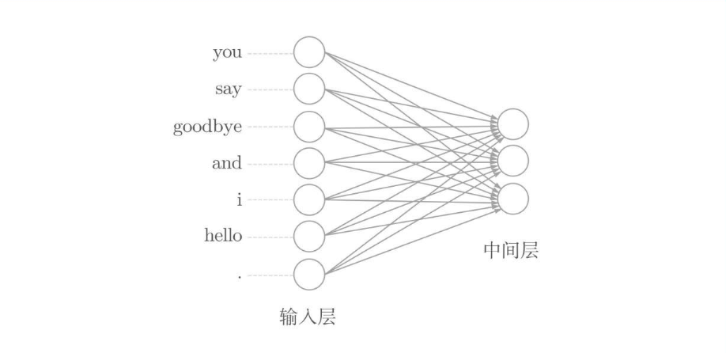
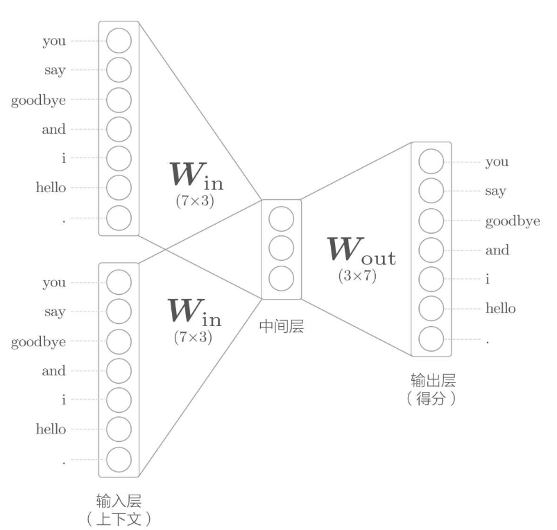
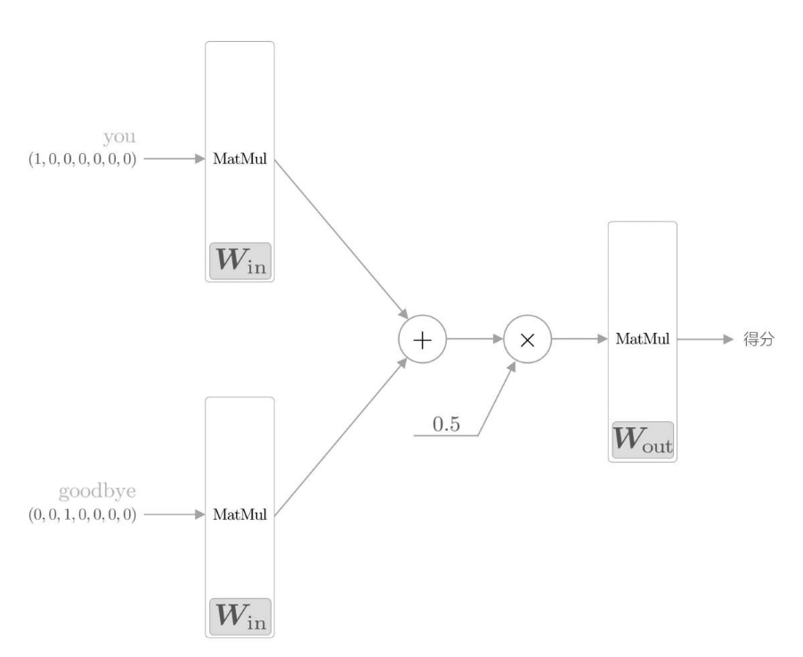
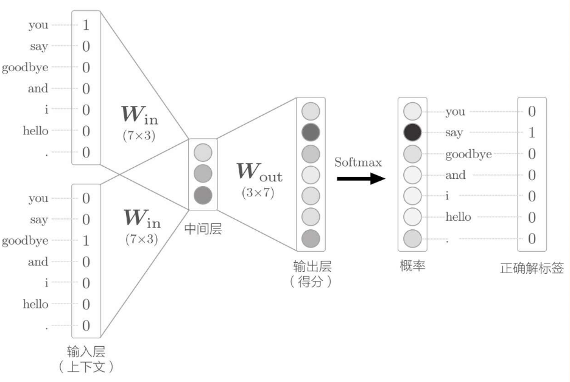
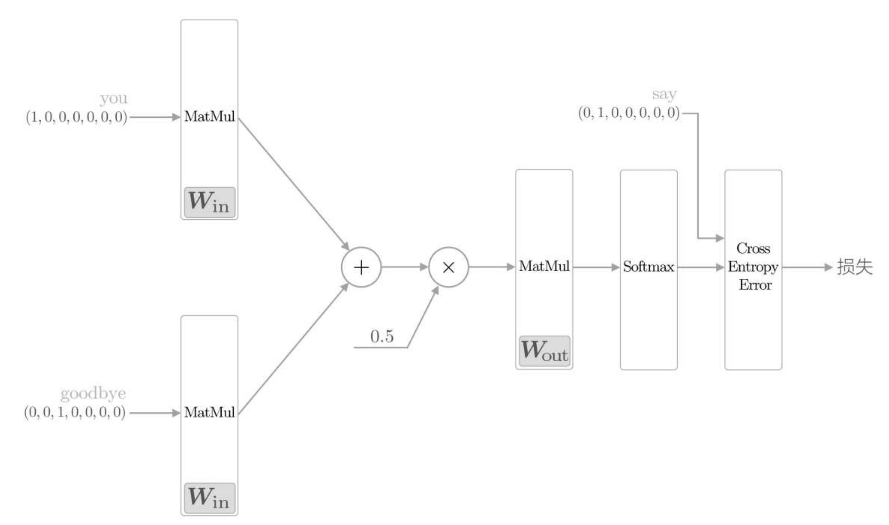
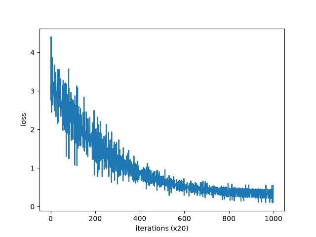
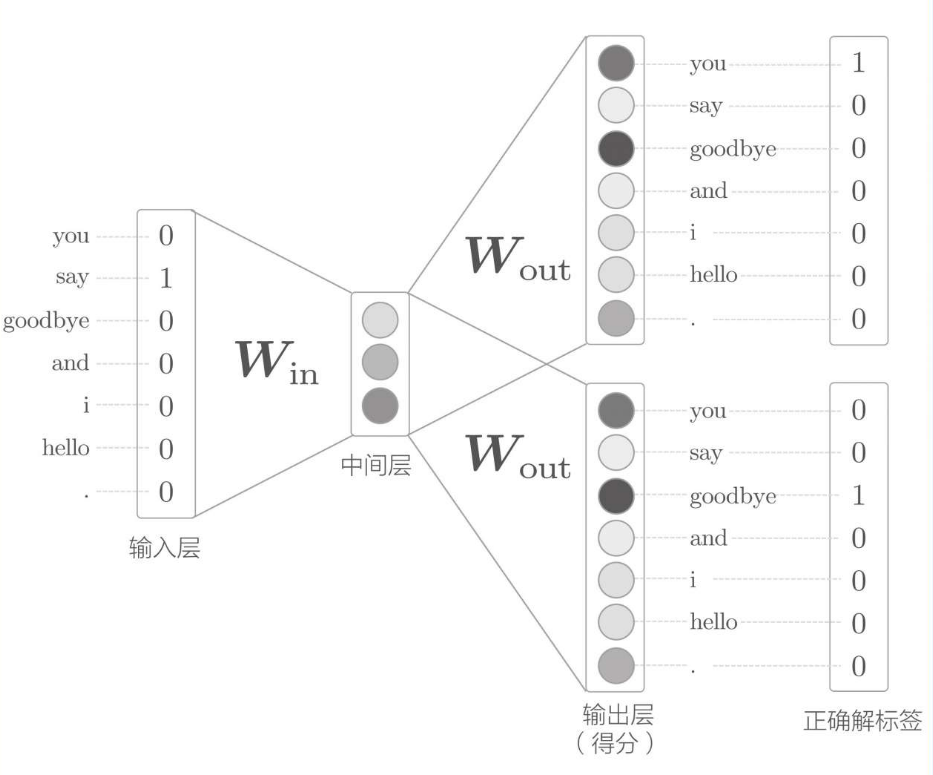

# 第 3 章 word2vec

接着上一章，本章的主题仍是单词的分布式表示。在上一章中，我们使用基于计数的方法得到了单词的分布式表示。本章我们将讨论该方法的替代方法，即基于推理的方法。

顾名思义，基于推理的方法使用了推理机制。当然，这里的推理机制用的是神经网络。本章，著名的word2vec将会登场。我们将花很多时间考察word2vec的结构，并通过代码实现来加深对它的理解。

本章的目标是实现一个简单的word2vec。这个简单的word2vec会优先考虑易理解性，从而牺牲一定的处理效率。因此，我们不会用它来处理大规模数据集，但用它处理小数据集毫无问题。下一章我们会对这个简单的word2vec进行改进，从而完成一个“真正的”word2vec。现在，让我们一起进入基于推理的方法和word2vec的世界吧！

## 3.1 基于推理的方法和神经网络

用向量表示单词的研究最近正在如火如荼地展开，其中比较成功的方法大致可以分为两种：一种是基于计数的方法；另一种是基于推理的方法。虽然两者在获得单词含义的方法上差别很大，但是两者的背景都是分布式假设。

本节我们将指出基于计数的方法的问题，并从宏观角度说明它的替代方法——基于推理的方法的优点。另外，为了做好word2vec的准备工作，我们会看一个用神经网络处理单词的例子。

### 3.1.1 基于计数的方法的问题

如上一章所说，基于计数的方法根据一个单词周围的单词的出现频数来表示该单词。具体来说，先生成所有单词的共现矩阵，再对这个矩阵进行SVD，以获得密集向量（单词的分布式表示）​。但是，基于计数的方法在处理大规模语料库时会出现问题。

在现实世界中，语料库处理的单词数量非常大。比如，据说英文的词汇量超过100万个。如果词汇量超过100万个，那么使用基于计数的方法就需要生成一个100万×100万的庞大矩阵，但对如此庞大的矩阵执行SVD显然是不现实的。

> 对于一个n×n的矩阵，SVD的复杂度是O（n3）​，这表示计算量与n的立方成比例增长。如此大的计算成本，即便是超级计算机也无法胜任。实际上，利用近似方法和稀疏矩阵的性质，可以在一定程度上提高处理速度，但还是需要大量的计算资源和时间。

基于计数的方法使用整个语料库的统计数据（共现矩阵和PPMI等）​，通过一次处理（SVD等）获得单词的分布式表示。而基于推理的方法使用神经网络，通常在mini-batch数据上进行学习。这意味着神经网络一次只需要看一部分学习数据（mini-batch）​，并反复更新权重。

基于计数的方法一次性处理全部学习数据；反之，基于推理的方法使用部分学习数据逐步学习。这意味着，在词汇量很大的语料库中，即使SVD等的计算量太大导致计算机难以处理，神经网络也可以在部分数据上学习。并且，神经网络的学习可以使用多台机器、多个GPU并行执行，从而加速整个学习过程。在这方面，基于推理的方法更有优势。

### 3.1.2 基于推理的方法的概要

基于推理的方法的主要操作是“推理”​。如下语句所示，当给出周围的单词（上下文）时，预测“?”处会出现什么单词，这就是推理。

```
you ? goodbye and you say hello.
```

解开上面语句中的推理问题并学习规律，就是基于推理的方法的主要任务。通过反复求解这些推理问题，可以学习到单词的出现模式。

基于推理的方法引入了某种模型，我们将神经网络用于此模型。这个模型接收上下文信息作为输入，并输出（可能出现的）各个单词的出现概率。在这样的框架中，使用语料库来学习模型，使之能做出正确的预测。另外，作为模型学习的产物，我们得到了单词的分布式表示。这就是基于推理的方法的全貌。

> 基于推理的方法和基于计数的方法一样，也基于分布式假设。分布式假设假设“单词含义由其周围的单词构成”​。基于推理的方法将这一假设归结为了上面的预测问题。由此可见，不管是哪种方法，如何对基于分布式假设的“单词共现”建模都是最重要的研究主题。

### 3.1.3 神经网络中单词的处理方法

从现在开始，我们将使用神经网络来处理单词。但是，神经网络无法直接处理you或say这样的单词，要用神经网络处理单词，需要先将单词转化为固定长度的向量。对此，一种方式是将单词转换为one-hot表示（one-hot向量）​。在one-hot表示中，只有一个元素是1，其他元素都是0。

我们来看一个one-hot表示的例子。和上一章一样，我们用 `"You say goodbye and I say hello."` 这个一句话的语料库来说明。在这个语料库中，一共有7个单词（​`you`、`say`​、`goodbye`、`and`、`i`、`hello`、`.`​）​。

我们按照下表的规则将其转换成 one-hot 向量表示形式：

| 单词    | 单词ID | one-hot 表示          |
| ------- | ------ | --------------------- |
| you     | 0      | (1, 0, 0, 0, 0, 0, 0) |
| say     | 1      | (0, 1, 0, 0, 0, 0, 0) |
| goodbye | 2      | (0, 0, 1, 0, 0, 0, 0) |
| ...     | ...    | ...                   |

以此类推。

单词可以表示为文本、单词ID和 one-hot 表示。此时，要将单词转化为 one-hot 表示，就需要准备元素个数与词汇个数相等的向量，并将单词ID对应的元素设为1，其他元素设为0。像这样，只要将单词转化为固定长度的向量，神经网络的输入层的神经元个数就可以固定下来。

输入层由7个神经元表示，分别对应于7个单词（第1个神经元对应于you，第2个神经元对应于say）​。

现在事情变得很简单了。因为只要将单词表示为向量，这些向量就可以由构成神经网络的各种“层”来处理。比如，对于one-hot表示的某个单词，使用全连接层对其进行变换的情况如下图所示。



如上图所示，全连接层通过箭头连接所有节点。这些箭头拥有权重（参数）​，它们和输入层神经元的加权和成为中间层的神经元。另外，本章使用的全连接层将省略偏置（这是为了配合后文对word2vec的说明）​。

> 没有偏置的全连接层相当于在计算矩阵乘积。在很多深度学习的框架中，在生成全连接层时，都可以选择不使用偏置。不使用偏置的全连接层相当于 MatMul 层。

现在，我们看一下代码。这里的全连接层变换可以写成如下的Python代码。

```py
import numpy as np

c = np.array([[1, 0, 0, 0, 0, 0, 0]])  # you 的 one-hot 向量
W = np.random.randn(7, 3)  # 权重
h = np.dot(c, W)  # 中间节点
print(h)  # [[ 0.06204169 -1.3760703  -0.05776062]]
```

这段代码将单词ID为0的单词表示为了one-hot表示，并用全连接层对其进行了变换。作为复习，全连接层的计算通过矩阵乘积进行。这可以用NumPy的np.dot（​）来实现（省略偏置）​。

> 这里，输入数据（变量c）的维数（ndim）是2。这是考虑了mini-batch处理，将各个数据保存在了第1维（0维度）中。

上述代码的功能也可以使用MatMul层完成，如下所示。

```py
import sys

sys.path.append("../..")
import numpy as np
from common.layer import MatMul

c = np.array([[1, 0, 0, 0, 0, 0, 0]])
W = np.random.randn(7, 3)
layer = MatMul(W)
h = layer.forward(c)
print(h)    # [[ 1.35718901 -1.00301849 -1.05657724]]
```

这里，我们先导入了 common 目录下的 MatMul 层。之后，将 MatMul 层的权重设为了W，并使用`forward()` 方法执行正向传播。

## 3.2 简单的 word2vec

上一节我们学习了基于推理的方法，并基于代码讨论了神经网络中单词的处理方法，至此准备工作就完成了，现在是时候实现word2vec了。

这里，我们使用由原版word2vec提出的名为continuous bag-of-words（CBOW）的模型作为神经网络。

> word2vec一词最初用来指程序或者工具，但是随着该词的流行，在某些语境下，也指神经网络的模型。正确地说，CBOW模型和skip-gram模型是word2vec中使用的两个神经网络。本节我们将主要讨论CBOW模型。

### 3.2.1 CBOW 模型的推理

CBOW模型是根据上下文预测目标词的神经网络（​“目标词”是指中间的单词，它周围的单词是“上下文”​）​。通过训练这个CBOW模型，使其能尽可能地进行正确的预测，我们可以获得单词的分布式表示。

CBOW模型的输入是上下文。这个上下文用['you', 'goodbye']这样的单词列表表示。我们将其转换为one-hot表示，以便CBOW模型可以进行处理。在此基础上，CBOW模型的网络可以画成下图这样。



上图就是 CBOW 模型的网络。它有两个输入层，经过中间层到达输出层。这里，从输入层到中间层的变换由相同的全连接层（权重为$W_{in}$）完成，从中间层到输出层神经元的变换由另一个全连接层（权重为$W_{out}$）完成。

> 这里，因为我们对上下文仅考虑两个单词，所以输入层有两个。如果对上下文考虑N个单词，则输入层会有N个。

现在，我们注意一下CBOW模型的中间层。此时，中间层的神经元是各个输入层经全连接层变换后得到的值的“平均”​。就上面的例子而言，经全连接层变换后，第1个输入层转化为h1，第2个输入层转化为h2，那么中间层的神经元是 $\frac{1}{2}(h_1+h_2)$。

最后是CBOW模型中的输出层，这个输出层有7个神经元。这里重要的是，这些神经元对应于各个单词。输出层的神经元是各个单词的得分，它的值越大，说明对应单词的出现概率就越高。得分是指在被解释为概率之前的值，对这些得分应用Softmax函数，就可以得到概率。

从CBOW模型的示意图中我们能够知道，从输入层到中间层的变换由全连接层（权重是$W_{in}$）完成。此时，全连接层的权重$W_{in}$是一个7×3的矩阵。提前剧透一下，这个权重就是我们要的单词的分布式表示。

权重$W_{in}$的各行保存着各个单词的分布式表示。通过反复学习，不断更新各个单词的分布式表示，以正确地从上下文预测出应当出现的单词。令人惊讶的是，如此获得的向量很好地对单词含义进行了编码。这就是word2vec的全貌。

> 中间层的神经元数量比输入层少这一点很重要。中间层需要将预测单词所需的信息压缩保存，从而产生密集的向量表示。这时，中间层被写入了我们人类无法解读的代码，这相当于“编码”工作。而从中间层的信息获得期望结果的过程则称为“解码”​。这一过程将被编码的信息复原为我们可以理解的形式。

到目前为止，我们从神经元视角图示了CBOW模型。下面，我们从层视角图示CBOW模型。这样一来，这个神经网络的结构如下图所示。



如上图所示，CBOW模型一开始有两个MatMul层，这两个层的输出被加在一起。然后，对这个相加后得到的值乘以0.5求平均，可以得到中间层的神经元。最后，将另一个MatMul层应用于中间层的神经元，输出得分。

```py
import sys

sys.path.append("../..")
import numpy as np
from common.layer import MatMul

# 样本的上下文
c0 = np.array([[1, 0, 0, 0, 0, 0, 0]])  # you
c1 = np.array([[0, 0, 1, 0, 0, 0, 0]])  # goodbye

# 生成权重初始值
W_in = np.random.randn(7, 3)
W_out = np.random.randn(3, 7)

# 生成层
in_layer0 = MatMul(W_in)
in_layer1 = MatMul(W_in)
out_layer = MatMul(W_out)

# 正向传播
h0 = in_layer0.forward(c0)
h1 = in_layer1.forward(c1)
h = 0.5 * (h0 + h1)
s = out_layer.forward(h)  # 计算得分

print(s)
# [[-1.01633624 -0.08948416  0.33510525  0.47603671  1.065994   -0.40313444
#    0.09719371]]
```

这里，我们首先将必要的权重（$W_{in}$和$W_{out}$）初始化。然后，生成与上下文单词数量等量（这里是两个）的处理输入层的 `MatMul` 层，输出侧仅生成一个 `MatMul` 层。需要注意的是，输入侧的 `MatMul` 层共享权重$W_{in}$。

之后，输入侧的 `MatMul` 层（`in_layer0`和`in_layer1`）调用 `forward()` 方法，计算中间数据，并通过输出侧的 `MatMul` 层（`out_layer`）计算各个单词的得分。

以上就是CBOW模型的推理过程。这里我们见到的CBOW模型是没有使用激活函数的简单的网络结构。除了多个输入层共享权重外，并没有什么难点。接下来，我们继续看一下CBOW模型的学习。

### 3.2.2 CBOW 模型的学习

到目前为止，我们介绍的CBOW模型在输出层输出了各个单词的得分。通过对这些得分应用Softmax函数，可以获得概率​。这个概率表示哪个单词会出现在给定的上下文（周围单词）中间。



上图所示的例子中，上下文是 you 和 goodbye，正确解标签（神经网络应该预测出的单词）是say。这时，如果网络具有“良好的权重”​，那么在表示概率的神经元中，对应正确解的神经元的得分应该更高。

CBOW模型的学习就是调整权重，以使预测准确。其结果是，权重$W_{in}$（确切地说是$W_{in}$和$W_{out}$两者）学习到蕴含单词出现模式的向量。根据过去的实验，CBOW模型（和skip-gram模型）得到的单词的分布式表示，特别是使用维基百科等大规模语料库学习到的单词的分布式表示，在单词的含义和语法上符合我们直觉的案例有很多。

> CBOW模型只是学习语料库中单词的出现模式。如果语料库不一样，学习到的单词的分布式表示也不一样。比如，只使用“体育”相关的文章得到的单词的分布式表示，和只使用“音乐”相关的文章得到的单词的分布式表示将有很大不同。

现在，我们来考虑一下上述神经网络的学习。其实很简单，这里我们处理的模型是一个进行多类别分类的神经网络。因此，对其进行学习只是使用一下Softmax函数和交叉熵误差。首先，使用Softmax函数将得分转化为概率，再求这些概率和监督标签之间的交叉熵误差，并将其作为损失进行学习，这一过程可以用下图表示。



如上图所示，只需向上一节介绍的进行推理的CBOW模型加上Softmax层和Cross Entropy Error层，就可以得到损失。这就是CBOW模型计算损失的流程，对应于神经网络的正向传播。

### 3.2.3 word3vec的权重和分布式表示

如前所述，word2vec中使用的网络有两个权重，分别是输入侧的全连接层的权重（$W_{in}$）和输出侧的全连接层的权重（$W_{out}$）​。一般而言，输入侧的权重$W_{in}$的每一行对应于各个单词的分布式表示。另外，输出侧的权重$W_{out}$也同样保存了对单词含义进行了编码的向量。

那么，我们最终应该使用哪个权重作为单词的分布式表示呢？这里有三个选项。

- A. 只使用输入侧的权重
- B. 只使用输出侧的权重
- C. 同时使用两个权重

方案A和方案B只使用其中一个权重。而在采用方案C的情况下，根据如何组合这两个权重，存在多种方式，其中一个方式就是简单地将这两个权重相加。

就word2vec（特别是skip-gram模型）而言，最受欢迎的是方案A。许多研究中也都仅使用输入侧的权重$W_{in}$作为最终的单词的分布式表示。遵循这一思路，我们也使用$W_{in}$作为单词的分布式表示。

## 3.3 学习数据的准备

在开始word2vec的学习之前，我们先来准备学习用的数据。这里我们仍以“You say goodbye and I say hello.”这个只有一句话的语料库为例进行说明。

### 3.3.1 上下文和目标词

word2vec中使用的神经网络的输入是上下文，它的正确解标签是被这些上下文包围在中间的单词，即目标词。也就是说，我们要做的事情是，当向神经网络输入上下文时，使目标词出现的概率高（为了达成这一目标而进行学习）​。

下面我们就从语料库生成上下文和目标词，如下表所示。

| corpus                            | contexts       | target   |
| --------------------------------- | -------------- | -------- |
| you [say] goobye and i say hello. | [you, goodbye] | [say]    |
| you say [goobye] and i say hello. | [say, and]     | [goobye] |
| you say goobye [and] i say hello. | [goodbye, i]   | [and]    |
| you say goobye and [i] say hello. | [and, say]     | [i]      |
| you say goobye and i [say] hello. | [i, hello]     | [say]    |
| you say goobye and i say [hello]. | [say, .]       | [hello]  |

在上表中，将语料库中的目标单词作为目标词，将其周围的单词作为上下文提取出来。我们对语料库中的所有单词都执行该操作（两端的单词除外）​，可以得到上表右侧的contexts（上下文）和target（目标词）​。contexts的各行成为神经网络的输入，target的各行成为正确解标签（要预测出的单词）​。另外，在各笔样本数据中，上下文有多个单词（这个例子中有两个）​，而目标词则只有一个，因此只有上下文写成了复数形式contexts。

现在，我们来实现从语料库生成上下文和目标词的函数。在此之前，我们先复习一下上一章的内容。首先，将语料库的文本转化成单词ID。这需要使用第2章实现的 `preprocess()` 函数。

```py
import sys

sys.path.append("../..")
from common.util import preprocess

message = "You say goodbye and i say hello."
corpus, word_to_id, id_to_word = preprocess(message)
print(corpus)
print(word_to_id)
print(id_to_word)
```

然后，从单词ID列表corpus生成contexts和target。具体来说，实现一个当给定corpus时返回contexts和target的函数。

```py
def create_contexts_target(corpus, vocab_size, window_size=1):
    target = corpus[window_size:-window_size]
    contexts = []

    for idx in range(window_size, len(corpus) - window_size):
        cs = []
        for t in range(-window_size, window_size + 1):
            if t == 0:
                continue
            cs.append(corpus[idx + t])
        contexts.append(cs)

    return np.array(contexts), np.array(target)
```

这个函数有两个参数：一个是单词ID列表（corpus）​；另一个是上下文的窗口大小（window_size）​。另外，函数返回的是NumPy多维数组格式的上下文和目标词。现在，我们来实际使用一下这个函数，接着刚才的实现，代码如下所示。

```py
contexts, target = create_contexts_target(corpus, len(word_to_id))
print(contexts)
# [[0 2]
#  [1 3]
#  [2 4]
#  [3 1]
#  [4 5]
#  [1 6]]
print(target)
# [1 2 3 4 1 5]
```

这样就从语料库生成了上下文和目标词，后面只需将它们赋给CBOW模型即可。不过，因为这些上下文和目标词的元素还是单词ID，所以还需要将它们转化为one-hot表示。

### 3.3.2 转换为 ont-hot 表示

下面，我们将上下文和目标词转化为one-hot表示。上下文和目标词从单词ID转化为了one-hot表示。这里需要注意各个多维数组的形状。在上面的例子中，使用单词ID时的contexts的形状是（6,2）​，将其转化为one-hot表示后，形状变为（6,2,7）​。

以下是 ont-hot 转换函数：

```py
def convert_one_hot(corpus, vocab_size):
    """
    one-hoe转换，需要考虑二维场景
    : param corpus:
    : param vocab_size:
    : return: ont-hot 表示
    """
    N = corpus.shape[0]

    if corpus.ndim == 1:
        one_hot = np.zeros((N, vocab_size), dtype=np.int32)
        # 遍历语料中的每个词汇，根据词汇ID更新one
        for idx, word_id in enumerate(corpus):
            one_hot[idx, word_id] = 1

    elif corpus.ndim == 2:
        C = corpus.shape[1]
        one_hot = np.zeros((N, C, vocab_size), dtype=np.int32)
        for idx_0, word_ids in enumerate(corpus):
            for idx_1, word_id in enumerate(word_ids):
                one_hot[idx_0, idx_1, word_id] = 1

    return one_hot
```

处理逻辑如下：

```py
message = "You say goodbye and i say hello."
corpus, word_to_id, id_to_word = preprocess(message)
contexts, target = create_contexts_target(corpus, len(word_to_id))
vocab_size = len(word_to_id)

contexts = convert_one_hot(contexts, vocab_size)
target = convert_one_hot(target, vocab_size)
```

至此，学习数据的准备就完成了，下面我们来讨论最重要的CBOW模型的实现。

## 3.4 CBOW 模型的实现

我们接下来将着手实现 CBOW 模型的代码，我们将其封装成 SimpleCBOW 类。首先，我们看一下 SimpleCBOW类的初始化方法：

```py
class SimpleCBOW:
    def __init__(self, vocab_size, hidden_size):
        V, H = vocab_size, hidden_size

        # 初始化权重参数
        W_in = 0.01 * np.random.randn(V, H).astype("f")
        W_out = 0.01 * np.random.randn(H, V).astype("f")

        # 生成层
        self.in_layer0 = MatMul(W_in)
        self.in_layer1 = MatMul(W_in)
        self.out_layer = MatMul(W_out)
        self.loss_layer = SoftmaxWithLoss()

        # 将所有的权重和梯度都整理到列表中
        layers = [self.in_layer0, self.in_layer1, self.out_layer]
        for layer in layers:
            self.params += layer.params
            self.grads += layer.grads

        # 将单词的分布式表示设置为成员变量
        self.word_vecs = W_in
```

这里，初始化方法的参数包括词汇个数`vocab_size`和中间层的神经元个数`hidden_size`。关于权重的初始化，首先我们生成两个权重（$W_{in}$和$W_{out}$）​，并用一些小的随机值初始化这两个权重。此外，我们指定NumPy数组的数据类型为astype（'f'）​，这样一来，初始化将使用32位的浮点数。

接着，我们创建必要的层。首先，生成两个输入侧的MatMul层、一个输出侧的MatMul层，以及一个Softmax with Loss层。这里，用来处理输入侧上下文的MatMul层的数量与上下文的单词数量相同（本例中是两个）​。另外，我们使用相同的权重来初始化MatMul层。

最后，将该神经网络中使用的权重参数和梯度分别保存在列表类型的成员变量params和grads中。

接下来，我们来实现神经网络的正向传播 `forward()` 函数。这个函数接收参数contexts和target，并返回损失（loss）​。

```py
def forward(self, contexts, target):
    h0 = self.in_layer0.forward(contexts[:, 0])
    h1 = self.in_layer1.forward(contexts[:, 1])
    h = 0.5 * (h0 + h1)
    score = self.out_layer.forward(h)
    loss = self.loss_layer.forward(score, target)

    return loss
```

这里，我们假定参数 contexts 是一个三维 NumPy 数组，其形状为 (N, 2, 7)，其中第0维的元素个数是 `mini-batch` 的数量，第1维的元素个数是上下文窗口的大小，第2维表示 `one-hot` 向量。此外，target是 (6, 7) 这样的二维形状。

最后，我们实现反向传播 `backward()`。

```py
def backward(self, dout=1):
    ds = self.loss_layer.backward(dout)
    da = self.out_layer.forward(ds)
    da *= 0.5
    self.in_layer0.backward(da)
    self.in_layer1.backward(da)

    return None
```

至此，反向传播的实现就结束了。我们已经将各个权重参数的梯度保存在了成员变量grads中。因此，通过先调用 `forward()` 函数，再调用 `backward()` 函数，grads列表中的梯度被更新。下面，我们继续看一下SimpleCBOW类的学习。

```py
import sys

sys.path.append("../..")
from common.optimizer import Adam
from common.trainer import Trainer
from common.util import convert_one_hot, create_contexts_target, preprocess
from simple_cbow import SimpleCBOW

window_size = 1
hidden_size = 5
barch_size = 3
max_epoch = 1000

# 数据预处理
text = "You say goodbye and i say hello."
corpus, word_to_id, id_to_word = preprocess(text)
vocab_size = len(word_to_id)
# 创建上下文及目标向量
contexts, target = create_contexts_target(corpus, vocab_size, window_size=window_size)
# 转换为 ont-hot 形式
contexts = convert_one_hot(contexts, vocab_size)
target = convert_one_hot(target, vocab_size)
print("contexts shape: ", contexts.shape)
print("target shape: ", target.shape)

# 初始化模型
model = SimpleCBOW(vocab_size, hidden_size)
optimizer = Adam()
trainer = Trainer(model, optimizer)

# 开始训练
trainer.fit(contexts, target, max_epoch, barch_size)
trainer.plot()

word_vecs = model.word_vecs
# 输出每个单词的分布式向量
for word_id, word in id_to_word.items():
    print(word, word_vecs[word_id])
```

下面是封装了模型推理和学习的逻辑类 Trainer 的具体实现：

```py
# coding: utf-8
import sys

sys.path.append("..")
import time

import matplotlib.pyplot as plt
import numpy
import numpy as np
from common.util import clip_grads


class Trainer:
    def __init__(self, model, optimizer):
        self.model = model
        self.optimizer = optimizer
        self.loss_list = []
        self.eval_interval = None
        self.current_epoch = 0

    def fit(self, x, t, max_epoch=10, batch_size=32, max_grad=None, eval_interval=20):
        data_size = len(x)
        max_iters = data_size // batch_size
        self.eval_interval = eval_interval
        model, optimizer = self.model, self.optimizer
        total_loss = 0
        loss_count = 0

        start_time = time.time()
        for epoch in range(max_epoch):
            # 打乱数据，生成索引
            idx = numpy.random.permutation(numpy.arange(data_size))
            x = x[idx]
            t = t[idx]

            for iters in range(max_iters):
                batch_x = x[iters * batch_size : (iters + 1) * batch_size]
                batch_t = t[iters * batch_size : (iters + 1) * batch_size]

                # 计算梯度并更新参数
                loss = model.forward(batch_x, batch_t)
                model.backward()
                params, grads = remove_duplicate(
                    model.params, model.grads
                )  # 将共享的权重合并为一个
                if max_grad is not None:
                    clip_grads(grads, max_grad)
                optimizer.update(params, grads)
                total_loss += loss
                loss_count += 1

                # 评估
                if (eval_interval is not None) and (iters % eval_interval) == 0:
                    avg_loss = total_loss / loss_count
                    elapsed_time = time.time() - start_time
                    print(
                        "| epoch %d |  iter %d / %d | time %d[s] | loss %.2f"
                        % (
                            self.current_epoch + 1,
                            iters + 1,
                            max_iters,
                            elapsed_time,
                            avg_loss,
                        )
                    )
                    self.loss_list.append(float(avg_loss))
                    total_loss, loss_count = 0, 0

            self.current_epoch += 1

    def plot(self, ylim=None):
        x = numpy.arange(len(self.loss_list))
        if ylim is not None:
            plt.ylim(*ylim)
        plt.plot(x, self.loss_list, label="train")
        plt.xlabel("iterations (x" + str(self.eval_interval) + ")")
        plt.ylabel("loss")
        plt.show()


def remove_duplicate(params, grads):
    """
    将参数列表中重复的权重合并为一个，
    并将对应的梯度相加
    """
    params, grads = params[:], grads[:]  # copy list

    while True:
        find_flg = False
        L = len(params)

        for i in range(0, L - 1):
            for j in range(i + 1, L):
                # 当权重共享时
                if params[i] is params[j]:
                    grads[i] += grads[j]  # 将梯度相加
                    find_flg = True
                    params.pop(j)
                    grads.pop(j)
                # 当以转置矩阵共享权重（weight tying）时
                elif (
                    params[i].ndim == 2
                    and params[j].ndim == 2
                    and params[i].T.shape == params[j].shape
                    and np.all(params[i].T == params[j])
                ):
                    grads[i] += grads[j].T
                    find_flg = True
                    params.pop(j)
                    grads.pop(j)

                if find_flg:
                    break
            if find_flg:
                break

        if not find_flg:
            break

    return params, grads
```

运行上面的训练代码，结果如下如所示：



通过不断学习，损失在减小，看起来学习进行得一切正常。我们来看一下学习结束后的权重参数。这里，我们取出输入侧的MatMul层的权重，实际确认一下它的内容。因为输入侧的MatMul层的权重已经赋值给了成员变量`word_vecs`，所以我来看下最后词汇的分布式向量。

```
you [-0.08733296 -1.020371   -0.16142899 -1.818681    1.2386943 ]
say [ 1.0642354   0.7097241  -0.16768804  0.30489644 -0.05277122]
goodbye [ 0.14895093 -2.1027763   3.0464327   0.2150275   1.8741611 ]
and [ 1.3632429   0.1346582  -1.0137464   0.98772806 -1.8128741 ]
i [ 0.80219644 -1.6355501   0.819029    1.634943   -0.36167252]
hello [-2.6642544  -2.180111    0.09655147 -0.55213857 -0.5050689 ]
. [ 1.5807176  1.0261713 -1.4504613 -0.8537835  1.2824849]
```

我们终于将单词表示为了密集向量！这就是单词的分布式表示。我们有理由相信，这样的分布式表示能够很好地捕获单词含义。

不过，遗憾的是，这里使用的小型语料库并没有给出很好的结果。当然，主要原因是语料库太小了。如果换成更大、更实用的语料库，相信会获得更好的结果。但是，这样在处理速度方面又会出现新的问题，这是因为当前这个CBOW模型的实现在处理效率方面存在几个问题。

## 3.5 word2ve的补充说明

我们下面从概率的角度，再来看一下 CBOW 模型。

### 3.5.1 CBOW模型和概率

首先简单说明一下概率的表示方法。比如事件A发生的概率记为`P(A)`​。联合概率记为`P(A, B)`​，表示事件A和事件B同时发生的概率。

后验概率即为`P(A|B)`，字面意思是“事件发生后的概率”​。从另一个角度来看，也可以解释为“在给定事件B（的信息）时事件A发生的概率”​。

下面，我们用概率的表示方法来描述CBOW模型。CBOW模型进行的处理是，当给定某个上下文时，输出目标词的概率。这里，我们使用包含单词$w_1, w_2,···, w_T$的语料库。现在针对第t个单词，考虑窗口大小为1的上下文。

$$
w_{1} w_{2} w_{3} ... w_{t-1} [w_{t}] w_{t+1} ... w_{T-1} w_T
$$

下面，我们用数学式来表示当给定上下文$w_{t-1}$和$w_{t+1}$时目标词为$w_{t}$的概率。使用后验概率，有式（3.1）​：

$$
P(w_t|w_{t-1}, w_{t+1})
$$

上述概率计算表示“当$w_{t-1}$和$w_{t+1}$发生后，$w_t$发生的概率”，也可以解释为“当给定$w_{t-1}$和$w_{t+1}$时，$w_t$发生的概率”。也就是说，CBOW模型可以按照上述计算公式建模。

这里，使用式（3.1）可以简洁地表示CBOW模型的损失函数。我们把第1章介绍的交叉熵误差函数（式（1.7）​）套用在这里。式（1.7）是$L=-\sum_k{t_k\log{y_k}}$，其中，$y_k$表示第k个事件发生的概率。$t_k$是监督标签，它是one-hot向量的元素。这里需要注意的是，​“$w_t$发生”这一事件是正确解，它对应的one-hot向量的元素是1，其他元素都是0（也就是说，当$w_t$之外的事件发生时，对应的one-hot向量的元素均为0）​。考虑到这一点，可以推导出下式：

$$
L=-\log{P(w_t|w_{t-1},w_{t+1})}
$$

CBOW模型的损失函数只是对式（3.1）的概率取log，并加上负号。顺便提一下，这也称为负对数似然（negative log likelihood）​。式（3.2）是一笔样本数据的损失函数。如果将其扩展到整个语料库，则损失函数可以写为：

$$
L=-\frac{1}{T}\sum_{t=1}^{T}log{P(w_t|w_{t-1}, w_{t+1})}
$$

CBOW模型学习的任务就是让式（3.3）表示的损失函数尽可能地小。那时的权重参数就是我们想要的单词的分布式表示。

这里，我们只考虑了窗口大小为1的情况，不过其他的窗口大小（或者窗口大小为m的一般情况）也很容易用数学式表示。

### 3.5.2 skip-gram 模型

如前所述，word2vec有两个模型：一个是我们已经讨论过的CBOW模型；另一个是被称为skip-gram的模型。skip-gram是反转了CBOW模型处理的上下文和目标词的模型。

```
? say ? and i say hello.
```

如上图所示，CBOW模型从上下文的多个单词预测中间的单词（目标词），而 skip-gram 模型则从中间的单词（目标词）预测周围的多个单词（上下文）。此时，skip-grap模型的网络结构如下图所示：



由上图可知，skip-gram模型的输入层只有一个，输出层的数量则与上下文的单词个数相等。因此，首先要分别求出各个输出层的损失（通过 SoftmaxWithLoss 层等），然后将它们加起来作为最后的损失。

``` py

```

现在，我们使用概率的表示方法来表示skip-gram模型。
