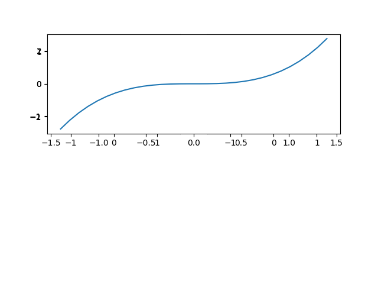
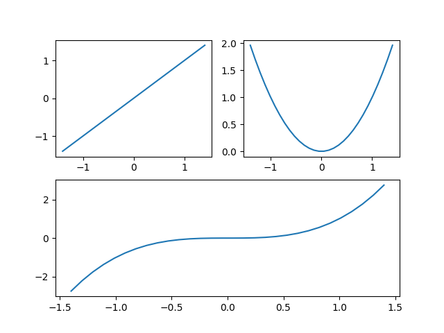

# Matplotlib绘图库学习

记录学习Matplotlib绘制标量的图形

## 使用Plot绘制我们的第一个图形

首先，我们需要导入 `matplotlib` 库：

``` py
import matplotlib
```

现在让我们绘制我们的图像！:)

``` py
import matplotlib.pyplot as plt

plt.plot([1, 2, 4, 9, 5, 3])
plt.show()
```

我们第一个matplotlib绘图程序就写好了，使用一些简单的数据，调用 `plot` 和 `show` 方法就完成了。

如果绘图函数 `plot` 接收一个数据数组，它将使用该数组作为纵轴坐标，并将数组中每个数据点的索引作为横轴坐标。我们也可以提供两个数组：一个用于横轴 x，另一个用于纵轴 y：

``` py
plt.plot([-3, -2, 5, 0], [1, 6, 4, 3])
plt.show()
```

坐标轴会自动与数据范围匹配。我们希望给图表留出更多空间，因此让我们调用坐标轴函数 `axis` 来更改每个坐标轴的范围 [xmin, xmax, ymin, ymax]。

``` py
plt.plot([-3, -2, 5, 0], [1, 6, 4, 3])
plt.axis([-4, 6, 0, 7])
plt.show()
```

现在，让我们绘制一个数学函数。我们使用 NumPy 的 `linspace` 函数创建一个包含 500 个浮点数的数组 x，取值范围从 -2 到 2，然后我们创建第二个数组 y，计算方法是 x 的平方（要了解 NumPy，请阅读 NumPy 教程）。

``` py
import matplotlib.pyplot as plt
import numpy as np

x = np.linspace(-2, 2, 500)
y = x**2

plt.plot(x, y)
plt.show()
```

这有点枯燥，我们来添加标题、x轴和y轴标签，并绘制一个网格。

``` py
# 添加标题
plt.title("Square function")
# 添加x坐标轴标签
plt.xlabel("x")
# 添加y坐标轴标签
plt.ylabel("y=x^2")
# 添加网格
plt.grid(True)

plt.plot(x, y)
plt.show()
```

## 线条样式和颜色

默认情况下，matplotlib 会在连续点之间绘制一条线。

``` py
plt.plot([0, 100, 100, 0, 0, 100, 50, 0, 100],
         [0, 0, 100, 100, 0, 100, 130, 100, 0])
plt.axis([-10, 110, -10, 140])
plt.show()
```

我们可以传递第三个参数来更改线条的样式和颜色。例如，`"g--"` 表示“绿色虚线”。

``` py
x = [0, 100, 100, 0, 0, 100, 50, 0, 100]
y = [0, 0, 100, 100, 0, 100, 130, 100, 0]

plt.axis([-10, 110, -10, 140])

plt.plot(x, y, "g--")
plt.show()
```

我们还可以在同一张图上绘制多条线，操作非常简单：只需传递 `x1, y1, [style1], x2, y2, [style2], ...`

``` py
x1 = [0, 100, 100, 0, 0, 100, 50, 0, 100]
y1 = [0, 0, 100, 100, 0, 100, 130, 100, 0]
x2 = [0, 100, 100, 0, 0]
y2 = [0, 0, 100, 100, 0]

plt.axis([-10, 110, -10, 140])
plt.plot(x1, y1, "g--", x2, y2, "r-")
plt.show()
```

或者是在调用 `show` 之前多次调用 `plot` 绘制多条线。

``` py
plt.plot(x1, y1, "g--")
plt.plot(x2, y2, "r-")
plt.show()
```

也可以绘制简单的点而不是线。这里有一个示例，使用了绿色虚线、红色点线和蓝色三角形。有关完整的样式和颜色选项列表，请参阅[文档](https://matplotlib.org/stable/api/_as_gen/matplotlib.pyplot.plot.html#matplotlib.pyplot.plot)。

``` py
x = np.linspace(-1.4, 1.4, 30)
# 以不同的格式绘制三条线：红色虚线、绿色点线和蓝色三角形线
plt.plot(x, x, "r--")
plt.plot(x, x**2, "g:")
plt.plot(x, x**3, "b^")

plt.show()
```

plot 函数返回一个 `Line2D` 对象列表（每条线对应一个对象）。我们也可以为这些线设置额外的属性，例如线宽、虚线样式或透明度。请参阅[文档](https://matplotlib.org/stable/tutorials/pyplot.html)中的完整属性列表。

``` py
x = np.linspace(-1.4, 1.4, 30)
# 返回一个 Line2D 对象列表
line1, line2, line3 = plt.plot(x, x, "r--", x, x**2, "g:", x, x**3, "b^")
# 设置线条宽度、线条样式和透明度
line1.set_linewidth(3.0)
line1.set_dash_capstyle("round")
line3.set_alpha(0.2)
plt.show()
```

## 保存图像 [savefig]

将图像保存到磁盘非常简单，只需调用 [`savefig`](https://matplotlib.org/stable/api/_as_gen/matplotlib.pyplot.savefig.html) 函数并传入文件名（或文件对象）即可。可用的图像格式取决于我们使用的图形后端。

``` py
import matplotlib.pyplot as plt
import numpy as np

x = np.linspace(-1.4, 1.4, 30)

plt.plot(x, x**2)
# 保存图像，transparent=True表示保存的图像背景为透明
plt.savefig("quadratic.png", transparent=True)
```

## 子图[subplots]

matplotlib 图形可以包含多个子图。这些子图以网格形式排列。要创建子图，只需调用 `subplot` 函数，并指定图形的行数和列数，以及要绘制的子图的索引（从 1 开始，然后从左到右，从上到下）。请注意，pyplot 会跟踪当前活动的子图（可以通过调用 `plt.gca()` 获取其引用），因此当您调用 `plot` 函数时，它会在活动的子图上绘制图形。

``` py
import matplotlib.pyplot as plt
import numpy as np

x = np.linspace(-1.4, 1.4, 30)

# 2 行, 2 列, 第一个子图
plt.subplot(2, 2, 1)
plt.plot(x, x)
# 2 行, 2 列, 第二个子图
plt.subplot(2, 2, 2)
plt.plot(x, x**2)
# 2 行, 2 列, 第三个子图
plt.subplot(2, 2, 3)
plt.plot(x, x**3)
# 2 行, 2 列, 第四个子图
plt.subplot(2, 2, 4)
plt.plot(x, x**4)

plt.show()
```

请注意，`subplot(223)` 是 `subplot(2, 2, 3)` 的简写形式。

创建跨越多个网格单元的子图也非常简单，如下所示：

``` py
x = np.linspace(-1.4, 1.4, 30)

# 2 行, 2 列, 第一个子图
plt.subplot(2, 2, 1)
plt.plot(x, x)
# 2 行, 2 列, 第二个子图
plt.subplot(2, 2, 2)
plt.plot(x, x**2)
# 2 行, 1 列, 第2个子图
plt.subplot(2, 1, 2)
plt.plot(x, x**3)

plt.show()
```

> 注意：第三个子图 `plt.subplot(2, 1, 2)` 的第三个参数必须是 `2`，不能为 `1`，为 `1` 的话，会直接覆盖第一行的两个子图。

如下图所示：



而正确的结果如下图：



如果需要更复杂的子图定位，可以使用 `subplot2grid` 代替 `subplot`。我们需要指定网格的行数和列数，然后指定子图在网格中的位置（左上角 = (0,0)），还可以选择性地指定子图跨越的行数和/或列数。例如：

``` py
# subplot2grid()函数的第一个参数是一个元组，表示整个图表被分成了几行几列；第二个参数也是一个元组，表示当前子图所在的位置；第三个参数colspan表示当前子图占据多少列；第四个参数rowspan表示当前子图占据多少行。

# 在这个例子中，整个图表被分成了3行3列，第一幅图占据了前两行和前两列，第二幅图占据了第一行的第三列，第三幅图占据了第二行和第三行的第三列，第四幅图占据了第三行的前两列。
plt.subplot2grid((3, 3), (0, 0), colspan=2, rowspan=2)
plt.plot(x, x)

# 
plt.subplot2grid((3, 3), (0, 2))
plt.plot(x, x**2)

plt.subplot2grid((3, 3), (1, 2), rowspan=2)
plt.plot(x, x**3)

plt.subplot2grid((3, 3), (2, 0), colspan=2)
plt.plot(x, x**4)

plt.show()
```

如果我们需要更灵活的子图定位，请查看相应的 [matplotlib 教程](https://matplotlib.org/stable/users/explain/axes/arranging_axes.html)。

## 多个画布[Multiple figures]

也可以绘制多个图形。每个图形可以包含一个或多个子图。默认情况下，matplotlib 会自动创建 figure(1)。切换图形时，pyplot 会跟踪当前活动的图形（可以通过调用 `plt.gcf()` 获取其引用），并且该图形的活动子图将成为当前子图。

``` py
x = np.linspace(-1.4, 1.4, 30)

# 说明：plt.figure()函数创建一个新的图形窗口，figsize参数指定图形的宽度和高度（单位为英寸）。plt.subplot()函数用于在同一图形窗口中创建多个子图，第一个参数表示行数，第二个参数表示列数，第三个参数表示当前子图的位置。plt.plot()函数用于绘制数据，参数分别是x轴数据、y轴数据、线条样式和标签。plt.title()函数设置图形的标题。最后，plt.show()函数显示所有的图形窗口。
plt.figure(1)
# 设置subplot之间不重叠
plt.subplots_adjust(hspace=0.5)
plt.subplot(211)
plt.plot(x, x**2, "r--", label="x^2")
plt.subplot(212)
plt.plot(x, x**3, "g-", label="x^3")
plt.title("Square and Cube Functions")

# 创建第二个图形窗口，并在其中绘制两个子图，分别显示x的四次方和五次方的函数图像。
plt.figure(2, figsize=(10, 5))
plt.subplot(121)
plt.plot(x, x**4, "b-.", label="x^4")
plt.subplot(122)
plt.plot(x, x**5, "m:", label="x^5")

plt.show()
```

## Pyplot的状态机：隐式与显式

到目前为止，我们一直使用 Pyplot 的状态机来跟踪当前活动的子图。每次调用 `plot` 函数时，pyplot 都会在当前活动的子图上绘制图形。它还会执行一些其他操作，例如，如果图形和子图尚不存在，它会在调用 `plot` 时自动创建它们。这种特性在交互式环境（例如 Jupyter）中非常方便。

但是，在编写程序时，显式比隐式更好。显式代码通常更容易调试和维护，如果你不相信我，只需阅读《Python之禅》中的第二条规则：

``` py
import this
```

输出：

``` bash
The Zen of Python, by Tim Peters

Beautiful is better than ugly.
Explicit is better than implicit.
Simple is better than complex.
Complex is better than complicated.
Flat is better than nested.
Sparse is better than dense.
Readability counts.
Special cases aren't special enough to break the rules.
Although practicality beats purity.
Errors should never pass silently.
Unless explicitly silenced.
In the face of ambiguity, refuse the temptation to guess.
There should be one-- and preferably only one --obvious way to do it.
Although that way may not be obvious at first unless you're Dutch.
Now is better than never.
Although never is often better than *right* now.
If the implementation is hard to explain, it's a bad idea.
If the implementation is easy to explain, it may be a good idea.
Namespaces are one honking great idea -- let's do more of those!
```

接下来，我们来显示地调用函数进行绘图：

``` py
x = np.linspace(-2, 2, 200)

# 创建一个包含两个子图的图形对象fig1，并共享x轴。设置图形大小为10英寸宽，5英寸高。在第一个子图ax_top上绘制两条曲线，分别是sin(3*x^2)和cos(5*x^2)，使用红色实线和蓝色实线表示。在第二个子图ax_bottom上绘制一条曲线sin(3*x)，使用红色虚线表示。最后，在第一个子图上启用网格。
fig1, (ax_top, ax_bottom) = plt.subplots(2, 1, sharex=True)
fig1.set_size_inches(10, 5)
line1, line2 = ax_top.plot(x, np.sin(3 * x**2), "r-", x, np.cos(5 * x**2), "b-")
line3 = ax_bottom.plot(x, np.sin(3 * x), "r--")
ax_top.grid(True)

# 创建一个包含一个子图的图形对象fig2。在该子图上绘制一条曲线y=x^2，使用默认的线条样式和颜色表示。最后，显示所有图形。
fig2, ax = plt.subplots(1, 1)
ax.plot(x, x ** 2)

plt.show()
```

为了保持一致性，本教程的其余部分将继续使用 pyplot 的状态机，但作者建议在程序中使用面向对象的接口。

## Pylab vs Pyplot vs Matplotlib

人们对 pylab、pyplot 和 matplotlib 之间的关系存在一些误解。其实很简单：matplotlib 是一个完整的库，它包含了 pylab 和 pyplot 的所有功能。

Pyplot 提供了许多绘制图形的工具，包括底层面向对象绘图库的状态机接口。

Pylab 是一个便捷模块，它在同一个命名空间内导入了 matplotlib.pyplot 和 NumPy。你会发现很多使用 pylab 的示例，但现在[强烈不建议](https://matplotlib.org/stable/api/index.html#module-pylab)这样做（因为显式导入比隐式导入更好）。

## 绘制文字

我们可以使用 `text` 函数在图表中的任意位置添加文本。只需指定水平和垂直坐标以及文本内容，还可以选择性地添加一些额外参数。matplotlib 中的任何文本都可以包含 TeX 公式表达式，更多详情请参阅[文档](https://matplotlib.org/stable/tutorials/text/mathtext.html)。

``` py
x = np.linspace(-1.5, 1.5, 30)
px = 0.8
py = px**2

# 绘制 y = x ** 2 的曲线，并在 (px, py) 处绘制一个红色圆点
plt.plot(x, x**2, "b-", px, py, "ro")
# 在图中添加文本，说明这是一个平方函数，并标注出 (px, py) 这个点的坐标
plt.text(
    0,
    1.5,
    "Square function\n$y = x^2$",
    fontsize=20,
    color="blue",
    horizontalalignment="center",
)
# 在 (px, py) 处添加文本，说明这是一个漂亮的点， ha="right" 表示文本右对齐， weight="heavy" 表示文本加粗
plt.text(px - 0.08, py, "Beautiful point", ha="right", weight="heavy")
# 在 (px, py) 处添加文本，标注出点的坐标， rotation=-30 表示文本旋转 -30 度， color="gray" 表示文本颜色为灰色
plt.text(
    px + 0.05, py - 0.4, "x= %0.2f\ny = %0.2f" % (px, py), rotation=-30, color="gray"
)

plt.show()
```

> `ha` 是 `horizontalalignment` 的缩写形式。

获取更多 text 信息，请查阅 [文档](https://matplotlib.org/stable/users/explain/text/text_props.html)。

有时需要对图表中的元素进行注释，例如上面提到的那个漂亮的点。注释函数 `annotate` 让这项工作变得非常简单：只需指定感兴趣点的位置和文本的位置，还可以选择性地添加一些额外的参数来控制文本和箭头。

``` py
x = np.linspace(-1.5, 1.5, 30)
px = 0.8
py = px**2

plt.plot(x, x**2, "r-", px, py, "ro")

# annotate函数的参数说明：
# "Beautiful Point"：这是注释文本，将显示在图表上。
# xy=(px, py)：这是注释点的坐标，即我们要标注的点的位置。
# xytext=(px+0.5, py+0.5)：这是注释文本的位置，即我们希望注释文本显示在点的右上方。
# color="green"：这是注释文本的颜色，设置为绿色。
# weight="heavy"：这是注释文本的字体粗细，设置为加粗。
# arrowprops={"facecolor": "lightgreen"}：这是箭头的属性，设置箭头的颜色为浅绿色。
plt.annotate(
    "Beautiful Point",
    xy=(px, py),
    xytext=(px - 1.3, py + 0.5),
    color="green",
    weight="heavy",
    arrowprops={"facecolor": "lightgreen"},
)

plt.show()
```

我们还可以使用 `bbox` 参数为文本添加边界框：

``` py
x = np.linspace(-1.5, 1.5, 30)
px = 0.8
py = px**2

plt.plot(x, x**2, "r-", px, py, "ro")

# 解释参数
# boxstyle: 箭头的样式，这里使用了 "rarrow.pad=-0.3"，表示右箭头，并且设置了内边距为 -0.3。
# ec: edge color，表示箭头边框的颜色。这里设置为 'b'，表示蓝色。
# lw: line width，表示箭头边框的线宽。这里设置为 2。
# fc: font color，表示字体颜色。 箭头填充颜色，这里设置为 'lightblue'，表示浅蓝色。
bbox_props = dict(boxstyle="rarrow,pad=0.3", ec="b", lw=2, fc="lightblue")
plt.text(px - 0.2, py, "Beautiful point", bbox=bbox_props, ha="right")

bbox_props = dict(
    boxstyle="round4,pad=1,rounding_size=0.2", ec="black", fc="#EEEEFF", lw=5
)
plt.text(
    0,
    1.5,
    "Square function\n$y = x^2$",
    fontsize=20,
    color="black",
    ha="center",
    bbox=bbox_props,
)

plt.show()
```

纯粹为了好玩，如果你想要一个 [xkcd](https://xkcd.com/) 风格的图，只需在 `plt.xkcd()` 部分中绘制即可：

``` py
import matplotlib.pyplot as plt
import numpy as np

x = np.linspace(-1.5, 1.5, 30)
px = 0.8
py = px**2

with plt.xkcd():
    plt.plot(x, x**2, "r-", px, py, "ro")

    # 解释参数
    # boxstyle: 箭头的样式，这里使用了 "rarrow.pad=-0.3"，表示右箭头，并且设置了内边距为 -0.3。
    # ec: edge color，表示箭头边框的颜色。这里设置为 'b'，表示蓝色。
    # lw: line width，表示箭头边框的线宽。这里设置为 2。
    # fc: font color，表示字体颜色。 箭头填充颜色，这里设置为 'lightblue'，表示浅蓝色。
    bbox_props = dict(boxstyle="rarrow,pad=0.3", ec="b", lw=2, fc="lightblue")
    plt.text(px - 0.2, py, "Beautiful point", bbox=bbox_props, ha="right")

    bbox_props = dict(
        boxstyle="round4,pad=1,rounding_size=0.2", ec="black", fc="#EEEEFF", lw=5
    )
    plt.text(
        0,
        1.5,
        "Square function\n$y = x^2$",
        fontsize=20,
        color="black",
        ha="center",
        bbox=bbox_props,
    )

    plt.show()
```

## 图例[legend]

添加图例最简单的方法是在所有行上设置标签，然后调用图例函数。

``` py
import matplotlib.pyplot as plt
import numpy as np

x = np.linspace(-1.4, 1.4, 50)
fig, ax = plt.subplots()

ax.plot(x, x**2, "r--", label="Square Function")
ax.plot(x, x**3, label="Cubic Function", color="green", linestyle="-")
# 设置图例
ax.legend(loc="best")
ax.grid(True)

plt.show()
```

## 非线性比例尺[Non-linear scales]

Matplotlib 支持非线性比例尺，例如对数或分对数比例尺。

``` py
import matplotlib.pyplot as plt
import numpy as np

x = np.linspace(0.1, 15, 500)
y = x**3 / np.exp(2 * x)

fig, ax = plt.subplots()
ax.plot(x, y)
# 设置y轴的刻度为线性刻度，适用于数据范围较小且包含正值的情况，其中linear参数指定了线性刻度的底数，默认为10
ax.set_yscale("linear")
ax.set_title("Linear Scale")
ax.grid(True)

fig, ax = plt.subplots()
ax.plot(x, y)
# 设置y轴的刻度为对数刻度，适用于数据范围较大且包含正值的情况，其中log参数指定了对数的底数，默认为10
# ax.set_yscale("log", base=10)
ax.set_yscale("log")
ax.set_title("Log Scale")
ax.grid(True)

fig, ax = plt.subplots()
ax.plot(x, y)
# 设置y轴的刻度为logit刻度，适用于数据范围在0和1之间的情况，其中logit参数指定了logit刻度的底数，默认为10
ax.set_yscale("logit")
ax.set_title("Logit Scale")
ax.grid(True)

fig, ax = plt.subplots()
ax.plot(x, y - y.mean())
# 设置y轴的刻度为对称对数刻度，适用于数据包含正负值的情况，其中linthresh参数指定了线性范围的阈值，默认为2
ax.set_yscale("symlog", linthresh=0.05)
ax.set_title("Symmetric Log Scale")
ax.grid(True)

plt.show()
```

## 刻度

坐标轴上有称为“刻度”的小标记。具体而言，“刻度”指的是标记所在的位置（例如 (-1, 0, 1)），“刻度线”是绘制在这些位置的小线段，“刻度标签”是绘制在刻度线旁边的标注，而“刻度定位器”是能够决定刻度放置位置的对象。默认的刻度定位器通常能较好地以合理的间距放置大约5到8个刻度。

但有时你需要更多控制（例如，上方的logit图形有太多刻度标签）。幸运的是，matplotlib为你提供了对刻度的完全控制。你甚至可以启用次要刻度。

``` py
import matplotlib.pyplot as plt
import numpy as np

x = np.linspace(-2, 2, 100)

# 解释：在第一个子图中，我们使用默认的刻度设置绘制了函数x^3的图像，并启用了网格线。我们还设置了标题来说明我们正在使用默认的刻度。
fig, ax = plt.subplots(1, 3, figsize=(12, 6))
ax[0].plot(x, x**3)
ax[0].grid(True)
ax[0].set_title("Default Ticks")

# 解释：在第二个子图中，我们使用set_ticks方法手动设置了x轴的刻度位置，并启用了网格线。我们还设置了标题来说明我们正在使用手动刻度。
ax[1].plot(x, x**3)
ax[1].xaxis.set_ticks(np.arange(-2, 2, 1))
ax[1].grid(True)
ax[1].set_title("Manual ticks on the x-axis")

# 解释：在第三个子图中，我们不仅设置了x轴的刻度，还设置了y轴的刻度和刻度标签。我们还启用了次要刻度，并通过tick_params函数禁用了x轴次要刻度的显示。最后，我们添加了网格线并设置了标题。
ax[2].plot(x, x**3)
# minorticks_on() 函数用于在 matplotlib 图形的坐标坐标轴上开启显示（或启用）次要刻度线。默认次要刻度是介于主刻度线之间的更小、更密集的刻度线，可以帮助更精确地读取图表上的数值数值数据点。需要对坐标数据进行更细致的观察时，次要刻度能提供更精确参考网格，提升图表的可读性。通常，次要刻度不附带刻度，以避免图形与主刻度混淆冲突混淆。
ax[2].minorticks_on()
# 用于批量设置坐标轴刻度、刻度标签及其外观的各种参数。它允许我们对主刻度和次要刻度进行精细的控制。
ax[2].tick_params(axis="x", which="minor", bottom=False)
ax[2].xaxis.set_ticks([-2, 0, 1, 2])
ax[2].yaxis.set_ticks(np.arange(-5, 5, 1))
ax[2].yaxis.set_ticklabels(["min", -4, -3, -2, -1, 0, 1, 2, 3, "max"])
ax[2].grid(True)
ax[2].set_title("Manual ticks and tick labels\n(plus minor ticks) on the y-axis")

plt.show()
```

## 极坐标投影[Polar projection]

绘制极坐标图就像在创建子图时将投影参数设为"polar"一样简单。

``` py
# 设置圆的半径为 1
radius = 1
# 生成角度数组 theta，从 0 到 2π，共 1000 个点
theta = np.linspace(0, 2 * np.pi * radius, 1000)

# 创建一个极坐标子图（projection="polar"表示使用极坐标系）
plt.subplot(111, projection="polar")
# 绘制第一条曲线：绿色的正弦波 sin(5θ)
plt.plot(theta, np.sin(5 * theta), "g-")
# 绘制第二条曲线：蓝色的余弦波 0.5*cos(20θ)，振幅为 0.5
plt.plot(theta, 0.5 * np.cos(20 * theta), "b-")

# 显示图形
plt.show()
```

## 3D 投影[3D projection]

绘制三维图表相当直接：创建子图时，将投影设置为"3d"。它会返回一个3D坐标轴对象，你可以用它来调用plot_surface，提供x、y和z坐标以及其他可选参数。要了解关于生成3D图形的更多信息，可以查看[matplotlib教程](https://matplotlib.org/stable/users/explain/toolkits/mplot3d.html)。

``` py
# 生成从 -5 到 5 的等间距数组，各 50 个点
x = np.linspace(-5, 5, 50)
y = np.linspace(-5, 5, 50)
# 生成网格坐标矩阵 X 和 Y
X, Y = np.meshgrid(x, y)

# 计算每个点到原点的距离 R = sqrt(x^2 + y^2)
R = np.sqrt(X**2 + Y**2)
# 计算 Z 值：Z = sin(R)，形成圆形波纹状的曲面
Z = np.sin(R)

# 创建图形，设置画布大小为 12x4 英寸
figure = plt.figure(1, figsize=(12, 4))
# 创建 3D 子图（projection='3d'表示使用三维坐标系）
subplot3d = plt.subplot(111, projection='3d')
# 绘制 3D 曲面图：
# - rstride=1, cstride=1: 行和列的步长都为 1（网格密度）
# - cmap=matplotlib.cm.coolwarm: 使用冷暖色调的颜色映射
# - linewidth=0.1: 设置网格线宽度
surface = subplot3d.plot_surface(X, Y, Z, rstride=1, cstride=1, cmap=matplotlib.cm.coolwarm, linewidth=0.1)


# 显示图形
plt.show()
```

展示相同数据的另一种方式是通过等高线图 `contour`。

``` py

# 生成从 -5 到 5 的等间距数组，各 50 个点
x = np.linspace(-5, 5, 50)
y = np.linspace(-5, 5, 50)
# 生成网格坐标矩阵 X 和 Y
X, Y = np.meshgrid(x, y)

# 计算每个点到原点的距离 R = sqrt(x^2 + y^2)
R = np.sqrt(X**2 + Y**2)
# 计算 Z 值：Z = sin(R)，形成圆形波纹状的曲面
Z = np.sin(R)

# 绘制等高线图：
# - cm=matplotlib.cm.coolwarm: 使用冷暖色调的颜色映射来表示高度
# plt.contour(X, Y, Z, cm=matplotlib.cm.coolwarm)
plt.contourf(X, Y, Z, cmap=matplotlib.cm.coolwarm)
# 添加颜色条（colorbar），显示颜色与数值的对应关系
plt.colorbar()

# 显示图形
plt.show()
```

`contour` 和 `contourf` 的主要区别：

| 特性     | `plt.contour`          | `plt.contourf`             |
| -------- | ---------------------- | -------------------------- |
| 含义     | contour（轮廓线）      | contour filled（填充轮廓） |
| 绘制方式 | 只绘制等高线           | 绘制等高线并填充区域       |
| 视觉效果 | 空心等值线             | 实心色块区域               |
| 用途     | 适合精确读取等值线数值 | 适合直观展示数据分布和趋势 |

## 散点图[Scatter Plot]

要绘制散点图，只需提供各点的x和y坐标。

``` py
# 设置随机种子，确保每次运行生成的随机数相同（便于复现结果）
np.random.seed(42)

# 生成两组随机数，每组 100 个，范围在 0 到 1 之间
# x 和 y 分别作为散点的横坐标和纵坐标
x, y = np.random.rand(2, 100)

# 绘制散点图
plt.scatter(x, y)

# 显示图形
plt.show()
```

我们也可以选择性地提供各点的比例尺。

``` py
# 设置随机种子，确保每次运行生成的随机数相同（便于复现结果）
np.random.seed(42)

# 生成三组随机数，每组 100 个
# x, y: 散点的横纵坐标（范围 0~1）
# scale: 用于控制散点大小的基础值
x, y, scale = np.random.rand(3, 100)

# 对 scale 进行非线性变换：放大 500 倍并取 5 次方
# 这样可以让散点大小差异更明显（小的更小，大的更大）
scale = 500 * scale**5

# 绘制散点图
# s=scale: 指定每个散点的大小（面积），实现大小不一的散点效果
plt.scatter(x, y, s=scale)

# 显示图形
plt.show()
```

与往常一样，我们可以提供其他一些参数，比如填充颜色、边缘颜色以及透明度级别。

``` py
import matplotlib.pyplot as plt
import numpy as np

# 设置随机种子，确保每次运行生成的随机数相同（便于复现结果）
np.random.seed(42)

for color in ["red", "green", "blue"]:
    n = 100
    x, y = np.random.rand(2, 100)
    scale = 500 * np.random.rand(n) ** 5
    plt.scatter(x, y, s=scale, c=color, alpha=0.3, ec="blue")

plt.grid(True)

# 显示图形
plt.show()
```