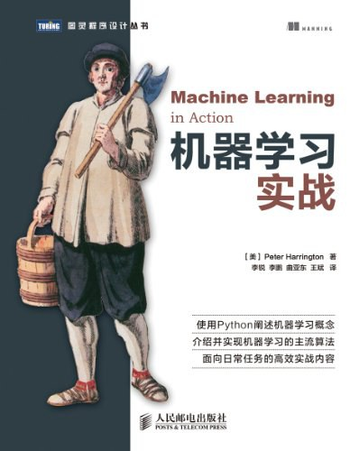

# 机器学习实战

| 作者             | 译者                        | 出版日期 | 出版社         | 豆瓣评分 |
| ---------------- | --------------------------- | -------- | -------------- | -------- |
| Peter Harrington | 李锐 / 李鹏 / 曲亚东 / 王斌 | 2013-6   | 人民邮电出版社 | 8.1      |

## 目录

### 第一部分 分类

#### 第 1 章 机器学习基础

#### 第 2 章 [k-近邻算法](./chapter-02/index.md)

#### 第 3 章 [决策树](./chapter-03/index.md)

#### 第 4 章 基于概率论的方法：朴素贝叶斯

#### 第 5 章 Logistic 回归

#### 第 6 章 支持向量机

### 第 7 章 利用 AdaBoost 元算法提高分类性能

### 第二部分 利用回归预测数值型数据

#### 第 8 章 预测数值型数据：回归

#### 第 9 章 树回归

### 第三部分 无监督学习

#### 第 10 章 利用K-均值聚类算法对未标注数据分组

#### 第 11 章 使用 Apriori 算法进行关联分析

#### 第 12 章 使用 FP-growth 算法来高效发现频繁项集

### 第四部分 其他工具

#### 第 13 章 利用PCA来简化数据

#### 第 14 章 利用SVD简化数据

#### 第 15 章 大数据与MapReduce

## 先决条件

### 理解

## 读书心得

## 配套资源
