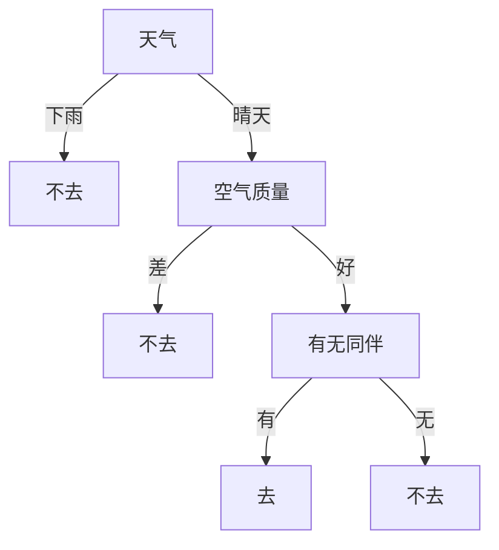

# 决策树分类算法

## 算法详解

### 先从一个生活场景说起

想象你要决定**周末是否去爬山**。你会考虑几个因素：

- **天气**：晴天还是雨天？
- **空气质量**：好还是差？
- **同伴**：有人陪还是没人陪？

你可能会这样思考：

- 如果 **下雨** → 不去
- 如果 **晴天**：
  - 看 **空气质量**：如果 **差** → 不去
  - 如果 **好** → 再看 **有无同伴**：
    - 有同伴 → 去；
    - 无同伴 → 不去

这个过程，其实就是一颗**决策树**（也叫**策略树**）。



### 什么是决策树分类算法？

**一句话**：它是一系列“如果-那么”规则组成的树状结构，用来对事物进行分类。

- 每个**内部节点**（如“天气”、“空气质量”）代表一个**特征**（要判断的条件）
- 每条**分支**代表一个**特征取值**（如“晴天”、“雨天”）
- 每个**叶子节点**代表一个**分类结果**（如“去”或“不去”）

新数据来了，就从根节点开始，根据特征值一路往下走，直到叶子节点得到分类。

### 核心概念：如何生成这棵树？

关键问题：**先判断哪个特征？**（比如为什么先看“天气”而不是“同伴”？）

算法用**“纯度”**来决定顺序。目标是：让按某个特征分出的子集，里面的数据**尽量属于同一类**。

衡量“纯度”的常用指标：

- **信息增益**（基于信息熵）：分裂前后“混乱程度”下降得越多，特征越好
- **基尼系数**：衡量子集内随机两个样本属于不同类的概率，越小越纯

举个例子：如果“天气”分为晴天和雨天，晴天里80%去爬山，雨天里100%不去，这样分就比较“纯”；如果无论晴天雨天都是50%去50%不去，那这个特征就没用。

#### 信息熵

我们以**周末是否去爬山**的例子，详细讲解信息熵如何在决策树中指导特征选择。

##### 一、原始数据

有6个样本，特征和标签如下（已编码）：

| 样本 | 天气 (0=雨天,1=晴天) | 空气质量 (0=差,1=好) | 同伴 (0=无,1=有) | 去爬山 (1=去,0=不去) |
| ---- | -------------------- | -------------------- | ---------------- | -------------------- |
| 1    | 1 (晴天)             | 1 (好)               | 1 (有)           | 1 (去)               |
| 2    | 1 (晴天)             | 1 (好)               | 0 (无)           | 0 (不去)             |
| 3    | 1 (晴天)             | 0 (差)               | 1 (有)           | 0 (不去)             |
| 4    | 0 (雨天)             | 1 (好)               | 1 (有)           | 0 (不去)             |
| 5    | 0 (雨天)             | 0 (差)               | 0 (无)           | 0 (不去)             |
| 6    | 1 (晴天)             | 1 (好)               | 1 (有)           | 1 (去)               |

标签统计：去爬山 = 2次（样本1和6），不去爬山 = 4次。

##### 二、什么是信息熵？

信息熵（Entropy）衡量数据集的**不确定性**（混乱程度）。  
公式：

$$
H(Y) = - \sum_{k=1}^{K} p_k \log_2 p_k
$$

其中 $p_k$ 是第 $k$ 类样本的比例，$K$ 是类别总数。  
若所有样本属于同一类（纯），则 $H=0$；若两类各占一半，则 $H=1$（根据信息熵计算公式可得，$-(\frac{1}{2}\log_2{\frac{1}{2}}+\frac{1}{2}\log_2{\frac{1}{2}})=-(-\frac{1}{2}-\frac{1}{2})=1$）。

**计算当前数据集的熵**：

- $p_{去} = \frac{2}{6} = \frac{1}{3}$，$p_{不去} = \frac{4}{6} = \frac{2}{3}$
  $$H(Y) = -\left( \frac{1}{3} \log_2 \frac{1}{3} + \frac{2}{3}\log_2 \frac{2}{3} \right)$$
  $$
  \log_2 \frac{1}{3} \approx -1.585,\quad \log_2 \frac{2}{3} \approx -0.585
  $$
  $$
  H(Y) = -\left( \frac{1}{3} \times -1.585 + \frac{2}{3} \times -0.585 \right)
  = -\left( -0.528 - 0.39 \right) = 0.918
  $$
  这个值介于0和1之间，说明有一定的不确定性（不是完全随机，但也不纯）。

##### 三、信息增益：选择哪个特征分裂？

决策树的目标是**选择能最大程度降低不确定性的特征**。  
信息增益 = 分裂前的熵 - 分裂后的加权平均熵（条件熵）。

$$
\text{Gain}(S, A) = H(S) - \sum_{v \in \text{Values}(A)} \frac{|S_v|}{|S|} H(S_v)
$$

我们计算三个候选特征（天气、空气质量、同伴）的信息增益，**谁最大谁就先分裂**。

###### 3.1 计算特征“天气”的信息增益

天气取值为：晴天（1）和雨天（0）。

- **晴天**的子集（样本1,2,3,6）：共4个样本，标签：去(1)、不去(0)、不去(0)、去(1) → 2去，2不去。  
  熵：$H\_{\text{晴}} = -\left( \frac{2}{4}\log_2\frac{2}{4} + \frac{2}{4}\log_2\frac{2}{4}\right) = -\left(0.5\times -1 + 0.5\times -1\right) = 1$

- **雨天**的子集（样本4,5）：共2个样本，标签：不去(0)、不去(0) → 0去，2不去。  
  熵：$H\_{\text{雨}} = -\left( \frac{0}{2}\log_2\frac{0}{2} + \frac{2}{2}\log_2\frac{2}{2}\right) = - (0 + 1\times 0) = 0$

加权条件熵：

$$
H(Y|\text{天气}) = \frac{4}{6} \times 1 + \frac{2}{6} \times 0 = 0.6667
$$

信息增益：

$$
\text{Gain}\_{\text{天气}} = 0.918 - 0.6667 = 0.2513
$$

###### 3.2 计算特征“空气质量”的信息增益

空气质量：好（1）、差（0）。

- **好**的子集（样本1,2,4,6）：标签：去、不去、不去、去 → 2去，2不去。  
  熵 = 1（与晴天相同）。

- **差**的子集（样本3,5）：标签：不去、不去 → 熵 = 0。

加权条件熵：

$$
\frac{4}{6}\times 1 + \frac{2}{6}\times 0 = 0.6667
$$

信息增益：

$$
\text{Gain}\_{\text{空气质量}} = 0.918 - 0.6667 = 0.2513
$$

和天气一样大。

###### 3.3 计算特征“同伴”的信息增益

同伴：有（1）、无（0）。

- **有同伴**的子集（样本1,3,4,6）：标签：去、不去、不去、去 → 2去，2不去。  
  熵 = 1。

- **无同伴**的子集（样本2,5）：标签：不去、不去 → 熵 = 0。

加权条件熵：

$$
\frac{4}{6}\times 1 + \frac{2}{6}\times 0 = 0.6667
$$

信息增益：

$$
\text{Gain}\_{\text{同伴}} = 0.918 - 0.6667 = 0.2513
$$

**三个特征的信息增益完全相同**。此时可任意选一个，比如选“天气”作为根节点。

> 注：实际数据中往往不会完全相等，这里因为数据对称导致一样。为了区分，可以引入增益率或基尼系数。

##### 四、递归构建子节点

以“天气”为根节点后，数据分成两支：

###### 雨天分支（熵=0，纯） → 直接成为叶子节点，预测“不去”。

###### 晴天分支（4个样本，熵=1）→ 需要继续分裂。

在晴天子集（样本1,2,3,6）中，再次计算剩余特征（空气质量、同伴）的信息增益。

**晴天子集的数据**：

| 样本 | 空气质量 | 同伴  | 去爬山  |
| ---- | -------- | ----- | ------- |
| 1    | 1(好)    | 1(有) | 1(去)   |
| 2    | 1(好)    | 0(无) | 0(不去) |
| 3    | 0(差)    | 1(有) | 0(不去) |
| 6    | 1(好)    | 1(有) | 1(去)   |

标签：去(2次)，不去(2次) → 熵=1。

**特征“空气质量”**：

- 好（样本1,2,6）：去、不去、去 → 2去1不去 → 熵 = -[ (2/3)log2(2/3) + (1/3)log2(1/3) ] = -[0.667×-0.585 + 0.333×-1.585] = 0.918
- 差（样本3）：不去 → 熵 = 0
  加权条件熵 = (3/4)×0.918 + (1/4)×0 = 0.6885  
  增益 = 1 - 0.6885 = 0.3115

**特征“同伴”**：

- 有（样本1,3,6）：去、不去、去 → 2去1不去，熵同样0.918
- 无（样本2）：不去，熵=0
  加权条件熵 = 3/4×0.918 = 0.6885，增益 = 0.3115

还是相等，任选一个。假设选“空气质量”：

- 空气质量**差**的分支（样本3）→ 纯节点，预测不去。
- 空气质量**好**的分支（样本1,2,6）→ 再按“同伴”分裂：
  - 同伴**有**（样本1,6）→ 都去，预测去。
  - 同伴**无**（样本2）→ 不去，预测不去。

最终生成的决策树（与之前一致）：

```
天气？
├─雨天 → 不去
└─晴天
   ├─空气质量差 → 不去
   └─空气质量好
      ├─同伴无 → 不去
      └─同伴有 → 去
```

##### 五、总结

1. **熵**度量数据集的纯度，值越低越纯。
2. 决策树在每一步计算每个特征的信息增益 = 父节点熵 - 子节点加权熵。
3. **信息增益最大**的特征被选为当前节点的分裂特征。
4. 递归重复，直到子集纯或达到停止条件。
5. 信息熵本质是选择能最快减少不确定性的问题来问，从而构建一棵简洁的分类树。

通过这个例子，你可以看到：开始时数据不确定性较高（熵0.918），选择天气分裂后，不确定性降为0.667（雨天分支完全确定，晴天分支仍不确定）；继续分裂直到叶子节点熵为0。整个过程就是利用信息熵不断“提纯”数据。

#### 基尼系数

我们用同样的**周末爬山**例子，详细拆解**基尼系数**在决策树（CART算法）中的计算过程。

##### 一、原始数据回顾

| 样本 | 天气 (0=雨天,1=晴天) | 空气质量 (0=差,1=好) | 同伴 (0=无,1=有) | 去爬山 (1=去,0=不去) |
| ---- | -------------------- | -------------------- | ---------------- | -------------------- |
| 1    | 1 (晴天)             | 1 (好)               | 1 (有)           | 1 (去)               |
| 2    | 1 (晴天)             | 1 (好)               | 0 (无)           | 0 (不去)             |
| 3    | 1 (晴天)             | 0 (差)               | 1 (有)           | 0 (不去)             |
| 4    | 0 (雨天)             | 1 (好)               | 1 (有)           | 0 (不去)             |
| 5    | 0 (雨天)             | 0 (差)               | 0 (无)           | 0 (不去)             |
| 6    | 1 (晴天)             | 1 (好)               | 1 (有)           | 1 (去)               |

- 类别：去(1) 出现2次，不去(0) 出现4次。

##### 二、基尼系数的定义与直觉

**基尼系数**（Gini Index）衡量数据集的“不纯度”：从数据集中随机抽取两个样本，它们属于不同类别的概率。

公式：

$$
\text{Gini}(S) = 1 - \sum_{k=1}^{K} p_k^2
$$

其中 $p_k$ 是第 $k$ 类样本的比例，$K$ 是类别数。

- 所有样本同一类：$p_1=1, p_2=0$ → $\text{Gini}=1-(1^2+0^2)=0$（最纯）
- 两类均匀各占一半：$p_1=0.5, p_2=0.5$ → $\text{Gini}=1-(0.25+0.25)=0.5$
- 多类时最大不纯度出现在各类均匀分布时。

##### 三、当前数据集的根节点基尼系数

$$
p_{去} = \frac{2}{6} = \frac{1}{3}, \quad p_{不去} = \frac{4}{6} = \frac{2}{3}
$$

$$
\text{Gini}\_{\text{根}} = 1 - \left[ \left(\frac{1}{3}\right)^2 + \left(\frac{2}{3}\right)^2 \right]
= 1 - \left( \frac{1}{9} + \frac{4}{9} \right)
= 1 - \frac{5}{9} = \frac{4}{9} \approx 0.4444
$$

> 对比：熵为 0.918（更大），因为熵对不平衡更敏感。基尼系数值域在 [0, 0.5]（二分类）。

##### 四、选择分裂特征：计算基尼增益

基尼增益（与信息增益类似，但使用基尼系数）：

$$
\Delta \text{Gini} = \text{Gini}_{\text{父}} - \sum_{v} \frac{|S_v|}{|S|} \cdot \text{Gini}(S_v)
$$

CART 通常直接选择**最小化加权基尼系数**的那个分裂，等价于最大化增益。

我们依次计算三个特征（天气、空气质量、同伴）的基尼增益。

###### 4.1 特征“天气”（晴天 / 雨天）

- **晴天**子集（样本1,2,3,6）：共4个样本，标签：1,0,0,1 → 2个去，2个不去。

  $$
  p_{去}=0.5,\ p_{不去}=0.5 \quad \Rightarrow \quad \text{Gini}\_{\text{晴}} = 1 - (0.25+0.25) = 0.5
  $$

- **雨天**子集（样本4,5）：共2个样本，标签：0,0 → 0个去，2个不去。
  $$
  p_{去}=0,\ p_{不去}=1 \quad \Rightarrow \quad \text{Gini}\_{\text{雨}} = 1 - (0+1) = 0
  $$

加权平均基尼：

$$
\text{Gini}\_{\text{加权,天气}} = \frac{4}{6} \times 0.5 + \frac{2}{6} \times 0 = \frac{2}{6} = 0.3333
$$

基尼增益：

$$
\Delta \text{Gini}_{\text{天气}} = \text{Gini}_{\text{根}} - \text{Gini}\_{\text{加权,天气}} = 0.4444 - 0.3333 = 0.1111
$$

###### 4.2 特征“空气质量”（好 / 差）

- **好**（样本1,2,4,6）：标签：1,0,0,1 → 2去，2不去 → 基尼 = 0.5
- **差**（样本3,5）：标签：0,0 → 基尼 = 0

加权基尼 = $\frac{4}{6} \times 0.5 + \frac{2}{6} \times 0 = 0.3333$，增益 = 0.1111（与天气相同）

###### 4.3 特征“同伴”（有 / 无）

- **有同伴**（样本1,3,4,6）：标签：1,0,0,1 → 2去，2不去 → 基尼 = 0.5
- **无同伴**（样本2,5）：标签：0,0 → 基尼 = 0

加权基尼 = 0.3333，增益 = 0.1111

**三个特征增益完全相同**（因为数据分布对称）。CART 可任选一个，比如选“天气”作为根节点。

> 注意：本例中基尼增益较小（0.1111），因为根节点本来不纯度就很低（0.444），而熵增益为 0.2513。基尼系数变化幅度通常小于熵，但分裂顺序一致。

##### 五、递归计算子节点

根节点按“天气”分裂后，雨天分支（基尼=0）成为叶子，直接预测“不去”。

**晴天分支**（样本1,2,3,6）：基尼系数 = 0.5（之前计算过）。需要继续分裂。

晴天子集数据：

| 样本 | 空气质量 | 同伴  | 去爬山 |
| ---- | -------- | ----- | ------ |
| 1    | 1(好)    | 1(有) | 1      |
| 2    | 1(好)    | 0(无) | 0      |
| 3    | 0(差)    | 1(有) | 0      |
| 6    | 1(好)    | 1(有) | 1      |

###### 5.1 计算晴天子集的基尼

2去，2不去 → 基尼 = 0.5（同上）。

###### 5.2 候选特征：空气质量、同伴

**特征“空气质量”**：

- **好**（样本1,2,6）：标签：1,0,1 → 2去，1不去。

  $$
  p_{去}=\frac{2}{3},\ p_{不去}=\frac{1}{3}
  $$

  $$
  \text{Gini}\_{\text{好}} = 1 - \left[ \left(\frac{2}{3}\right)^2 + \left(\frac{1}{3}\right)^2 \right]
  = 1 - \left( \frac{4}{9} + \frac{1}{9} \right) = 1 - \frac{5}{9} = \frac{4}{9} \approx 0.4444
  $$

- **差**（样本3）：只有不去 → 基尼 = 0

加权基尼：

$$
\frac{3}{4} \times 0.4444 + \frac{1}{4} \times 0 = 0.3333
$$

增益：

$$
\Delta \text{Gini}\_{\text{空气质量}} = 0.5 - 0.3333 = 0.1667
$$

**特征“同伴”**：

- **有同伴**（样本1,3,6）：标签：1,0,1 → 2去1不去 → 基尼 = 0.4444
- **无同伴**（样本2）：不去 → 基尼 = 0

加权基尼 = $\frac{3}{4} \times  0.4444 = 0.3333$，增益 = 0.1667

二者相同，任选一个，比如选“空气质量”。

###### 5.3 第二次分裂后的结果

按“空气质量”分裂晴天分支：

- **空气质量差**：样本3 → 叶子，预测“不去”。
- **空气质量好**：样本1,2,6 → 此时数据：1(去),0(不去),1(去) → 2去1不去。基尼 = 0.4444。继续分裂（仅剩“同伴”特征）：
  - 同伴**有**（样本1,6）：都去 → 基尼=0 → 叶子“去”
  - 同伴**无**（样本2）：不去 → 基尼=0 → 叶子“不去”

最终树结构与熵版本一致。

##### 六、基尼系数 vs 信息熵：直观对比

| 指标 | 公式                   | 取值范围（二分类） | 分裂行为                             |
| ---- | ---------------------- | ------------------ | ------------------------------------ |
| 熵   | $-\sum p_k \log_2 p_k$ | [0, 1]             | 倾向于产生更平衡的分裂               |
| 基尼 | $1 - \sum p_k^2$       | [0, 0.5]           | 计算更快（无对数），分裂结果通常相近 |

在天气例子中，两者选择的特征顺序完全一致。区别在于数值大小：熵随不平衡变化更剧烈（例如 p=0.5 时熵=1，基尼=0.5；p=0.75 时熵≈0.811，基尼=0.375），但在比较增益时排序通常一致。

CART 默认使用基尼系数，因为：

- 无需计算对数，速度更快
- 基尼系数偏向于将多数类分离出来，在工业应用中效果良好

##### 七、总结

1. **基尼系数** = 随机抽两个样本类别不同的概率，越小越纯。
2. **决策树分裂流程**：
   - 计算父节点基尼
   - 对每个特征，计算按该特征分裂后的加权基尼
   - 选择加权基尼最小（或基尼增益最大）的特征作为分裂特征
   - 递归进行，直到节点基尼为0或达到停止条件
3. **天气例子**演示了基尼系数的计算和递归过程，结果与熵方法等价。

通过计算可以直观理解：基尼系数与信息熵一样，都是度量不纯度的工具，最终目的都是让树的分支尽可能纯。

### 重要技巧：防止“过拟合”

树如果长得太深，会把训练数据的细节都记住（包括噪音），对新数据反而不准。解决办法：

- **预剪枝**：在树长大之前提前停止（如限制最大深度、节点最少样本数）
- **后剪枝**：先让树充分生长，再剪掉不重要的分支

### 优点与缺点

| 优点                                 | 缺点                         |
| ------------------------------------ | ---------------------------- |
| 容易理解，结果可解释性强（白盒模型） | 容易过拟合（需要剪枝）       |
| 不需要特征缩放（数值/类别均可）      | 对数据小变化敏感（不稳定）   |
| 可以处理非线性关系                   | 某些算法偏向选择取值多的特征 |

### 一个简单的数学例子

假设有一组数据：

| 天气 | 空气质量 | 同伴 | 去爬山？ |
| ---- | -------- | ---- | -------- |
| 晴天 | 好       | 有   | 去       |
| 晴天 | 好       | 无   | 不去     |
| 晴天 | 差       | 有   | 不去     |
| 雨天 | 好       | 有   | 不去     |

计算根节点“天气”的**基尼增益**：

- 整体基尼系数：2个去，2个不去 → $1 - (0.5^2+0.5^2) = 0.5$
- 按“天气”分：
  - 晴天：1去2不去 → 基尼 = $1 - (1/3)^2+(2/3)^2 \approx 0.444$
  - 雨天：1不去0去 → 基尼 = 0
- 加权平均基尼 = $3/4×0.444 + 1/4×0 = 0.333$
- 增益 = $0.5 - 0.333 = 0.167$

类似计算其他特征，选增益最大的作为根节点。

### 常用算法

- **ID3**：使用信息增益（偏向取值多的特征）
- **C4.5**：使用增益率（修正偏差）
- **CART**：使用基尼系数（用于分类）或方差缩减（用于回归）

### 总结

决策树算法就像一个**智能的猜谜游戏**：每次选择一个最能把答案分开的问题来问。它模仿了人类做复杂决策的过程——先抓住最重要的因素，再逐步细化。

理解它并不需要高深数学，关键是明白：**把复杂问题拆成一系列简单的是非题**，直到能确定答案。

## 算法实现

### 基于 ID3 算法实现

以下是使用 **Python + NumPy** 实现的决策树分类算法（基于信息增益的 ID3 风格，支持离散特征）。代码不依赖任何机器学习库，仅使用 NumPy 进行数组计算。

```python
import numpy as np
from collections import Counter

class DecisionTree:
    """
    基于信息增益的决策树分类器（ID3风格）
    仅支持离散特征，标签为分类值
    """

    class Node:
        """树节点"""
        def __init__(self):
            self.feature_idx = None      # 分裂特征索引
            self.children = {}           # {特征值: 子节点}
            self.label = None            # 叶子节点的预测标签
            self.is_leaf = False

    def __init__(self, max_depth=None, min_samples_split=2):
        self.max_depth = max_depth
        self.min_samples_split = min_samples_split
        self.tree = None
        self.n_features = None
        self.feature_values = None       # 每个特征的所有可能取值

    def _entropy(self, y):
        """计算熵"""
        _, counts = np.unique(y, return_counts=True)
        probs = counts / len(y)
        return -np.sum(probs * np.log2(probs + 1e-10))

    def _information_gain(self, X, y, feature_idx):
        """计算信息增益"""
        base_entropy = self._entropy(y)
        values = self.feature_values[feature_idx]
        weighted_entropy = 0.0

        for v in values:
            mask = X[:, feature_idx] == v
            if np.sum(mask) == 0:
                continue
            sub_y = y[mask]
            weighted_entropy += (len(sub_y) / len(y)) * self._entropy(sub_y)

        return base_entropy - weighted_entropy

    def _best_split(self, X, y):
        """选择最佳分裂特征"""
        best_gain = -1
        best_idx = None

        for idx in range(self.n_features):
            # 如果该特征所有样本值相同，跳过
            if len(np.unique(X[:, idx])) == 1:
                continue
            gain = self._information_gain(X, y, idx)
            if gain > best_gain:
                best_gain = gain
                best_idx = idx

        return best_idx, best_gain

    def _build_tree(self, X, y, depth):
        """递归构建树"""
        node = self.Node()

        # 停止条件：单一标签 / 样本数不足 / 达到最大深度 / 信息增益为0
        if len(np.unique(y)) == 1:
            node.is_leaf = True
            node.label = y[0]
            return node

        if len(y) < self.min_samples_split:
            node.is_leaf = True
            node.label = Counter(y).most_common(1)[0][0]
            return node

        if self.max_depth is not None and depth >= self.max_depth:
            node.is_leaf = True
            node.label = Counter(y).most_common(1)[0][0]
            return node

        best_idx, best_gain = self._best_split(X, y)
        if best_idx is None or best_gain <= 0:
            node.is_leaf = True
            node.label = Counter(y).most_common(1)[0][0]
            return node

        node.feature_idx = best_idx

        # 根据最佳特征的不同取值划分数据
        values = self.feature_values[best_idx]
        for v in values:
            mask = X[:, best_idx] == v
            if np.sum(mask) == 0:
                # 未出现该取值时，创建叶子节点（用多数类）
                child = self.Node()
                child.is_leaf = True
                child.label = Counter(y).most_common(1)[0][0]
                node.children[v] = child
            else:
                sub_X = X[mask]
                sub_y = y[mask]
                child = self._build_tree(sub_X, sub_y, depth + 1)
                node.children[v] = child

        return node

    def fit(self, X, y):
        """
        训练决策树
        X: numpy array (n_samples, n_features) – 特征值应为整数或类别编码
        y: numpy array (n_samples,) – 标签
        """
        X = np.asarray(X)
        y = np.asarray(y)
        self.n_features = X.shape[1]

        # 记录每个特征的所有可能取值（用于分裂）
        self.feature_values = []
        for idx in range(self.n_features):
            self.feature_values.append(np.unique(X[:, idx]))

        self.tree = self._build_tree(X, y, depth=0)

    def _predict_one(self, x, node):
        """预测单个样本"""
        if node.is_leaf:
            return node.label

        feat_val = x[node.feature_idx]
        if feat_val in node.children:
            return self._predict_one(x, node.children[feat_val])
        else:
            # 测试集中出现了训练未见的特征值，返回当前节点下最常见的标签（降级处理）
            # 简单方法：找到任意子节点中的多数标签（这里直接选第一个子节点的标签）
            # 更合理：统计该节点下所有样本的多数类，但为了简单，取第一个子节点的叶子预测（递归）
            # 实际工程中可存储节点的多数类，这里为简化直接返回第一个子节点的叶子标签
            first_child = next(iter(node.children.values()))
            # 如果第一个孩子是内部节点，递归找叶子标签
            while not first_child.is_leaf:
                first_child = next(iter(first_child.children.values()))
            return first_child.label

    def predict(self, X):
        """批量预测"""
        X = np.asarray(X)
        return np.array([self._predict_one(x, self.tree) for x in X])

    def score(self, X, y):
        """计算准确率"""
        pred = self.predict(X)
        return np.mean(pred == y)


# ========== 示例使用 ==========
if __name__ == "__main__":
    # 天气示例数据（已编码）
    # 特征：天气（0:雨天, 1:晴天），空气质量（0:差, 1:好），同伴（0:无, 1:有）
    X = np.array([
        [1, 1, 1],   # 晴天, 好, 有
        [1, 1, 0],   # 晴天, 好, 无
        [1, 0, 1],   # 晴天, 差, 有
        [0, 1, 1],   # 雨天, 好, 有
        [0, 0, 0],   # 雨天, 差, 无
        [1, 1, 1],   # 晴天, 好, 有
    ])
    y = np.array([1, 0, 0, 0, 0, 1])   # 1:去爬山, 0:不去

    clf = DecisionTree(max_depth=3)
    clf.fit(X, y)
    print("训练准确率:", clf.score(X, y))

    # 预测新样本
    X_test = np.array([
        [1, 1, 0],   # 晴天, 好, 无 -> 预测不去(0)
        [1, 0, 1],   # 晴天, 差, 有 -> 不去(0)
    ])
    pred = clf.predict(X_test)
    print("预测结果:", pred)   # 输出应为 [0 0]

    # 输出树结构（简易打印）
    def print_tree(node, indent=""):
        if node.is_leaf:
            print(indent + f"预测: {node.label}")
            return
        print(indent + f"特征{node.feature_idx}?")
        for val, child in node.children.items():
            print(indent + f"  {val} -> ", end="")
            print_tree(child, indent + "    ")
    print("\n决策树结构：")
    print_tree(clf.tree)
```

#### 代码说明

1. **信息增益**：使用熵减少量作为分裂标准。
2. **树节点**：`Node` 存储分裂特征、子节点字典或叶子标签。
3. **建树停止条件**：
   - 当前节点样本全为同一类
   - 样本数少于 `min_samples_split`
   - 达到最大深度 `max_depth`
   - 最佳信息增益 ≤ 0 或无法分裂
4. **预测**：从根节点根据特征值向下遍历；若遇到测试时未见过的特征值，则返回第一个子节点下的叶子标签（简化处理）。
5. **特征处理**：假定所有特征已编码为非负整数（如离散标签编码），每次分裂均使用训练时记录的特征所有可能取值。

#### 扩展建议

- **处理连续特征**：需要二分法寻找最佳阈值，可修改 `_best_split` 逻辑。
- **后剪枝**：可增加剪枝方法（如错误率降低剪枝）。
- **缺失值处理**：可在计算信息增益时忽略缺失值，预测时走概率分支。

### 基于 CART 算法实现

以下是基于 **CART**（分类与回归树）算法的决策树实现，使用 **Python + NumPy**，**基尼系数**作为分裂准则，支持**连续特征**和**离散特征**，生成**二叉树**。

```python
import numpy as np
from collections import Counter

class CARTClassifier:
    """
    CART 分类树（二叉树）
    支持连续特征（二分阈值）和离散特征（二分：等于某个值 vs 不等于）
    """

    class Node:
        def __init__(self):
            self.is_leaf = False
            self.label = None               # 叶子节点：预测类别
            self.feature_idx = None         # 内部节点：分裂特征索引
            self.threshold = None           # 连续特征：阈值；离散特征：取某个值
            self.left = None                # 左子树（条件满足时）
            self.right = None               # 右子树
            self.condition_desc = ""        # 可读条件描述

    def __init__(self, max_depth=None, min_samples_split=2, min_impurity_decrease=0.0):
        self.max_depth = max_depth
        self.min_samples_split = min_samples_split
        self.min_impurity_decrease = min_impurity_decrease
        self.tree = None
        self.n_features = None
        self.feature_types = None   # 每个特征是 'c' (连续) 还是 'd' (离散)

    def _gini(self, y):
        """计算基尼系数：1 - sum(p_i^2)"""
        _, counts = np.unique(y, return_counts=True)
        probs = counts / len(y)
        return 1.0 - np.sum(probs ** 2)

    def _weighted_gini(self, y_left, y_right):
        """左右子节点的加权基尼系数"""
        n = len(y_left) + len(y_right)
        gini_left = self._gini(y_left)
        gini_right = self._gini(y_right)
        return (len(y_left) / n) * gini_left + (len(y_right) / n) * gini_right

    def _best_split(self, X, y):
        """
        寻找最佳分裂特征和分裂点
        返回: (best_feature_idx, best_threshold, best_gain)
        """
        best_gain = -1.0
        best_feature_idx = None
        best_threshold = None
        parent_gini = self._gini(y)

        for idx in range(self.n_features):
            feature = X[:, idx]
            unique_vals = np.unique(feature)

            # 连续特征：按相邻值的中点为候选阈值
            if self.feature_types[idx] == 'c':
                # 排序后取相邻中值
                sorted_vals = np.sort(unique_vals)
                for i in range(len(sorted_vals) - 1):
                    threshold = (sorted_vals[i] + sorted_vals[i+1]) / 2.0
                    mask = feature <= threshold
                    y_left = y[mask]
                    y_right = y[~mask]
                    if len(y_left) < self.min_samples_split or len(y_right) < self.min_samples_split:
                        continue
                    weighted_gini = self._weighted_gini(y_left, y_right)
                    gain = parent_gini - weighted_gini
                    if gain > best_gain and gain >= self.min_impurity_decrease:
                        best_gain = gain
                        best_feature_idx = idx
                        best_threshold = threshold

            # 离散特征：枚举每一个取值，二分（等于 value vs 不等于 value）
            else:  # 'd'
                for val in unique_vals:
                    mask = feature == val
                    y_left = y[mask]
                    y_right = y[~mask]
                    if len(y_left) < self.min_samples_split or len(y_right) < self.min_samples_split:
                        continue
                    weighted_gini = self._weighted_gini(y_left, y_right)
                    gain = parent_gini - weighted_gini
                    if gain > best_gain and gain >= self.min_impurity_decrease:
                        best_gain = gain
                        best_feature_idx = idx
                        best_threshold = val  # 对于离散特征，threshold 存储用于分割的具体取值

        return best_feature_idx, best_threshold, best_gain

    def _build_tree(self, X, y, depth):
        """递归构建 CART 二叉树"""
        node = self.Node()

        # 终止条件
        if len(np.unique(y)) == 1:
            node.is_leaf = True
            node.label = y[0]
            return node

        if len(y) < self.min_samples_split:
            node.is_leaf = True
            node.label = Counter(y).most_common(1)[0][0]
            return node

        if self.max_depth is not None and depth >= self.max_depth:
            node.is_leaf = True
            node.label = Counter(y).most_common(1)[0][0]
            return node

        best_idx, best_thr, best_gain = self._best_split(X, y)
        if best_idx is None:   # 没有有效分裂
            node.is_leaf = True
            node.label = Counter(y).most_common(1)[0][0]
            return node

        node.feature_idx = best_idx
        node.threshold = best_thr

        # 根据特征类型决定分割方式
        if self.feature_types[best_idx] == 'c':
            mask = X[:, best_idx] <= best_thr
            node.condition_desc = f"X[:, {best_idx}] <= {best_thr:.4f}"
        else:
            mask = X[:, best_idx] == best_thr
            node.condition_desc = f"X[:, {best_idx}] == {best_thr}"

        X_left, y_left = X[mask], y[mask]
        X_right, y_right = X[~mask], y[~mask]

        node.left = self._build_tree(X_left, y_left, depth + 1)
        node.right = self._build_tree(X_right, y_right, depth + 1)

        return node

    def fit(self, X, y, feature_types):
        """
        训练 CART 分类树
        X : numpy array (n_samples, n_features)
        y : numpy array (n_samples,)
        feature_types : list of str, 长度 = n_features, 每个元素 'c' 或 'd'
        """
        X = np.asarray(X)
        y = np.asarray(y)
        self.n_features = X.shape[1]
        self.feature_types = feature_types
        assert len(self.feature_types) == self.n_features, "feature_types 长度必须等于特征数"
        self.tree = self._build_tree(X, y, depth=0)

    def _predict_one(self, x, node):
        """单样本预测"""
        if node.is_leaf:
            return node.label
        feat_val = x[node.feature_idx]
        if self.feature_types[node.feature_idx] == 'c':
            if feat_val <= node.threshold:
                return self._predict_one(x, node.left)
            else:
                return self._predict_one(x, node.right)
        else:  # 离散
            if feat_val == node.threshold:
                return self._predict_one(x, node.left)
            else:
                return self._predict_one(x, node.right)

    def predict(self, X):
        X = np.asarray(X)
        return np.array([self._predict_one(x, self.tree) for x in X])

    def score(self, X, y):
        pred = self.predict(X)
        return np.mean(pred == y)

    def print_tree(self, node=None, indent=""):
        """打印决策树结构"""
        if node is None:
            node = self.tree
        if node.is_leaf:
            print(indent + f"-> 类别 {node.label}")
        else:
            print(indent + f"如果 {node.condition_desc}:")
            print(indent + "  满足条件 → ", end="")
            self.print_tree(node.left, indent + "     ")
            print(indent + "  不满足条件 → ", end="")
            self.print_tree(node.right, indent + "     ")


# ==================== 示例使用 ====================
if __name__ == "__main__":
    # 示例1：连续特征 + 离散特征混合的数据
    # 特征0：温度（连续），特征1：湿度（连续），特征2：天气类型（离散：0晴天,1雨天）
    X = np.array([
        [28, 65, 0],   # 高温高湿晴天
        [22, 80, 1],   # 低温高湿雨天
        [26, 70, 0],   #
        [20, 85, 1],
        [30, 60, 0],
        [25, 75, 1],
    ])
    y = np.array([1, 0, 0, 0, 1, 0])   # 1: 去爬山, 0: 不去

    # 特征类型：连续、连续、离散
    feature_types = ['c', 'c', 'd']

    clf = CARTClassifier(max_depth=3, min_samples_split=2)
    clf.fit(X, y, feature_types)
    print("训练准确率:", clf.score(X, y))
    print("\n决策树结构:")
    clf.print_tree()

    # 预测新样本
    X_test = np.array([
        [27, 68, 0],   # 应该预测为？
        [21, 82, 1],
    ])
    pred = clf.predict(X_test)
    print("\n预测结果:", pred)

    # 示例2：完全连续特征的鸢尾花数据集（简化）
    print("\n--- 鸢尾花示例（仅前两个特征）---")
    from sklearn.datasets import load_iris
    iris = load_iris()
    X_iris = iris.data[:, :2]   # 仅取前两个连续特征
    y_iris = iris.target
    # 只取两类数据做二分类演示（setosa vs versicolor）
    mask = y_iris < 2
    X_iris_bin = X_iris[mask]
    y_iris_bin = y_iris[mask]

    clf2 = CARTClassifier(max_depth=4)
    feature_types_iris = ['c', 'c']
    clf2.fit(X_iris_bin, y_iris_bin, feature_types_iris)
    print(f"训练准确率: {clf2.score(X_iris_bin, y_iris_bin):.3f}")
    print("决策树结构:")
    clf2.print_tree()
```

#### 代码说明

1. **基尼系数**：`_gini` 计算节点不纯度，`_weighted_gini` 计算分裂后两个子节点的加权基尼。
2. **最佳分裂搜索** (`_best_split`)：
   - 对连续特征：将特征值排序后，取相邻值中点作为候选阈值，按 `<= threshold` 分割。
   - 对离散特征：枚举每个取值，按 `== value` 与 `!= value` 分割。
   - 要求分裂后的左右子节点样本数至少为 `min_samples_split`。
   - 计算基尼增益 = 父节点基尼 - 加权基尼，选择增益最大且超过 `min_impurity_decrease` 的分裂。
3. **递归建树** (`_build_tree`)：
   - 终止条件：纯节点、样本数不足、达到最大深度、无法有效分裂（增益为负或无候选）。
   - 叶子节点存储多数类标签。
   - 内部节点存储特征索引、阈值（连续为数值，离散为特定取值）。
4. **预测**：根据特征类型选择比较方式（连续用 `<=`，离散用 `==`），递归下降到叶子。
5. **打印树**：可读格式显示每个节点的分裂条件。

## 总结

### CART 与 ID3 的主要区别

| 特性     | ID3 (之前实现)               | CART (本实现)                       |
| -------- | ---------------------------- | ----------------------------------- |
| 树结构   | 多叉树（每个特征值一个分支） | 二叉树                              |
| 分裂准则 | 信息增益（熵）               | 基尼系数                            |
| 特征处理 | 仅离散                       | 连续（二分阈值） + 离散（二分等于） |
| 输出     | 分类                         | 分类（也可回归，这里仅分类）        |

#### 使用建议

- 连续特征和离散特征混合时，请正确指定 `feature_types` 列表（`'c'` 或 `'d'`）。
- 连续特征不需要手动离散化，算法会自动寻找最佳分割点。
- 离散特征取值较多时，分裂计算量会增大，但 CART 的二叉方式比多叉更紧凑。
- 可调整 `max_depth`、`min_samples_split`、`min_impurity_decrease` 控制过拟合。

如果需要**回归树**（均方误差），可以类似地修改 `_gini` 为 `_mse`，并改变分裂评价方式，此处不展开。
