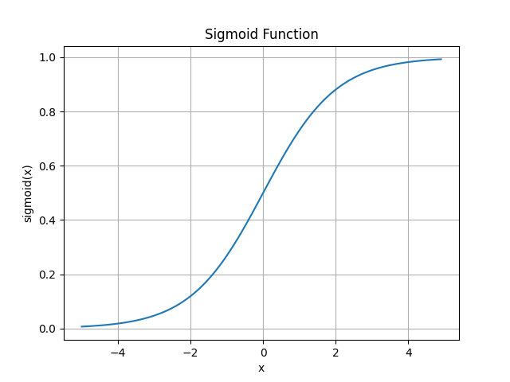
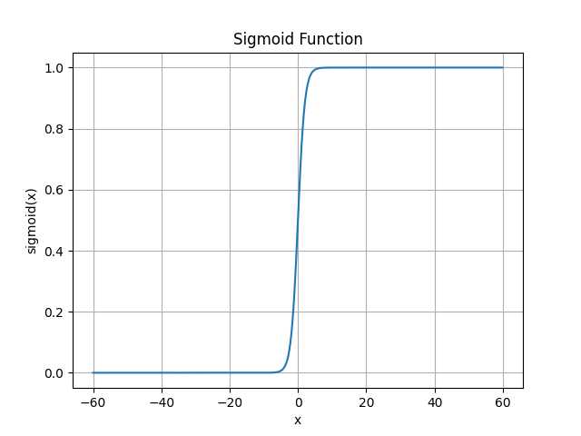
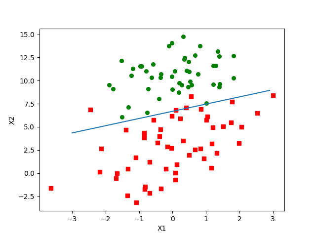

# 第 5 章 Logistic回归

本章内容：

- Sigmoid 函数和 Logistic 回归分类器
- 最优化理论初探
- 梯度下降最优化算法
- 数据中的缺失项处理

Logistic 回归的一般流程

1. 收集数据：采用任意方法收集数据。
2. 准备数据：由于需要进行距离计算，因此要求数据类型为数值型。另外，结构化数据格式则最佳。
3. 分析数据：采用任意方法对数据进行分析。
4. 训练算法：大部分时间将用于训练，训练的目的是为了找到最佳的分类回归系数。
5. 测试算法：一旦训练步骤完成，分类将会很快。
6. 使用算法：首先，我们需要输入一些数据，并将其转换成为对应的结构化数值；接着，基于训练好的回归系数就可以对这些数值进行简单的回归计算，判定它们属于哪个类别；在这之后，我们就可以在输出的类别上做一些其他分析工作。

## 5.1 基于 Logistic 回归和 Sigmoid 函数的分类

Logistic 回归

- 优点：计算代价不高，易于理解和实现
- 缺点：容易欠拟合，分类精度可能不高
- 适用数据类型：数值型和标称型

我们想要的函数应该是，能接受所有的输入然后预测出类别。例如，在两个类的情况下，上述函数输出0或1。如果我们之前接触过具有这种性质的函数，该函数称为海维塞德阶跃函数（Heaviside step function）​，或者直接称为单位阶跃函数。然而，海维塞德阶跃函数的问题在于：该函数在跳跃点上从0瞬间跳跃到1，这个瞬间跳跃过程有时很难处理。

Sigmoid 函数公式：

$$
\sigmoid(x)=\frac{1}{1+e^{-x}}
$$

对应的 Python 代码如下：

```py
import numpy as np


def sigmoid(x):
    """sigmoid函数"""
    return 1.0 / (1 + np.exp(-x))
```

以下是 Sigmoid 在 [-5.0, 5.0] 和 [-60, 60] 范围之间的值分布：




当x为0时，Sigmoid函数值为0.5。随着x的增大，对应的Sigmoid值将逼近于1；而随着x的减小，Sigmoid值将逼近于0。如果横坐标刻度足够大（图5-1下图）, Sigmoid函数看起来很像一个阶跃函数。

因此，为了实现Logistic回归分类器，我们可以在每个特征上都乘以一个回归系数，然后把所有的结果值相加，将这个总和代入Sigmoid函数中，进而得到一个范围在0～1之间的数值。任何大于0.5的数据被分入1类，小于0.5即被归入0类。所以，Logistic回归也可以被看成是一种概率估计。

确定了函数形式，接下来我们将学习如何计算回归系数。

## 5.2 基于最优化方法的最佳回归系数确定

Sigmoid 函数的输入即为 z，由下面公式得出：

$$
z = w_0*x_0+w_1*x_1+w_2*x_2+...+w_n*x_n
$$

如果采用向量的写法，上述公式可以写成 $z=w^T\cdot x$，它表示将这两个数值向量对应元素相乘然后全部加起来即得到z值。其中的向量x是分类器的输入数据，向量w也就是我们要找到的最佳参数（系数）​，从而使得分类器尽可能地精确。为了寻找该最佳参数，需要用到最优化理论的一些知识。

下面首先介绍梯度上升的最优化方法，我们将学习到如何使用该方法求得数据集的最佳参数。接下来，展示如何绘制梯度上升法产生的决策边界图，该图能将梯度上升法的分类效果可视化地呈现出来。最后我们将学习随机梯度上升算法，以及如何对其进行修改以获得更好的结果。

### 5.2.1 梯度上升法

梯度上升的思想：要找到某函数的最大值，最好的方法是沿着该函数的梯度方向探寻。梯度的函数表示如下：

$$
\nabla f\left(x, y  \right)=\begin{pmatrix} \frac{\partial{f(x, y)}}{\partial{x}} \\ \frac{\partial{f(x, y)}}{\partial{y}} \end{pmatrix}
$$

### 5.2.2 训练算法：使用梯度上升找到最佳参数

```py
import numpy as np
from sigmoid import sigmoid


def load_data_set(file_name: str):
    data_matrix = []
    label_matrix = []
    with open(file_name) as fr:
        lines = fr.readlines()
        for line in lines:
            data_list = line.strip().split("\t")
            # 为了便于计算系数，在特征向量的索引为0的位置添加了一个1.0特征值
            data_matrix.append([1.0, float(data_list[0]), float(data_list[1])])
            label_matrix.append(float(data_list[2]))
    return data_matrix, label_matrix


def gradient_descent(data_matrix_in: list, label_matrix_in: list):
    data_matrix = np.matrix(data_matrix_in)
    # 转置，从行向量转换成列向量
    label_matrix = np.matrix(label_matrix_in).transpose()
    max_cycles = 500
    step = 0.001
    m, n = data_matrix.shape
    # 创建权重列向量
    weights = np.ones((n, 1))
    for i in range(max_cycles):
        h = sigmoid(data_matrix * weights)
        error = label_matrix - h
        weights = weights + step * data_matrix.transpose() * error
    return weights
```

其中关键代码在于 `data_matrix.transpose() * error`，它衡量的是每个特征对预测误差的贡献程度。某个特征值越大且对应的误差越大，该特征的权重就需要更大幅度的调整。这正是梯度上升中梯度 `∂L/∂w = X^T(y - h)` 的矩阵形式。

### 5.2.3 分析数据：画出决策边界

```py
def plot_classify_line(data_set: list[list[float]], label_set: list[float], weights: np.ndarray) -> None:
    print(weights)
    print(weights.shape)
    n = len(label_set)
    x1 = []
    y1 = []
    x2 = []
    y2 = []
    for i in range(n):
        if label_set[i] == 1.0:
            x1.append(data_set[i][1])
            y1.append(data_set[i][2])
        else:
            x2.append(data_set[i][1])
            y2.append(data_set[i][2])
    plt.scatter(x1, y1, s=30, c="red", marker="s")
    plt.scatter(x2, y2, s=30, c="green")
    x = np.arange(-3.0, 3.0, 0.1)
    # y = (-weights[0])
    # y = w0 + w1x1 + w2x2 -> x2 = (-w0-w1x1)/w2
    y = (-weights[0] - weights[1] * x) / weights[2]
    print(x, y)
    plt.plot(x, y)
    plt.xlabel("X1")
    plt.ylabel("X2")
    plt.show()


if __name__ == "__main__":
    data_set, labels = load_data_set("test_set.txt")
    weights = np.array(gradient_descent(data_set, labels)).flatten()
    plot_classify_line(data_set, labels, weights)
```

绘制结果如下图所示：



### 5.2.4 训练算法：随机梯度上升

梯度上升算法是在每次更新回归系数时都需要遍历整个数据集，该方法在处理100个左右的数据集时尚可，但是如果有数十亿样本和成千上万的特征，那么该方法的计算复杂度就太高了。一种改进方法是一次仅用一个样本点来更新回归系数，该方法称为随机梯度上升算法。

```py

```
