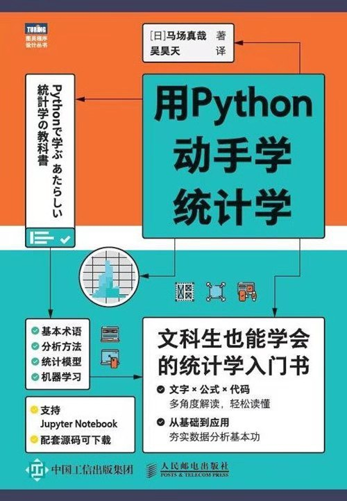

# 用 Python 学统计学

| 作者         | 译者   | 出版日期  | 出版社         | 豆瓣评分 |
| ------------ | ------ | --------- | -------------- | -------- |
| [日]马场真哉 | 吴昊天 | 2021-6-10 | 人民邮电出版社 | 8.0      |

## 读书计划及目标

计划：2026/04/20 ~ 2026/04/24 两周

阅读完全书

1. 巩固基础知识，完成示例输出，完成学习笔记输出
2. 学习统计学，使用Python完成数据分析
3. 学习并理解统计学在机器学习中的作用

实际：

## 目录

### 第 1 章 统计学基础

### 第 2 章 Python 与 Jupyter Notebook 基础

### 第 3 章 使用 Python 进行数据分析

### 第 4 章 统计模型基础

### 第 5 章 正泰线性模型

### 第 6 章 广义线性模型

### 第 7 章 统计学与机器学习

## 读书心得

1. 花了多久？
2. 得到了什么？

## 配套资源
