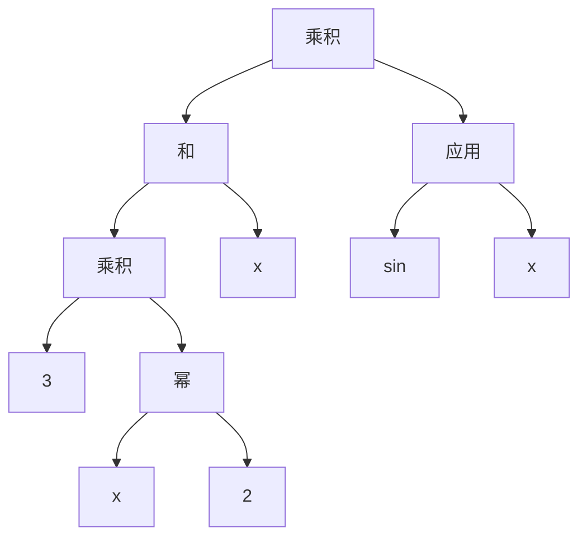

# 第 10 章 使用符号表达式

目标：

- 对代数表达式建模
- 编写代码来分析、转换或计算代数表达式
- 操作定义函数的表达式来计算函数的导数
- 编写 Python 函数计算导数公式
- 使用 SymPy 库计算积分公式

我们前面学习了通过取越来越短割线的斜率来近似计算函数在某点的导数，然后学习了通过估算多个窄长方形在图形下的面积来近似计算积分。但是这些都是通过 Python 函数实现的， 我们并没有计算出对应函数的导数和积分函数。我们本章将学习这些技巧。

## 10.1 使用计算机代数系统计算精确的导数

Mathematica 是最流行的计算机代数系统之一，可以在 Wolfram
Alpha 网站上免费在线使用其引擎。如果需要计算精确的导数公式，我们最好的方式就是求助于
[Wolfram ALpha](https://www.wolframalpha.com/)。

Wolfram
Alpha 对输入更加兼容，能理解大多数简单公式（包括 LaTex 和 Python 语法）。

## 10.2 代数表达式建模

接下来我们将以$f(x)=(3x^2 + x)\cdot sin(x)$为例对其进行建模。

### 10.2.1 将表达式拆分成若干部分

我们可以通过将代数表达式拆分成更小的表达式来建立模型。

$(3x^2+ x)\cdot sin(x)$可以拆项为 $3x^2 + x$和$sin(x)$的乘积或者
$x3^2 \cdot sin(x)$和$x\cdot sin(x)$的求和。

### 10.2.2 构建表达树

$(3x^2 + x)\cdot sin(x)$拆解成表达式如下图所示：



### 10.2.3 使用 Python 语言实现表达式树

接下来我们将使用类对上述算数运算进行建模。

```py
f_expression = Product(
    Sum(
        Product(
            Number(3),
            Power(
                Variable('x'),
                Number(2)
            )
        ),
        Variable('x')
    ),
    Apply(Function('sin'), Variable('x'))
)
```

### 10.2.4 练习

练习10.4：实现一个Quotient组合器，表示两个表达式相除。如何表示下面的表达式？

```py
class Quotient():
    """
    Quotient: 除法表达式
    """
    def __init__(self, numerator, denominator):
        self.numerator = numerator  # 分子
        self.denominator = denominator  # 分母
```

练习10.5：实现一个Difference组合器，表示两个表达式相减。如何表示$b^2 - 4ac$呢？

```py
class Difference():
    """
    Difference: 减法表达式
    """
    def __init__(self, expr1, expr2):
        self.expr1 = expr1  # 被减数
        self.expr2 = expr2  # 减数
```

$b^2 - 4ac$对应的表达式形式为：

```py
Difference(
    Power(
        Variable('b')
        Number(2)
    ),
    Product(
        Number(4),
        Product(
            Variable('a'),
            Variable('c')
        )
    )
)
```

练习10.6：实现Negative组合器，表示一个表达式取反。例如，对$x^2 + y^2$取反得到$-(x^2 + y^2)$。用新的组合器实现该表达式。

```py
class Negative():
    """
    Negative: 取反表达式
    """
    def __init__(self, expr):
        self.expr = expr
```

$-(x^2 + y^2)$的表达式表示为：

```py
Negative(
    Power(
        Variable('x'),
        Number(2)
    ),
    Power(
        Variable('y'),
        Number(2)
    )
)
```

练习10.8（小项目）：创建一个名为`Expression`的抽象基类，并使所有元素和组合器都继承该类。例如，`class Variable()`将变成`class Variable(Expression)`。然后重载Python的运算符号`+`、`-`、`*`和`/`，使它们产生Expression对象。例如，代码`2*Variable("x")+3`应该产生`Sum(Product(Number(2),Variable("x")),Number(3))`。

``` py
import math
from abc import ABC, abstractmethod

_function_python = {
    "sin": "math.sin({})",
    "cos": "math.cos({})",
    "ln": "math.ln({})",
    "log": "math.log({})",
}


class Expression(ABC):
    @abstractmethod
    def _python_expr() -> str:
        pass

    def python_function(self, **bindings):
        # 指定eval的全局作用域
        global_vars = {"math": math}
        # 通过eval执行字符串对应的python代码
        return eval(self._python_expr(), global_vars, bindings)


class Number(Expression):
    """
    Number: 表示数字的表达式
    """

    def __init__(self, number):
        self.number = number

    def _python_expr(self):
        return f"{self.number}"


class Variable(Expression):
    """
    Variable: 表示变量的表达式
    """

    def __init__(self, symbol: str):
        self.symbol = symbol

    def _python_expr(self):
        return f"{self.symbol}"


class Sum(Expression):
    """
    Sum: 加法表达式
    """

    def __init__(self, *exps):  # 允许计算任意个项的和，从而可以将两个或更多表达式相加
        self.exps = exps

    def _python_expr(self):
        return f"({'+'.join(f'{exp._python_expr()}' for exp in self.exps)})"


class Difference(Expression):
    """
    Difference: 减法表达式
    """

    def __init__(self, exp1: Expression, exp2: Expression):
        self.exp1 = exp1  # 被减数
        self.exp2 = exp2  # 减数

    def _python_expr(self):
        return f"({self.exp1._python_expr()} - {self.exp2._python_expr()})"


class Product(Expression):
    """
    Product: 乘法表达式
    """

    def __init__(self, exp1: Expression, exp2: Expression):
        self.exp1 = exp1
        self.exp2 = exp2

    def _python_expr(self):
        return f"({self.exp1._python_expr()} * {self.exp2._python_expr()})"


class Quotient(Expression):
    """
    Quotient: 除法表达式
    """

    def __init__(self, numerator: Expression, denominator: Expression):
        self.numerator = numerator  # 分子
        self.denominator = denominator  # 分母

    def _python_expr(self):
        return f"({self.numerator._python_expr()} / {self.denominator._python_expr()})"


class Negative(Expression):
    """
    Negative: 取反表达式
    """

    def __init__(self, exp: Expression):
        self.exp = exp

    def _python_expr(self):
        return f"(-{self.exp._python_expr()})"


class Power(Expression):
    """
    Power: 幂函数表达式
    """

    def __init__(self, base: Expression, exponent: Expression):
        self.base = base
        self.exponent = exponent

    def _python_expr(self):
        return f"({self.base._python_expr()}**{self.exponent._python_expr()})"


class Function:
    """
    Function: 使用字符串保存函数名称
    """

    def __init__(self, name):
        self.name = name


class Apply(Expression):
    """
    Apply: 存储一个函数以及传入该函数的参数
    """

    def __init__(self, function: Function, argument: Expression):
        self.funciton = function
        self.argument = argument

    def _python_expr(self):
        return _function_python[self.funciton.name].format(self.argument._python_expr())
```

测试：

``` py
f_expression = Power(Variable("x"), Number(2))

print(f_expression._python_expr())  # (x**2)
print(f_expression.python_function(x=3))  # 9
```

## 10.3 符号表达式的应用

对于目前研究的函数 $f(x)=(3x^^2 + x)sin(x)$，我们可以写一个Python函数来计算它。

``` py
def f(x):
    return (3 * x**2 + x) * math.sin(x)
```

为了计算函数的导数和积分函数，我们需要将函数转换成由元素和组合器构建的Python数据结构，接下来我们将学习如何转换。

### 10.3.1 寻找表达式中的所有变量

我们首先来实现一个函数，接收一个表达式并返回其包含的变量的列表。例如，$y\cdot x + x^z$对应的变量列表为x、y、z。

我们来实现 distinct_variables 来完成上述功能：

``` py
def distinct_variables(exp: Expression):
    """
    distinct_variables: 根据函数表达式的组合结构，获取函数表达式中的变量列表

    :param exp: 说明
    :type exp: Expression
    """
    if isinstance(exp, Variable):
        return set(exp.symbol)
    elif isinstance(exp, Number):
        return set()
    elif isinstance(exp, Sum):
        return set().union(*[distinct_variables(exp_item) for exp_item in exp.exps])
    elif isinstance(exp, Difference):
        return distinct_variables(exp.exp1).union(distinct_variables(exp.exp2))
    elif isinstance(exp, Product):
        return distinct_variables(exp.exp1).union(distinct_variables(exp.exp2))
    elif isinstance(exp, Quotient):
        return distinct_variables(exp.numerator).union(
            distinct_variables(exp.denominator)
        )
    elif isinstance(exp, Power):
        return distinct_variables(exp.base).union(distinct_variables(exp.exponent))
    elif isinstance(exp, Negative):
        return distinct_variables(exp.exp)
    elif isinstance(exp, Apply):
        return set(distinct_variables(exp.argument))
    elif isinstance(exp, Function):
        return set()
    else:
        raise TypeError("Not a valid expression.")
```

该函数实现使用了递归的思想

### 10.3.2 计算表达式的值

我们来实现根据函数表达式的树形结构，计算表达式的值，我们首先定义一个基类，并在基类中完成表达式的计算：

``` py
class Expression(ABC):
    ...
    @abstractmethod
    def evaluate(self, **bindings):
        pass
```

接下来针对每种操作符，我们实现对应的 evaluate 函数：

``` py

class Expression(ABC):
    ...

    @abstractmethod
    def evaluate(self, **bindings):
        """
        evaluate: 根据传入的参数计算表达式的值
        """
        pass


class Number(Expression):
    ...

    def evaluate(self, **bindings):
        return self.number


class Variable(Expression):
    ...

    def evaluate(self, **bindings):
        try:
            return bindings[self.symbol]
        except:
            raise KeyError(f"Variable '{self.symbol}' is not bound.")


class Sum(Expression):
    ...

    def evaluate(self, **bindings):
        return sum(exp.evaluate(**bindings) for exp in self.exps)


class Difference(Expression):
    ...

    def evaluate(self, **bindings):
        return self.exp1.evaluate(**bindings) - self.exp2.evaluate(**bindings)


class Product(Expression):
    ...

    def evaluate(self, **bindings):
        return self.exp1.evaluate(**bindings) * self.exp2.evaluate(**bindings)


class Quotient(Expression):
    ...

    def evaluate(self, **bindings):
        return self.numerator.evaluate(**bindings) / self.denominator.evaluate(
            **bindings
        )


class Negative(Expression):
    ...

    def evaluate(self, **bindings):
        return -self.exp.evaluate(**bindings)

class Power(Expression):
    ...

    def evaluate(self, **bindings):
        return self.base.evaluate(**bindings) ** (self.exponent.evaluate(**bindings))


class Apply(Expression):
    ...

    def evaluate(self, **bindings):
        return _function_bindings[self.funciton.name](
            self.argument.evaluate(**bindings)
        )

```

其中函数映射对应如下：

``` py
_function_bindings = {
    "sin": math.sin,
    "cos": math.cos,
    "ln": lambda x: math.log(x, math.e),
    "log": math.log,
}
```

例如，绑定$f(x)=\frac{1}{1 + e^(-x)}$。


下面使用matplotlib验证函数形式和表达式形式计算的值是否一致：

``` py
# 计算表达式 f(x) = (1 + math.e ** -x) ** (-1) 的值
sig_moid_expression = Power(
    Sum(Number(1), Power(Number(math.e), Negative(Variable("x")))), Number(-1)
)


def seg_moid(x):
    return (1 + math.e ** (-x)) ** (-1)


def plot_sig_moid():
    x_sets = np.linspace(-2, 2, 100)
    plt.figure(figsize=(10, 6))
    # 绘制seg_moid函数计算的值
    plt.plot(
        x_sets,
        [seg_moid(x=x_set) for x_set in x_sets],
        label="Sigmoid Function",
        color="blue",
        linewidth=2.5,
    )
    # 绘制表达式计算的值
    plt.plot(
        x_sets,
        [sig_moid_expression.evaluate(x=x_set) for x_set in x_sets],
        label="Sigmoid Expression",
        color="red",
        linewidth=0.5,
    )
    plt.title("Sigmoid Function Visualization", fontsize=14, fontweight="bold")
    plt.xlabel("Input (x)", fontsize=12)
    plt.ylabel("Output S(x)", fontsize=12)
    plt.grid(True, alpha=0.3)
    plt.legend()

    plt.show()


plot_sig_moid()
```

### 10.3.3 表达式展开

我们还可以用表达式数据结构计算表达式展开的形式。在代数中，与此对应的性质是加法与乘法运算的**分配率**。这条法则的意思是，乘法运算 $(a + b) \cdot c$与 $a \cdot c + b \cdot c$相等，同理，$x(y + z) = xy + xz$。

下面我们来实现展开运算。

``` py

```