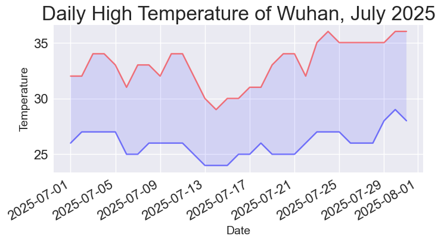

# 第 16 章 下载数据

我们将接触以两种常见格式（CSV 和 JSON）存储的数据并将其可视化。首先使用 Python
模块 csv 来处理以 CSV 格式存储的天气数据，找出两个截然不同的地区在一段时间内的最
高温度和最低温度。然后使用 Matplotlib 根据下载的数据创建图形，展示这两个地区的温
度变化。最后使用 json 模块访问以 GeoJSON 格式存储的地震数据，并使用 Plotly 绘制
一幅散点图，展示这些地震的位置和强度。

## 16.1 CSV 文件格式

要在文本文件中存储数据，最简单的方式是将数据组织为一系列以逗号分隔的值
(comma-separated values, CSV)并写入文件。这样的文件称为 CSV 文件。

### 16.1.1 解析 CSV 文件头

```python
from pathlib import Path
import csv

path = Path('data/wuhan_july_weather.csv')
lines = path.read_text().splitlines()

reader = csv.reader(lines)
header_row = next(reader)
print(header_row)
```

首先，导入 Path 类和 csv 模块。然后，创建一个 Path 对象，它指向文件夹
weather_data 中我们要使用的天气数据文件。我们读取这个文件，并通过把 splitlines()
纳入方法链式调用来获取一个包含文件中各行的列表，再将这个列表赋给变量 lines。

接下来，创建一个 reader 对象，用于解析文件的各行。为了创建 reader 对象，调用
csv.reader()函数并将包含 CSV 文件中各行的列表传递给它。

当以 reader 对象为参数时，函数 next()返回文件中的下一行（从文件开头开始）​。在上
述代码中，只调用了 next()一次，且是首次调用，因此得到的是文件的第一行，其中包含
文件头。接着将返回的数据赋给 header_row。

```python
['date', 'time', 'hmax', 'hmin', 'havg']
```

reader 对象处理文件中以逗号分隔的第一行数据，并将每项数据都作为一个元素存储在列
表中。

### 16.1.2 打印文件头及其位置

为了让文件头数据更容易理解，我们将列表中的每个文件头及其位置打印出来：

```python
from pathlib import Path
import csv

path = Path('data/wuhan_july_weather.csv')
lines = path.read_text().splitlines()

reader = csv.reader(lines)
header_row = next(reader)

for index, column_header in enumerate(header_row):
    print(index, column_header)
```

在循环中，对列表调用 enumerate()来获取每个元素的索引及其值。​

### 16.1.3 提取并读取数据

知道需要哪些列中的数据后，我们来读取一些数据。首先，读取每日最高温度：

```python
from pathlib import Path
import csv

path = Path('data/wuhan_july_weather.csv')
lines = path.read_text().splitlines()

reader = csv.reader(lines)
header_row = next(reader)

# 获取表头以及索引
for index, column_header in enumerate(header_row):
    print(index, column_header)

# 读取每日的最高温度
highs = []
for row in reader:
    high = int(row[2])
    highs.append(high)
print(highs)
```

### 16.1.4 绘制温度图

为了可视化这些温度数据，首先使用 Matplotlib 创建一个显示每日最高温度的简单绘图。

```python
from pathlib import Path
import csv
import matplotlib.pyplot as plt

path = Path('data/wuhan_july_weather.csv')
lines = path.read_text().splitlines()

reader = csv.reader(lines)
header_row = next(reader)

# # 获取表头以及索引
# for index, column_header in enumerate(header_row):
#     print(index, column_header)

# 读取每日的最高温度
highs = []
for row in reader:
    high = int(row[2])
    highs.append(high)

# 绘制武汉7月份每日对应的最高温度
plt.style.use('seaborn-v0_8')
fig, ax = plt.subplots()
ax.plot(highs, color='red')
ax.set_title("Daily High Temperature of Wuhan, July 2025", fontsize=24)
ax.set_xlabel("Date", fontsize=14)
ax.set_ylabel("Temperature", fontsize=14)
ax.tick_params(labelsize=16)
ax.set_aspect('equal')

plt.show()
```

### 16.1.5 datetime 模块

下面学习在图中添加日期，使其更为有用。

为了创建一个表示 2021 年 7 月 1 日的对象，可使用 datetime 模块中的 strptime()方
法。我们在终端会话中看看 strptime()的工作原理：

```bash
>>> from datetime import datetime
>>> first_date = datetime.strptime('2025-09-11', '%Y-%m-%d')
>>> print(first_date)
2025-09-11 00:00:00
```

首先导入 datetime 模块中的 datetime 类，再调用 strptime()方法，并将包含日期的字
符串作为第一个实参。第二个实参告诉 Python 如何设置日期的格式。在这里，'%Y-'让
Python 将字符串中第一个连字符前面的部分视为四位数的年份，'%m-'让 Python 将第二个
连字符前面的部分视为表示月份的两位数，'%d'让 Python 将字符串的最后一部分视为月份
中的一天(1 ～ 31)。

strptime()方法的第二个实参可接受各种以%打头的参数，并根据它们来决定如何解读日期
。

| 参数 | 含义                            |
| ---- | ------------------------------- |
| %A   | 星期几，如 Monday               |
| %B   | 月份名，如 July                 |
| %m   | 用数表示的月份（01~12）         |
| %d   | 用数表示的月份中的一天（01~31） |
| %Y   | 四位数的年份，如 2025           |
| %y   | 两位数的年份，如 25             |
| %H   | 24 小时制的小时数（00~23）      |
| %I   | 12 小时制的小时数（02~12）      |
| %p   | am 或 pm                        |
| %M   | 分钟数（00~59）                 |
| %S   | 秒数（00~61）                   |

### 16.1.6 在图中添加日期

现在可对温度图进行改进了——提取日期和最高温度，并将日期作为 x 坐标值：

```python
from pathlib import Path
import csv
import matplotlib.pyplot as plt
from datetime import datetime

path = Path('data/wuhan_july_weather.csv')
lines = path.read_text().splitlines()

reader = csv.reader(lines)
header_row = next(reader)

# # 获取表头以及索引
# for index, column_header in enumerate(header_row):
#     print(index, column_header)

# 读取每日的最高温度
dates, highs = [], []
for row in reader:
    current_date = datetime.strptime(row[0], r'%Y%m%d')
    high = int(row[2])
    dates.append(current_date)
    highs.append(high)

# 绘制武汉7月份每日对应的最高温度
plt.style.use('seaborn-v0_8')
fig, ax = plt.subplots()
ax.plot(dates, highs, color='red')
ax.set_title("Daily High Temperature of Wuhan, July 2025", fontsize=24)
ax.set_xlabel("Date", fontsize=14)
ax.set_ylabel("Temperature", fontsize=14)
# 绘制倾斜的日期标签
fig.autofmt_xdate()
ax.tick_params(labelsize=16)
ax.set_aspect('equal')

plt.show()
```

这里创建了两个空列表，用于存储从文件中提取的日期和最高温度。然后，将包含日期信息
的数据(row[0])转换为 datetime 对象，并将其追加到列表 dates 的末尾。将日期和最高
温度值传递给 plot()。调用 fig.autofmt_xdate()来绘制倾斜的日期标签，以免它们彼此
重叠。

### 16.1.7 覆盖更长的时间

### 16.1.8 再绘制一个数据系列

```python
from pathlib import Path
import csv
import matplotlib.pyplot as plt
from datetime import datetime

path = Path('data/wuhan_july_weather.csv')
lines = path.read_text().splitlines()

reader = csv.reader(lines)
header_row = next(reader)

# # 获取表头以及索引
# for index, column_header in enumerate(header_row):
#     print(index, column_header)

# 读取每日的最高温度、最低温度
dates, highs, lows = [], [], []
for row in reader:
    current_date = datetime.strptime(row[0], r'%Y%m%d')
    high = int(row[2])
    low = int(row[3])
    dates.append(current_date)
    highs.append(high)
    lows.append(low)

# 绘制武汉7月份每日对应的最高温度
plt.style.use('seaborn-v0_8')
fig, ax = plt.subplots()
ax.plot(dates, highs, color='red')
ax.plot(dates, lows, color='blue')
ax.set_title("Daily High Temperature of Wuhan, July 2025", fontsize=24)
ax.set_xlabel("Date", fontsize=14)
ax.set_ylabel("Temperature", fontsize=14)
# 绘制倾斜的日期标签
fig.autofmt_xdate()
ax.tick_params(labelsize=16)
ax.set_aspect('equal')

plt.show()
```

### 16.1.9 给图中区域着色

添加两个数据系列后，就能知道每天的温度范围了。下面来给这张图做最后的修饰，通过着
色来呈现每天的温度范围。为此，将使用 fill_between()方法，它接受一组 x 坐标值和两
组 y 坐标值，并填充两组 y 坐标值之间的空间：

```python
from pathlib import Path
import csv
import matplotlib.pyplot as plt
from datetime import datetime

path = Path('data/wuhan_july_weather.csv')
lines = path.read_text().splitlines()

reader = csv.reader(lines)
header_row = next(reader)

# # 获取表头以及索引
# for index, column_header in enumerate(header_row):
#     print(index, column_header)

# 读取每日的最高温度、最低温度
dates, highs, lows = [], [], []
for row in reader:
    current_date = datetime.strptime(row[0], r'%Y%m%d')
    high = int(row[2])
    low = int(row[3])
    dates.append(current_date)
    highs.append(high)
    lows.append(low)

# 绘制武汉7月份每日对应的最高温度
plt.style.use('seaborn-v0_8')
fig, ax = plt.subplots()
ax.plot(dates, highs, color='red', alpha=0.5)
ax.plot(dates, lows, color='blue', alpha=0.5)
# 给两条连线区域着色
ax.fill_between(dates, highs, lows, facecolor='blue', alpha=0.1)
ax.set_title("Daily High Temperature of Wuhan, July 2025", fontsize=24)
ax.set_xlabel("Date", fontsize=14)
ax.set_ylabel("Temperature", fontsize=14)
# 绘制倾斜的日期标签
fig.autofmt_xdate()
ax.tick_params(labelsize=16)
ax.set_aspect('equal')

plt.show()
```

实参 alpha 指定颜色的透明度。alpha 值为 0 表示完全透明，为 1（默认设置）表示完全
不透明。通过将 alpha 设置为 0.5，可让红色和蓝色折线的颜色看起来更浅。

向 fill_between()传递一组 x 坐标值（列表 dates）和两组 y 坐标值（highs 和
lows）​。实参 facecolor 指定填充区域的颜色，我们还将 alpha 设置成了较小的值
0.1，让填充区域既能将两个数据系列连接起来，又不分散观看者的注意力。



### 16.1.10 错误检查

我们应该能够使用任何地方的天气数据来运行 sitka_highs_lows.py 中的代码，但有些气
象站收集的数据类型有所不同，还有些会偶尔出故障，未能收集部分或全部应收集的数据。
缺失数据可能引发异常，如果不妥善处理，还可能会导致程序崩溃。

## 16.2 制作全球地震散点图：GeoJSON 格式

## 16.3 小结
