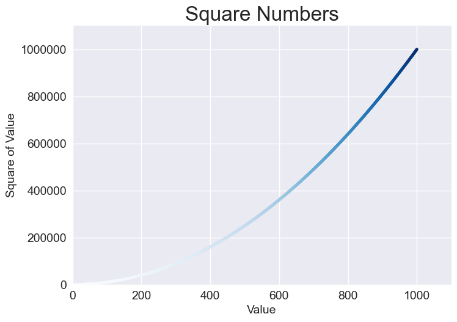
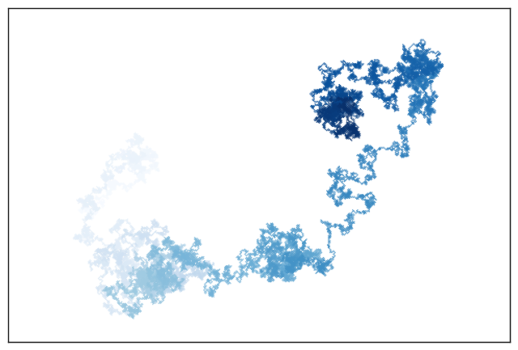

# 第 15 章 生成数据

数据可视化指的是通过可视化表示来探索和呈现数据集内的规律。它与数据分析紧密相关，
而数据分析指的是使用代码来探索数据集内的规律和关联。数据集既可以是用一行代码就能
装下的小型数值列表，也可以是数万亿字节、包含多种信息的数据。

## 15.1 安装 Matplotlib

Matplotlib [/ˈmætˌplɒtˌlɪb/​] 是 Python 中最基础、最著名的 2D 绘图库，用于创建各
种类型的静态、动态和交互式的图表和可视化。​

首先使用 Matplotlib 来生成几个图形，我们需要先使用 pip 安装 Matplotlib。

```bash
python -m pip install --user matplotlib
```

## 15.2 绘制简单的折线图

创建折线图，只需要指定要使用的数，Matpolotlib 将完成余下工作：

```python
# 使用Matplotlib绘制平方数据
# 首先导入pyplot模块，并指定别名
import matplotlib.pyplot as plt

squares = [n ** 2 for n in range(1, 6)]

fig, ax = plt.subplots()
ax.plot(squares)

plt.show()
```

pyplot 模块提供了很多用于生成图形和绘图的函数。其中 subplots() 可在一个图形
(figure)中绘制一或多个绘图(plot)。变量 fig 表示由生成的一些列绘图构成的整个图形
。变量 ax 表示图形中的绘图，在大多数情况下，使用这个图形来定义和定制绘图。

接下来调用 plot() 方法，它将根据给定的数据绘制图形。pyplot.show()函数打开
Matplotlib 查看器显示绘图。

### 15.2.1 修改标签文字和线条粗细

```python
# 设置标题和连线粗细
import matplotlib.pyplot as plt

squares = [n ** 2 for n in range(1, 6)]

fig, ax = plt.subplots()
# 设置连线粗细
ax.plot(squares, linewidth=3)
# 设置标题以及标题的字体
ax.set_title("Squares Numbers", fontsize=24)
# 设置X轴的说明文字
ax.set_xlabel("Value", fontsize=14)
# 设置Y轴的说明文字
ax.set_ylabel("Squares of Value", fontsize=14)
# 设置刻度标记的样式
ax.tick_params(labelsize=14)

plt.show()
```

参数 linewidth 决定了 plot()绘制的线条的粗细。set_xlabel()方法和 set_ylabel()方
法让我们能够为每条轴设置标题。tick_params()方法设置刻度标记的样式，它在这里将两
条轴上的刻度标记的字号都设置为 14(labelsize=14)。

### 15.2.2 校正绘图

我们发现绘图中 4.0 的平方是 25，并不正确。

在向 plot()提供一个数值序列时，它假设第一个数据点对应的 x 坐标值为 0，但这里的第
一个点对应的 x 坐标值应该为 1。为了改变这种默认行为，可给 plot()同时提供输入值和
输出值：

```python
# 校正绘图
import matplotlib.pyplot as plt

input_values = list(range(1, 6))
squares = [n ** 2 for n in input_values]

# 在一个图形中绘制一个或多个绘图，fig为图形，ax为绘图
fix, ax = plt.subplots()
# 绘制连线图，并设置连线宽度
ax.plot(input_values, squares, linewidth=3)
# 设置绘图的标题
ax.set_title("Square Numbers", fontsize=24)
# 设置x轴标题及字体大小
ax.set_xlabel("Value", fontsize=14)
# 设置y轴标题及字体大小
ax.set_ylabel("Squares of Value", fontsize=14)
# 设置刻度线样式，x轴和y轴的字体大小
ax.tick_params(labelsize=14)

# 启动图形终端展示绘图
plt.show()
```

### 15.2.3 使用内置样式

Matplotlib 提供了很多已定义好的样式，这些样式包含默认的背景色、网格线、线条粗细
、字体、字号等设置，让我们无需做太多定制就能生成引人瞩目的可视化效果。要看到能在
我们的系统中使用的所有样式，可在终端会话中执行如下命令：

```bash
import matplotlib.pyplot as plt
plt.style.available
```

输出：

```bash
['Solarize_Light2', '_classic_test_patch', '_mpl-gallery', '_mpl-gallery-nogrid', 'bmh', 'classic', 'dark_background', 'fast', 'fivethirtyeight', 'ggplot', 'grayscale', 'petroff10', 'seaborn-v0_8', 'seaborn-v0_8-bright', 'seaborn-v0_8-colorblind', 'seaborn-v0_8-dark', 'seaborn-v0_8-dark-palette', 'seaborn-v0_8-darkgrid', 'seaborn-v0_8-deep', 'seaborn-v0_8-muted', 'seaborn-v0_8-notebook', 'seaborn-v0_8-paper', 'seaborn-v0_8-pastel', 'seaborn-v0_8-poster', 'seaborn-v0_8-talk', 'seaborn-v0_8-ticks', 'seaborn-v0_8-white', 'seaborn-v0_8-whitegrid', 'tableau-colorblind10']
```

要使用这些样式，可在调用 subplots()的代码前添加如下代码行:

```python
# 使用Matplotlib内置样式
import matplotlib.pyplot as plt

input_values = list(range(1, 6))
squares = [n ** 2 for n in input_values]

# 在调用subplots()之前设置内置样式 seaborn-v0_8
plt.style.use('seaborn-v0_8')
fig, ax = plt.subplots()
ax.plot(input_values, squares, linewidth=3)
ax.set_title("Square Numbers", fontsize=24)
ax.set_xlabel("Values", fontsize=14)
ax.set_ylabel("Square of Value", fontsize=14)
ax.tick_params(labelsize=14)

plt.show()
```

### 15.2.4 使用 scatter() 绘制散点图并设置样式

scatter 意为"撒，散播"。

要绘制单个点，可使用 scatter()方法，并向它传递该点的 x 坐标值和 y 坐标值：

```python
# 绘制单个点
import matplotlib.pyplot as plt

plt.style.use("seaborn-v0_8")
fig, ax = plt.subplots()
# 使用 scatter() 方法绘制单个点
ax.scatter(2, 4)

plt.show()
```

添加样式：

```python
# 绘制单个点
import matplotlib.pyplot as plt

plt.style.use("seaborn-v0_8")
fig, ax = plt.subplots()
# 使用 scatter() 方法绘制单个点，传入x,y坐标，同时可使用可选的参数s设置点的尺寸
ax.scatter(2, 4, s=200)
# 设置样式
ax.set_title("Square Numbers", fontsize=24)
ax.set_xlabel("Value", fontsize=14)
ax.set_ylabel("Square of Value", fontsize=14)
ax.tick_params(labelsize=14)

plt.show()
```

### 15.2.5 使用 scatter() 绘制一系列点

要绘制一系列点，可向 scatter()传递两个分别包含 x 坐标和 y 坐标值的列表，如下所示
：

```python
# 使用scotter()绘制多个点
import matplotlib.pyplot as plt

x_values = list(range(1, 6))
y_values = [n **2 for n in x_values]

# 使用内置样式作为默认样式
plt.style.use('seaborn-v0_8')
fig, ax = plt.subplots()
# 绘制散点并指定点的尺寸
ax.scatter(x_values, y_values, s=100)
# 设置样式
ax.set_title("Square Numbers", fontsize=24)
ax.set_xlabel("Value", fontsize=14)
ax.set_ylabel("Square of Value", fontsize=14)
ax.tick_params(labelsize=14)

plt.show()
```

### 15.2.6 自定计算数据

绘制 1000 个点的代码：

```python
# 使用scotter()绘制1000个点
import matplotlib.pyplot as plt

x_values = list(range(1, 1001))
y_values = [n **2 for n in x_values]

# 使用内置样式作为默认样式
plt.style.use('seaborn-v0_8')
fig, ax = plt.subplots()
# 绘制散点并指定点的尺寸
ax.scatter(x_values, y_values, s=10)
# 设置样式
ax.set_title("Square Numbers", fontsize=24)
ax.set_xlabel("Value", fontsize=14)
ax.set_ylabel("Square of Value", fontsize=14)
ax.tick_params(labelsize=14)
# 设置每个坐标的取值范围
ax.axis([0, 1100, 0, 1_100_000])

plt.show()
```

axis()方法要求提供四个值：x 轴和 y 轴各自的最小值和最大值。这里将 x 轴的取值范围
设置为 0 ～ 1100，将 y 轴的取值范围设置为 0 ～ 1 100 000。

### 15.2.7 定制刻度标记

在刻度标记表示的数足够大时，Matplotlib 将默认使用科学记数法。这通常是好事，因为
如果使用常规表示法，很大的数将占据很多内存。

几乎每个图形元素都是可定制的，如果我们愿意，可让 Matplotlib 始终使用常规表示法，
展示数值原始文案，不采用默认的科学计数法：

```python
# 使用scotter()绘制多个点
import matplotlib.pyplot as plt

x_values = list(range(1, 1001))
y_values = [n **2 for n in x_values]

# 使用内置样式作为默认样式
plt.style.use('seaborn-v0_8')
fig, ax = plt.subplots()
# 绘制散点并指定点的尺寸
ax.scatter(x_values, y_values, s=10)
# 设置样式
ax.set_title("Square Numbers", fontsize=24)
ax.set_xlabel("Value", fontsize=14)
ax.set_ylabel("Square of Value", fontsize=14)
ax.tick_params(labelsize=14)
# 设置每个坐标的取值范围
ax.axis([0, 1100, 0, 1_100_000])
# 由于默认情况下matplotlib在数值比较大时采用科学计数法，我们可以修改这个默认行为，使其展示原始数值，即使数值较大
ax.ticklabel_format(style='plain')

plt.show()
```

ticklabel_format()方法让我们能够覆盖默认的刻度标记样式。

### 15.2.8 定制颜色

要修改数据点的颜色，可向 scatter()传递参数 color 并将其设置为要使用的颜色的名称(
用引号引起来)，如下所示：

```python
ax.scatter(x_values, y_values, color="red", s=10)
```

还可以使用 RGB 颜色模式定制颜色。此时传递参数 color，并将其设置为一个元组，其中
包含三个 0 ～ 1 的浮点数，分别表示红色、绿色和蓝色分量。例如，下面的代码行创建一
个由浅绿色的点组成的散点图：

```python
ax.scatter(x_values, y_values, color=(0, 0.8, 0), s=10)
```

值越接近 0，指定的颜色越深；值越接近 1，指定的颜色越浅。

### 15.2.9 使用颜色映射

**颜色映射**(colormap)是一个从起始颜色渐变到结束颜色的颜色序列。在可视化中，颜色
映射用于突出数据的规律。例如，我们可能用较浅的颜色来显示较小的值，使用较深的颜色
来显示较大的值。使用颜色映射，可根据精心设计的色标(color scale)准确地设置所有点
的颜色。

pyplot 模块内置了一组颜色映射。要使用这些颜色映射，需要告诉 pyplot 该如何设置数
据集中每个点的颜色。下面演示了如何根据每个点的 y 坐标值来设置其颜色：

```python
# # 绘制单个点
# import matplotlib.pyplot as plt

# plt.style.use("seaborn-v0_8")
# fig, ax = plt.subplots()
# # 使用 scatter() 方法绘制单个点，传入x,y坐标，同时可使用可选的参数s设置点的尺寸
# ax.scatter(2, 4, s=200)
# # 设置样式
# ax.set_title("Square Numbers", fontsize=24)
# ax.set_xlabel("Value", fontsize=14)
# ax.set_ylabel("Square of Value", fontsize=14)
# ax.tick_params(labelsize=14)

# plt.show()

# 使用scotter()绘制多个点
import matplotlib.pyplot as plt

x_values = list(range(1, 1001))
y_values = [n **2 for n in x_values]

# 使用内置样式作为默认样式
plt.style.use('seaborn-v0_8')
fig, ax = plt.subplots()
# # 绘制散点并指定点的颜色和尺寸
# 使用颜色映射，值越大颜色越深
ax.scatter(x_values, y_values, c=y_values, cmap=plt.cm.Blues, s=10)
# 设置样式
ax.set_title("Square Numbers", fontsize=24)
ax.set_xlabel("Value", fontsize=14)
ax.set_ylabel("Square of Value", fontsize=14)
ax.tick_params(labelsize=14)
# 设置每个坐标的取值范围
ax.axis([0, 1100, 0, 1_100_000])
# 由于默认情况下matplotlib在数值比较大时采用科学计数法，我们可以修改这个默认行为，使其展示原始数值，即使数值较大
ax.ticklabel_format(style='plain')

plt.show()
```

参数 c 类似于参数 color，但用于将一系列值关联到颜色映射。这里将参数 c 设置成了一
个 y 坐标值列表，并使用参数 cmap 告诉 pyplot 使用哪个颜色映射。这些代码将 y 坐标
值较小的点显示为浅蓝色，将 y 坐标值较大的点显示为深蓝色。

> 注意：要了解 pyplot 中所有的颜色映射，请访问 Matplotlib 主页并单击
> Documentation。在 Learning resources 部分找到 Tutorials 并单击其中的
> Introductory tutorials，向下滚动到 Colors，再单击 Choosing Colormaps in
> Matplotlib。

### 15.2.10 自动保存绘图

如果要将绘图保存到文件中，而不是在 Matplotlib 查看器中显示它，可将 plt.show()替
换为 plt.savefig()：

```python
plt.savefig("squares_plot.png", bbox_inches="tight")
```

我们将 scatter() 绘制散点保存为图标，结果如下图所示：



## 15.3 随机游走

本节将使用 Python 生成随机游走数据，再使用 Matplotlib 以美观的形式将这些数据呈现
出来。随机游走是由一系列简单的随机决策产生的行走路径。可以将随机游走看作一只晕头
转向的蚂蚁每一步都沿随机的方向前行所经过的路径。

### 15.3.1 创建 RandomWalk 类

```python
from random import choice

class RandomWalk:
    """模拟随机游走的类"""

    def __init__(self, num_points=5000):
        # 设置游走的点总数
        self.number_points = num_points
        # 记录游走经过的点坐标，初始坐标为 (0, 0)
        self.x_values = [0]
        self.y_values = [0]

    def fill_walk(self):
        current_point = [0, 0]
        while len(self.x_values) < self.number_points:
            direction = choice([[1, 1], [1, -1], [-1, 1], [-1, -1]])
            current_point[0] += direction[0]
            current_point[1] += direction[1]
            self.x_values.append(current_point[0])
            self.y_values.append(current_point[1])

    def desc_points(self):
        i = 0
        while i < len(self.x_values):
            print(f"({self.x_values[i]}, {self.y_values[i]})")
            i += 1
```

> 注意：元组是不可修改的列表，所以上面的案例中不能使用元组保存坐标和方向数据

### 15.3.2 绘制随机游走图

```python
import matplotlib.pyplot as plt
from random_walk import RandomWalk

random_walker = RandomWalk()
random_walker.fill_walk()

plt.style.use('classic')
fig, ax = plt.subplots()
ax.scatter(random_walker.x_values, random_walker.y_values, s=10)
ax.set_aspect('equal')

plt.show()
```

默认情况下，Matplotlib 独立地缩放每个轴，而这将水平或垂直拉伸绘图。为避免这种问
题，这里使用 set_aspect()指定两条轴上刻度的间距必须相等。

### 15.3.3 模拟多次随机游走

每次随机游走都不同，探索可能生成的各种模式很有趣。要在不运行程序多次的情况下使用
前面的代码模拟多次随机游走，一种办法是将这些代码放在一个 while 循环中，如下所示
：

```python
import matplotlib.pyplot as plt
from random_walk import RandomWalk


while True:
    random_walker = RandomWalk()
    random_walker.fill_walk()

    plt.style.use('classic')
    fig, ax = plt.subplots()
    ax.scatter(random_walker.x_values, random_walker.y_values, s=10)
    ax.set_aspect('equal')

    plt.show()

    keep_running = input("Make another walk? (y/n):")
    if keep_running == 'n':
        break
```

这些代码每模拟完一次随机游走，都会在 Matplotlib 查看器中显示结果，并在不关闭查看
器的情况下暂停。如果关闭查看器，程序将询问是否要再模拟一次随机游走。如果模拟多次
，我们将发现会生成各种各样的随机游走：集中在起点附近的，沿特定方向远远偏离起点的
，点的分布非常不均匀的，等等。要结束程序，请按 N 键。

### 15.3.4 设置随机游走图的样式

1. 给点着色

我们将使用颜色映射来指出游走中各个点的先后顺序，并删除每个点的黑色轮廓，让其颜色
更加明显。

为了根据游走中各个点的先后顺序进行着色，传递参数 c，并将其设置为一个列表，其中包
含各点的先后顺序。由于这些点是按顺序绘制的，因此给参数 c 指定的列表只需包含数 0
～ 4999。

将参数 c 设置为 point_numbers，指定使用颜色映射 Blues，并传递实参
edgecolors='none'以删除每个点的轮廓。最终的随机游走图从浅蓝色渐变为深蓝色，准确
地指出从起点游走到终点的路径。

```python
import matplotlib.pyplot as plt
from random_walk import RandomWalk

while True:
    random_walker = RandomWalk()
    random_walker.fill_walk()

    plt.style.use('classic')
    fig, ax = plt.subplots()
    point_numbers = range(len(random_walker.x_values))
    # 给随机路径的点设置着色，越往后出现的点颜色越深
    ax.scatter(random_walker.x_values, random_walker.y_values, s=10, c=point_numbers, cmap=plt.cm.Blues, edgecolor="none")
    ax.set_aspect('equal')

    plt.show()

    keep_running = input("Make another walk? (y/n):")
    if keep_running == 'n':
        break
```

2. 重新绘制起点和终点

除了给随机游走的各个点着色，以指出它们的先后顺序以外，如果还能呈现随机游走的起点
和终点就好了。为此，可在绘制随机游走图后重新绘制第一个点和最后一个点。这里让起点
和终点比其他点更大并显示为不同的颜色，以示突出：

```python
import matplotlib.pyplot as plt
from random_walk import RandomWalk

while True:
    random_walker = RandomWalk()
    random_walker.fill_walk()

    plt.style.use('classic')
    fig, ax = plt.subplots()
    point_numbers = range(len(random_walker.x_values))
    # 给随机路径的点设置着色，越往后出现的点颜色越深
    ax.scatter(random_walker.x_values, random_walker.y_values, s=10, c=point_numbers, cmap=plt.cm.Blues, edgecolor="none")
    # 重新绘制起点和终点
    ax.scatter(random_walker.x_values[0], random_walker.y_values[0], s=100, color=(1, 0, 0))
    ax.scatter(random_walker.x_values[-1], random_walker.y_values[-1], s=100, color=(0, 1, 0))
    ax.set_aspect('equal')

    plt.show()

    keep_running = input("Make another walk? (y/n):")
    if keep_running == 'n':
        break
```

3. 隐藏坐标轴

下面来隐藏绘图的坐标轴，以免分散观看者的注意力。要隐藏坐标轴，可使用如下代码：

```python
import matplotlib.pyplot as plt
from random_walk import RandomWalk

while True:
    random_walker = RandomWalk()
    random_walker.fill_walk()

    plt.style.use('classic')
    fig, ax = plt.subplots()
    point_numbers = range(len(random_walker.x_values))
    # 给随机路径的点设置着色，越往后出现的点颜色越深
    ax.scatter(random_walker.x_values, random_walker.y_values, s=10, c=point_numbers, cmap=plt.cm.Blues, edgecolor="none")
    # 重新绘制起点和终点
    ax.scatter(random_walker.x_values[0], random_walker.y_values[0], s=100, color=(1, 0, 0))
    ax.scatter(random_walker.x_values[-1], random_walker.y_values[-1], s=100, color=(0, 1, 0))
    ax.set_aspect('equal')
    # 隐藏坐标
    ax.get_xaxis().set_visible(False)
    ax.get_yaxis().set_visible(False)

    plt.show()

    keep_running = input("Make another walk? (y/n):")
    if keep_running == 'n':
        break
```

4. 增加点的个数

```python
import matplotlib.pyplot as plt
from random_walk import RandomWalk

while True:
    random_walker = RandomWalk(50_000)
    random_walker.fill_walk()

    plt.style.use('classic')
    fig, ax = plt.subplots()
    point_numbers = range(len(random_walker.x_values))
    # 给随机路径的点设置着色，越往后出现的点颜色越深
    ax.scatter(random_walker.x_values, random_walker.y_values, s=1, c=point_numbers, cmap=plt.cm.Blues, edgecolor="none")
    ax.set_aspect('equal')
    # 隐藏坐标
    ax.get_xaxis().set_visible(False)
    ax.get_yaxis().set_visible(False)

    plt.show()

    keep_running = input("Make another walk? (y/n):")
    if keep_running == 'n':
        break
```

模拟了一次包含 50 000 个点的随机游走，并将每个点的大小都设置为 1。最终的随机游走
图像云雾一般。我们使用简单的散点图制作出了一件艺术品！



5. 调整屏幕尺寸以适应屏幕

当图形适应屏幕的大小时，能更有效地将数据的规律呈现出来。为了让绘图窗口更适应屏幕
的大小，可在 subplots()调用中调整 Matplotlib 输出的尺寸：

```python
import matplotlib.pyplot as plt
from random_walk import RandomWalk

while True:
    random_walker = RandomWalk(50_000)
    random_walker.fill_walk()

    plt.style.use('classic')
    # 调整屏幕尺寸
    fig, ax = plt.subplots(figsize=(15, 9))
    point_numbers = range(len(random_walker.x_values))
    # 给随机路径的点设置着色，越往后出现的点颜色越深
    ax.scatter(random_walker.x_values, random_walker.y_values, s=1, c=point_numbers, cmap=plt.cm.Blues, edgecolor="none")
    ax.set_aspect('equal')
    # 隐藏坐标
    ax.get_xaxis().set_visible(False)
    ax.get_yaxis().set_visible(False)

    plt.show()

    keep_running = input("Make another walk? (y/n):")
    if keep_running == 'n':
        break
```

在创建绘图时，可向 subplots()传递参数 figsize，以指定生成的图形尺寸。参数
figsize 是一个元组，向 Matplotlib 指出绘图窗口的尺寸，单位为英寸。

Matplotlib 假定屏幕的分辨率为每英寸 100 像素。如果上述代码指定的绘图尺寸不合适，
可根据需要调整数值。如果知道当前系统的分辨率，可通过参数 dpi 向 plt.subplots()传
递该分辨率：

```python
fig, ax = plt.subplots(figsize=(10, 6), dpi=128)
```

## 15.4 使用 Plotly 模拟掷骰子

当需要创建要在浏览器中显示的图形时，Plotly 很有用，因为它生成的图形将自动缩放，
以适应观看者的屏幕。Plotly 生成的图形还是交互式的：当用户将鼠标指向特定的元素时
，将显示有关该元素的信息。本节将使用 Plotly Express 来创建初始图形。Plotly
Express 是 Plotly 的一个子集，致力于让用户使用尽可能少的代码来生成绘图。我们将先
使用几行代码生成初始绘图，在确定输出正确后再像使用 Matplotlib 那样对绘图进行定制
。

本节将使用 Plotly 来生成交互式图形。我们将对掷骰子的结果进行分析。

### 15.4.1 安装 Plotly

```bash
python -m pip install --user plotly
python -m pip install --user pandas
```

Plotly Express 依赖于 pandas（一个用于高效地处理数据的库）​，因此需要同时安装
pandas。

### 15.4.2 创建 Die 类

```python
from random import randint

class Die:
    """模拟骰子"""

    def __init__(self, num_sides=6):
        """初始化，默认是六面的骰子"""
        self.num_sides = num_sides

    def roll(self):
        """模拟掷骰子"""
        return randint(1, self.num_sides)
```

### 15.4.3 掷骰子

记录每次掷骰子的数据。

```python
from die import Die

# 创建一个六面骰子
die = Die()

# 将掷骰子的结构存储在此列表中
results = []

while len(results) < 100:
    results.append(die.roll())

print(results)
```

### 15.4.4 分析结果

计算每面出现的次数。

```python
from die import Die

# 创建一个六面骰子
die = Die()

# 将掷骰子的结构存储在此列表中
results = []

while len(results) < 100:
    results.append(die.roll())

# 分析结果
frequencies = []
for side in range(1, die.num_sides + 1):
    side_count = results.count(side)
    frequencies.append(side_count)

print(frequencies)
```

### 15.4.5 绘制直方图

```python
from die import Die
import plotly.express as px

# 创建一个六面骰子
die = Die()

# 将掷骰子的结构存储在此列表中
results = []
while len(results) < 100:
    results.append(die.roll())

# 分析结果
frequencies = []
# 骰子面数对应列表
sides = range(1, die.num_sides + 1)
for side in sides:
    side_count = results.count(side)
    frequencies.append(side_count)

# 对结果进行可视化
fig = px.bar(x=sides, y=frequencies)
fig.show()
```

首先导入模块 plotly.express，并按照惯例给它指定别名 px。然后，使用函数 px.bar()
创建一个直方图。对于这个函数，最简单的用法是只向它传递一组 x 坐标值和一组 y 坐标
值。这里传递的 x 坐标值为掷一个骰子可能得到的结果，而 y 坐标值为每种结果出现的次
数。

最后一行调用 fig.show()，让 Plotly 将生成的直方图渲染为 HTML 文件，并在一个新的
浏览器选项卡中打开这个文件。

我们还可以尝试绘制其他类型的图表。比如将 px.bar()替换为 px.scatter()或
px.line()。

### 15.4.6 定制绘图

确定选择的绘图是我们想要的类型且数据得到准确的呈现后，便可专注于添加合适的标签和
样式了。

要使用 Plotly 定制绘图，一种方式是在调用生成绘图的函数（这里是 px.bar()）时传递
一些可选参数。下面演示了如何指定图题并给每条坐标轴添加标签

```python
from die import Die
import plotly.express as px

# 创建一个六面骰子
die = Die()

# 将掷骰子的结构存储在此列表中
results = []
while len(results) < 1000:
    results.append(die.roll())

# 分析结果
frequencies = []
# 骰子面数对应列表
sides = range(1, die.num_sides + 1)
for side in sides:
    side_count = results.count(side)
    frequencies.append(side_count)

# 对结果进行可视化
# 设置样式
title = "Results of Rolling One D6 1,000 Times"
labels = {'x': 'Result', 'y': 'Frequency of Result'}
fig = px.line(x=sides, y=frequencies, title=title, labels=labels)
fig.show()
```

### 14.4.7 同时掷两个骰子

```python
from die import Die
import plotly.express as px

# 创建两个个六面骰子
die1 = Die()
die2 = Die()

# 将掷骰子的结构存储在此列表中
results = []
while len(results) < 1000:
    results.append(die1.roll() + die2.roll())

# 分析结果
frequencies = []
# 骰子面数对应列表
sides = range(2, 15)
for side in sides:
    side_count = results.count(side)
    frequencies.append(side_count)

# 对结果进行可视化
# 设置样式
title = "Results of Rolling One D6 1,000 Times"
labels = {'x': 'Result', 'y': 'Frequency of Result'}
fig = px.bar(x=sides, y=frequencies, title=title, labels=labels)
fig.show()
```

### 15.4.8 进一步定制

刚才生成的绘图存在一个问题，应予以解决：尽管有 11 个条形，但 x 轴的默认布局设置
未给所有条形加上标签。虽然对大多数可视化图形来说，这种默认设置的效果很好，但就这
里而言，给所有的条形都加上标签效果更佳。

Plotly 提供了 update_layout()方法，可用来对创建的图形做各种修改。下面演示了如何
让 Plotly 给每个条形都加上标签：

```python
from die import Die
import plotly.express as px

# 创建两个个六面骰子
die1 = Die()
die2 = Die()

# 将掷骰子的结构存储在此列表中
results = []
while len(results) < 1000:
    results.append(die1.roll() + die2.roll())

# 分析结果
frequencies = []
# 骰子面数对应列表
sides = range(2, 15)
for side in sides:
    side_count = results.count(side)
    frequencies.append(side_count)

# 对结果进行可视化
# 设置样式
title = "Results of Rolling One D6 1,000 Times"
labels = {'x': 'Result', 'y': 'Frequency of Result'}
fig = px.bar(x=sides, y=frequencies, title=title, labels=labels)
fig.update_layout(xaxis_dtick=1)
fig.show()
```

对表示整张图的 fig 对象调用 update_layout()方法。这里传递了参数 xaxis_dtick，它
指定 x 轴上刻度标记的间距。我们将这个间距设置为 1，给每个条形都加上标签。

### 15.4.9 同时掷两个面数不同的骰子

下面来创建一个 6 面骰子和一个 10 面骰子，看看同时掷这两个骰子 50 000 次的结果如
何：

```python
from die import Die
import plotly.express as px

# 创建一个六面骰子
die1 = Die()
# 创建一个十面骰子
die2 = Die(10)

# 将掷骰子的结构存储在此列表中
results = []
while len(results) < 5000:
    results.append(die1.roll() + die2.roll())

# 分析结果
frequencies = []
# 骰子面数对应列表
sides = range(2, 17)
for side in sides:
    side_count = results.count(side)
    frequencies.append(side_count)

# 对结果进行可视化
# 设置样式
title = "Results of Rolling One D6 1,000 Times"
labels = {'x': 'Result', 'y': 'Frequency of Result'}
fig = px.bar(x=sides, y=frequencies, title=title, labels=labels)
fig.update_layout(xaxis_dtick=1)
fig.show()
```

### 15.4.10 保存图形

生成我们喜欢的图形后，就可以通过浏览器将其保存为 HTML 文件了，不过我们也可以用代
码完成这项任务。要将图形保存为 HTML 文件，可将 fig.show()替换为
fig.write_html()：

```python
from die import Die
import plotly.express as px

# 创建一个六面骰子
die1 = Die()
# 创建一个十面骰子
die2 = Die(10)

# 将掷骰子的结构存储在此列表中
results = []
while len(results) < 5000:
    results.append(die1.roll() + die2.roll())

# 分析结果
frequencies = []
# 骰子面数对应列表
sides = range(2, 17)
for side in sides:
    side_count = results.count(side)
    frequencies.append(side_count)

# 对结果进行可视化
# 设置样式
title = "Results of Rolling One D6 1,000 Times"
labels = {'x': 'Result', 'y': 'Frequency of Result'}
fig = px.bar(x=sides, y=frequencies, title=title, labels=labels)
fig.update_layout(xaxis_dtick=1)
fig.show()
fig.write_html('dice_visual_d6d10.html')
```

## 15.5 第一阶段小结

1. 学习使用 Matplotlib 绘制简单图形
2. 学习使用 Plotly 绘制简单图形
