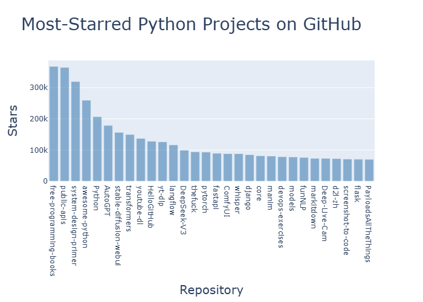
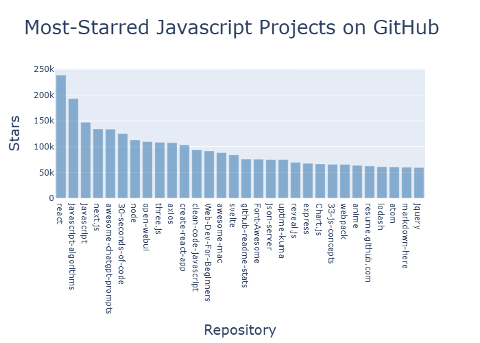

# 第 17 章 使用 API

## 17.1 使用 API

### 17.1.1 Git 和 Github

### 17.1.2 使用 API 调用请求数据

GitHub 的 API 让我们能够调用 API 请求各种信息。

```bash
https://api.github.com/search/repositories?q=language:python+sort:starts
```

这个 API 调用返回 GitHub 当前托管了多少个 Python 项目，以及有关最受欢迎的 Python
仓库的信息。

repositories 后面的问号指出需要传递一个参数。参数 q 表示查询，而等号(=)让我们能
够开始指定查询(q=)。接着，通过 language:python 指出只想获取主要语言为 Python 的
仓库的信息。最后的+sort:stars 指定将项目按星数排序。

### 17.1.3 安装 Requests

Requests 包让 Python 程序能够轻松地向网站请求信息并检查返回的响应。

```bash
python -m pip install --user requests
```

### 17.1.4 处理 API 响应

```python
import requests

# 执行 API 调用并查看响应
url = 'https://api.github.com/search/repositories'
url += '?q=language:python+sort:starts+starts:>10000'

headers = {"Accept": "application/vnd.github.v3+json"}
r = requests.get(url, headers=headers)
print(f"Status Code: {r.status_code}")          # Status Code: 200

# 将响应转换成字典
response_dist = r.json()

print(response_dist.keys())                     # dict_keys(['total_count', 'incomplete_results', 'items'])
```

我们调用 get()并将变量 url 和 headers 传递给它，再将响应对象存储在变量 r 中。响
应对象包含一个名为 status_code 的属性，指出请求是否成功（状态码 200 表示请求成功
）​。我们打印 status_code，以核实调用是否成功。使用 json()方法将这些信息转换为一
个 Python 字典，并将结果赋值给变量 response_dict。

### 17.1.5 处理响应字典

将 API 调用返回的信息存储到字典里后，就可处理其中的数据了。生成一些概述这些信息
的输出是一种不错的方式，可帮助我们确认收到了期望的信息，进而开始研究感兴趣的信息
：

```python
import requests

# 执行 API 调用并查看响应
url = 'https://api.github.com/search/repositories'
url += '?q=language:python+sort:stars+stars:>10000'


headers = {"Accept": "application/vnd.github.v3+json"}
r = requests.get(url, headers=headers)
print(f"Status Code: {r.status_code}")          # Status Code: 200

# 将响应转换成字典
response_dict = r.json()

# 处理响应字典
print(f"Total repositories: {response_dict['total_count']}")
print(f"Complete results: {not response_dict['incomplete_results']}")
repo_dicts = response_dict['items']
print(f"Repositories returned: {len(repo_dicts)}")
# 研究第一个仓库
repo_dict = repo_dicts[0]
print(f"\nKeys: {len(repo_dict)}")
for key in sorted(repo_dict.keys()):
    print(key)
```

下面来提取与一些键相关的值：

```python
import requests

# 执行 API 调用并查看响应
url = 'https://api.github.com/search/repositories'
url += '?q=language:python+sort:stars+stars:>10000'


headers = {"Accept": "application/vnd.github.v3+json"}
r = requests.get(url, headers=headers)
print(f"Status Code: {r.status_code}")          # Status Code: 200

# 将响应转换成字典
response_dict = r.json()

# 处理响应字典
print(f"Total repositories: {response_dict['total_count']}")
print(f"Complete results: {not response_dict['incomplete_results']}")
repo_dicts = response_dict['items']
print(f"Repositories returned: {len(repo_dicts)}")
# 研究第一个仓库
repo_dict = repo_dicts[0]

print("\nSelected information about first repository:")
print(f"Name: {repo_dict['name']}")
print(f"Owner: {repo_dict['owner']['login']}")
print(f"Stars: {repo_dict['stargazers_count']}")
print(f"Repository: {repo_dict['html_url']}")
print(f"Created: {repo_dict['created_at']}")
print(f"Updated: {repo_dict['updated_at']}")
print(f"Description: {repo_dict['description']}")
```

### 17.1.6 概述最受欢迎的仓库

在对这些数据进行可视化时，我们想涵盖多个仓库。下面就来编写一个循环，打印 API 调
用返回的每个仓库的特定信息，以便能够在图形中包含这些信息：

```python
import requests

# 执行 API 调用并查看响应
url = 'https://api.github.com/search/repositories'
url += '?q=language:python+sort:stars+stars:>10000'


headers = {"Accept": "application/vnd.github.v3+json"}
r = requests.get(url, headers=headers)
print(f"Status Code: {r.status_code}")          # Status Code: 200

# 将响应转换成字典
response_dict = r.json()

# 处理响应字典
print(f"Total repositories: {response_dict['total_count']}")
print(f"Complete results: {not response_dict['incomplete_results']}")
repo_dicts = response_dict['items']
print(f"Repositories returned: {len(repo_dicts)}")
# 研究第一个仓库
print("\nSelected information about first repository:")
for repo_dict in repo_dicts:
    print(f"Name: {repo_dict['name']}")
    print(f"Owner: {repo_dict['owner']['login']}")
    print(f"Stars: {repo_dict['stargazers_count']}")
    print(f"Repository: {repo_dict['html_url']}")
    print(f"Created: {repo_dict['created_at']}")
    print(f"Updated: {repo_dict['updated_at']}")
    print(f"Description: {repo_dict['description']}")
```

### 17.1.7 监控 API 的速率限制

## 17.2 使用 Plotly 可视化仓库

```python
import requests
import plotly.express as px

url = 'https://api.github.com/search/repositories'
url += '?q=language:python+sort:stars+stars:>10000'
headers = {"Accept": "application/vnd.github.v3+json"}

r = requests.get(url, headers=headers)
response_dict = r.json()

repo_dicts = response_dict['items']
print(len(repo_dicts))

repo_names, stars = [], []
for repo_dict in repo_dicts:
    repo_names.append(repo_dict['name'])
    stars.append(repo_dict['stargazers_count'])

print(repo_names)
print(stars)

fig = px.bar(x=repo_names, y=stars)
fig.show()
```

### 17.2.1 设置图形的样式

Plotly 提供了众多定制图形以及设置其样式的方式，可在确定信息被正确地可视化后使用
。下面对 px.bar()调用做些修改，并对创建的 fig 对象做进一步的调整。

首先设置图形的样式——添加图形的标题并给每条坐标轴添加标题：

```python
import requests
import plotly.express as px

url = 'https://api.github.com/search/repositories'
url += '?q=language:python+sort:stars+stars:>10000'
headers = {"Accept": "application/vnd.github.v3+json"}

r = requests.get(url, headers=headers)
response_dict = r.json()

repo_dicts = response_dict['items']

repo_names, stars = [], []
for repo_dict in repo_dicts:
    repo_names.append(repo_dict['name'])
    stars.append(repo_dict['stargazers_count'])

title = "Most-Starred Python Projects on GitHub"
labels = {
    "x": "Repository",
    "y": "Stars"
}
fig = px.bar(x=repo_names, y=stars, title=title, labels=labels)
# 使用fig.update_layout()方法修改一些图形元素
fig.update_layout(title_font_size=28, xaxis_title_font_size=20, yaxis_title_font_size=20)

fig.show()
```

### 17.2.2 添加定制工具提示

在 Plotly 中，将鼠标指向条形将显示它表示的信息。这通常称为工具提示(tooltip)。在
这里，当前显示的是项目获得了多少颗星。下面来添加定制工具提示，以显示项目的描述和
所有者。

为生成这样的工具提示，需要再提取一些信息：

```python
import requests
import plotly.express as px

url = 'https://api.github.com/search/repositories'
url += '?q=language:python+sort:stars+stars:>10000'
headers = {"Accept": "application/vnd.github.v3+json"}

r = requests.get(url, headers=headers)
response_dict = r.json()

repo_dicts = response_dict['items']

repo_names, stars, hover_texts = [], [], []
for repo_dict in repo_dicts:
    repo_names.append(repo_dict['name'])
    stars.append(repo_dict['stargazers_count'])
    owner = repo_dict['owner']['login']
    description = repo_dict['description']
    hover_text = f"{owner}<br />{description}"
    hover_texts.append(hover_text)

title = "Most-Starred Python Projects on GitHub"
labels = {
    "x": "Repository",
    "y": "Stars"
}
fig = px.bar(x=repo_names, y=stars, title=title, labels=labels, hover_name=hover_texts)
# 使用fig.update_layout()方法修改一些图形元素
fig.update_layout(title_font_size=28, xaxis_title_font_size=20, yaxis_title_font_size=20)

fig.show()
```

在 px.bar()调用中，添加参数 hover_name 并将其设置为 hover_texts。Plotly 在创建每
个条形时，都将提取这个列表中的文本，并在观看者将鼠标指向条形时显示它们。

### 17.2.3 添加可单击的链接

Plotly 允许在文本元素中使用 HTML，这让我们能够轻松地在图形中添加链接。下面将 x
轴标签作为链接，让观看者能够访问项目在 GitHub 上的主页。为此，需要提取 URL 并使
用它们来生成 x 轴标签：

```python
import requests
import plotly.express as px

url = 'https://api.github.com/search/repositories'
url += '?q=language:python+sort:stars+stars:>10000'
headers = {"Accept": "application/vnd.github.v3+json"}

r = requests.get(url, headers=headers)
response_dict = r.json()

repo_dicts = response_dict['items']

repo_links, stars, hover_texts = [], [], []
for repo_dict in repo_dicts:
    repo_name = repo_dict['name']
    repo_url = repo_dict['html_url']
    repo_link = f"<a href='{repo_url}' >{repo_name}</a>"
    repo_links.append(repo_link)
    stars.append(repo_dict['stargazers_count'])
    owner = repo_dict['owner']['login']
    description = repo_dict['description']
    hover_text = f"{owner}<br />{description}"
    hover_texts.append(hover_text)

title = "Most-Starred Python Projects on GitHub"
labels = {
    "x": "Repository",
    "y": "Stars"
}
fig = px.bar(x=repo_links, y=stars, title=title, labels=labels, hover_name=hover_texts)
# 使用fig.update_layout()方法修改一些图形元素
fig.update_layout(title_font_size=28, xaxis_title_font_size=20, yaxis_title_font_size=20)

fig.show()
```

这里修改了列表的名称（从 repo_names 改为 repo_links）​，更准确地指出了其中存放的
是哪种信息。然后，从 repo_dict 中提取项目的 URL，并将其赋给临时变量 repo_url。接
下来，创建一个指向项目的链接 ​，为此使用了 HTML 标签<a>，其格式
为<a href='URL'>link text</a>。然后，将这个链接追加到列表 repo_links 的末尾。

在调用 px.bar()时，将列表 repo_links 用作图形的 x 坐标值。虽然生成的图形与之前相
同，但观看者可单击图形底端的项目名，以访问相应项目在 GitHub 上的主页。至此，我们
对 API 获取的数据进行了可视化，得到的图形是可交互的，包含丰富的信息！

### 17.2.4 定制标记颜色

创建图形后，可使用以 update\_打头的方法来定制其各个方面。前面使用了
update_layout()方法，而 update_traces()则可用来定制图形呈现的数据。

创建图形后，可使用以 update\_打头的方法来定制其各个方面。前面使用了
update_layout()方法，而 update_traces()则可用来定制图形呈现的数据。

```python
import requests
import plotly.express as px

url = 'https://api.github.com/search/repositories'
url += '?q=language:python+sort:stars+stars:>10000'
headers = {"Accept": "application/vnd.github.v3+json"}

r = requests.get(url, headers=headers)
response_dict = r.json()

repo_dicts = response_dict['items']

repo_links, stars, hover_texts = [], [], []
for repo_dict in repo_dicts:
    repo_name = repo_dict['name']
    repo_url = repo_dict['html_url']
    repo_link = f"<a href='{repo_url}' >{repo_name}</a>"
    repo_links.append(repo_link)
    stars.append(repo_dict['stargazers_count'])
    owner = repo_dict['owner']['login']
    description = repo_dict['description']
    hover_text = f"{owner}<br />{description}"
    hover_texts.append(hover_text)

title = "Most-Starred Python Projects on GitHub"
labels = {
    "x": "Repository",
    "y": "Stars"
}
fig = px.bar(x=repo_links, y=stars, title=title, labels=labels, hover_name=hover_texts)
# 使用fig.update_layout()方法修改一些图形元素
fig.update_layout(title_font_size=28, xaxis_title_font_size=20, yaxis_title_font_size=20)
fig.update_traces(marker_color="SteelBlue", marker_opacity=0.6)

fig.show()
```



在 Plotly 中，trace 指的是图形上的一系列数据。update*traces()方法接受大量的参数
，其中以 marker*打头的参数都会影响图形上的标记。这里将每个标记的颜色都设置成了
'SteelBlue'。你可将参数 marker_color 设置为任何有具体名称的 CSS 颜色。我们还将每
个标记的不透明度都设置成了 0.6。不透明度值 1.0 表示完全不透明，而 0 表示完全透明
。

同理，我们如果将请求路径中的参数 Python 改成 JavaScript，即可对 JavaScript 在
GitHub 上最受欢迎的前三十名的仓库



### 17.2.5 深入了解 Plotly

虽然 Plotly 提供了内容丰富、条理清晰的文档，但是可能让你觉得无从下手。因此，要深
入了解 Plotly，最好先阅读文章 Plotly Express in Python。这篇文章概述了使用
Plotly Express 可创建的所有图表类型，其中还包含一些链接，指向各种图表的详细介绍
。

如果要深入地了解如何定制 Plotly 图形，可阅读文章 Styling Plotly Express Figures
in Python。

## 17.3 其他网站数据分析

## 17.4 小结

1. 学习使用 requests 库发送 API 请求，获取网络数据
2. 使用 Plotly 库绘制分析数据，定制 Plotly 库绘图样式
